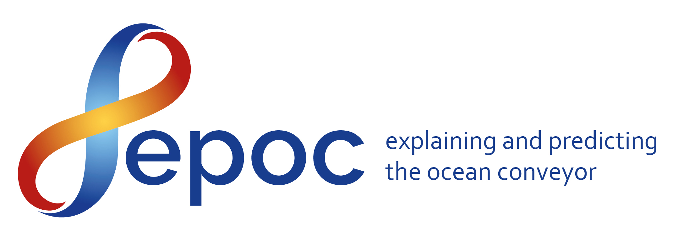
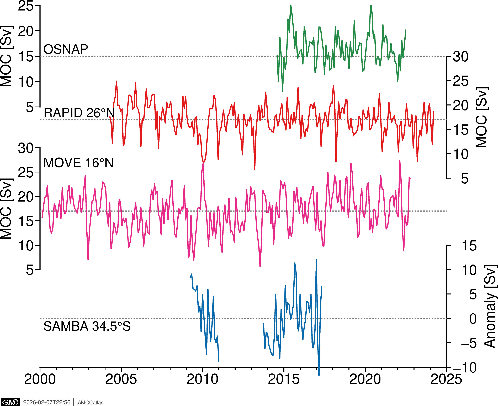
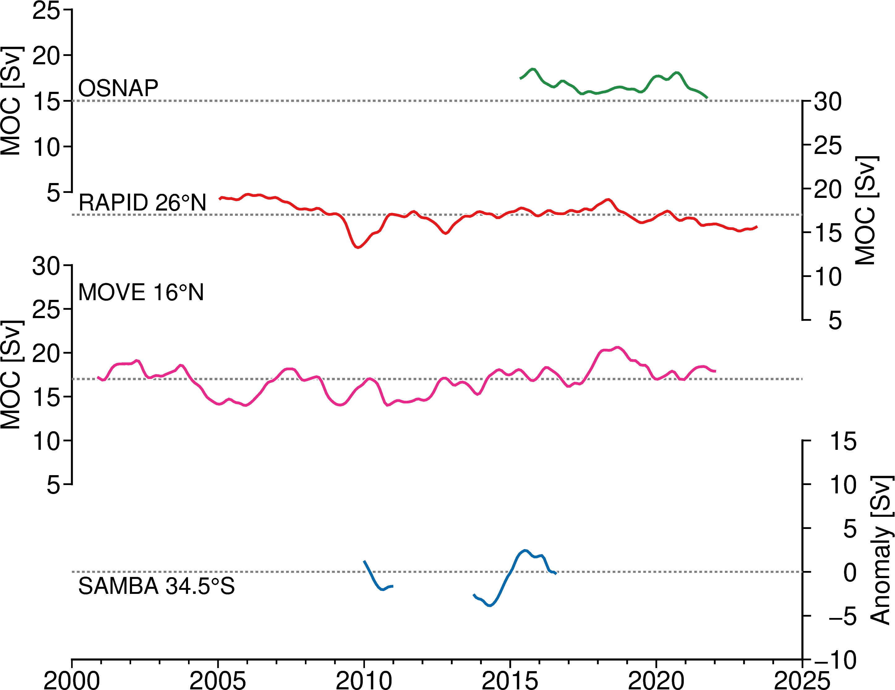
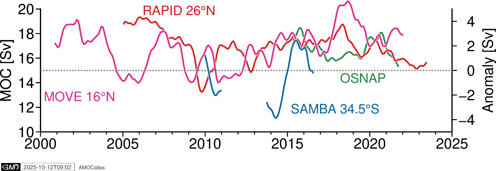
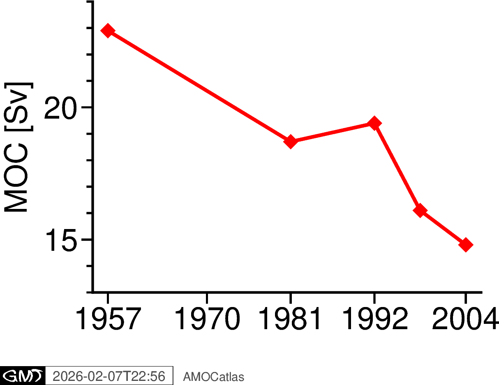

# AMOCatlas


[](https://pypi.org/project/AMOCatlas/)
[](https://pypi.org/project/AMOCatlas/)
[](LICENSE)

**Standardized, modular loading of AMOC observing array datasets, with optional structured logging and metadata enrichment.**

AMOCatlas provides a unified system to access and process data from major Atlantic Meridional Overturning Circulation (AMOC) observing arrays. The Atlantic Meridional Overturning Circulation is a critical component of Earth's climate system, transporting heat northward in the Atlantic Ocean. This project enables researchers to easily access, analyze, and visualize data from key monitoring stations.

This is a work in progress, all contributions welcome!

## Table of Contents
- [Features](#features)
- [Supported Arrays](#supported-arrays)
- [Installation](#installation)
- [Quick Start](#quick-start)
- [Documentation](#documentation)
- [Development](#development)
- [Funding & Support](#funding--support)
- [Acknowledgements](#acknowledgements)
- [Contributing](#contributing)

## Features

- 🌊 **Unified Data Access**: Single interface for multiple AMOC observing arrays
- 📊 **Automatic Data Download**: Intelligent caching system prevents redundant downloads
- 📝 **Structured Logging**: Per-dataset logging for reproducible workflows
- 🔍 **Metadata Enrichment**: Enhanced datasets with processing timestamps and source information
- 📈 **Visualization Tools**: Built-in plotting functions with consistent styling
- 🧪 **Sample Datasets**: Quick access to example data for testing and development

## Available Data Sources

| Data Source | Location | Description | Read Command |
|-------------|----------|-------------|--------------|
| **RAPID** | 26°N | MOC and overturning transports since 2004 | `read.rapid()` |
| **MOCHA** | 26°N | Meridional Heat transport since 2004 | `read.mocha()` |
| **MOVE** | 16°N | Meridional overturning since 2001 | `read.move()` |
| **OSNAP** | Subpolar North Atlantic | Meridional overturning since 2014 | `read.osnap()` |
| **SAMBA** | 34.5°S | South Atlantic MOC *anomaly* | `read.samba()` |
| **41°N Array** | 41°N | Meridional overturning from Argo + altimetry | `read.wh41n()` |
| **NOAC 47°N** | 47°N | North Atlantic Ocean Current - MOC | `read.noac47n()` |
| **DSO** | Denmark Strait | Overflow transport | `read.dso()` |
| **FBC** | Faroe Bank Channel | Overflow transport monitoring | `read.fbc()` |
| **Arctic Gateway** | Arctic Ocean | Pan-Arctic gateway transports | `read.arcticgateway()` |
| **FW2015** | 26°N | Frajka-Williams 2015 satellite-cable dataset at 26°N | `read.fw2015()` |
| **CALAFAT2025** | Atlantic | Bayesian estimates of Atlantic meridional heat transport spanning latitudes | `read.calafat2025()` |
| **ZHENG2024** | Atlantic | Observation-based Atlantic meridional freshwater transport spanning latitudes | `read.zheng2024()` |
| **SF2021** | 26°N | Meridional overturning estimate at 26°N from satellite altimetry | `read.sf2021()` |
| **NAC** | Atlantic | North Atlantic Current from Satellite and Float Observations | `read.nac()` |
| **LEBRAS35N** | 35°N | Meridional Overturning at 35°N from deep moorings, floats, and satellite altimeter | `read.lebras35n()` |
| **AXMOC34.5S** | 34.5°S | Estimates of AMOC, heat and freshwater transports at 34.5°S | `read.axmoc34s()` |
| **AXMOC22.5S** | 22.5°S | Estimates of AMOC and heat transport at 22.5°S | `read.axmoc22s()` |

For more detail on the AMOC and observing arrays, see: 

  - UCAR overview: https://climatedataguide.ucar.edu/climate-data/observations-atlantic-meridional-overturning-circulation-amoc
  - AtlantOS/OceanSITES: https://www.ocean-ops.org/oceansites/tma/index.html

## Installation

### From PyPI (Recommended)
```bash
pip install AMOCatlas
```

**Requirements**: Python ≥3.10, with numpy, pandas, xarray, and matplotlib.

### For Development
```bash
git clone https://github.com/AMOCcommunity/amocatlas.git
cd amocatlas
pip install -r requirements-dev.txt
pip install -e .
```

This installs amocatlas locally. The `-e` ensures that any edits you make in the files will be picked up by scripts that import functions from amocatlas.

## Quick Start

### Load a Dataset
```python
from amocatlas import read

# Load the full RAPID transport dataset (new API - recommended)
ds = read.rapid()
print(ds)

# Or load a small bundled sample dataset via the legacy API
from amocatlas import readers
ds = readers.load_sample_dataset("rapid")
```

### Load Full Datasets
```python
from amocatlas import read

# Load complete dataset (downloads and caches data) - new API
ds = read.osnap()                          # Single standardized dataset
all_files = read.osnap(all_files=True)     # Get all files for array

```

A `*.log` file will be written to `logs/` by default.

Data will be cached in `~/.amocatlas_data/` unless you specify a custom location with `data_dir="/path/to/custom/data"`.

**Setting Default Data Directory:**
```python
import amocatlas
amocatlas.set_data_dir("~/my_data")    # Custom location
amocatlas.set_data_dir("project")      # Use project/data (source checkout only)
print(amocatlas.get_data_dir())        # Show current setting
```

**Note:** The `"project"` option only works when running from a source checkout (editable install with `pip install -e .`). For regular pip installations, use an explicit path like `"~/my_data"` instead.

### API Features (v0.2.0+)

AMOCatlas provides **standardized, analysis-ready data by default** with the new `read` API:

**Key Benefits:**
- 🧹 **Standardized Data**: Consistent variable names, metadata, and units
- 🚀 **Easy to Use**: Single function calls instead of complex workflows  
- 🔄 **Flexible**: Get raw data when needed with `raw=True`
- 📊 **Smart Defaults**: Automatically handles array-specific parameters

```python
from amocatlas import read

# Standard workflow - recommended for most users
rapid_data = read.rapid()              # Single standardized dataset
osnap_data = read.osnap()              # Automatically uses latest version
arctic_data = read.arcticgateway()     # Consistent across all arrays

# Advanced usage
all_rapid = read.rapid(all_files=True) # Get all files for an array
raw_data = read.rapid(raw=True)        # Original format for special cases
```


## Documentation

Documentation is available at [https://amoccommunity.github.io/AMOCatlas](https://amoccommunity.github.io/AMOCatlas/).

Check out the demo notebook `notebooks/demo.ipynb` for example functionality.

## Project Structure

```
amocatlas/
│
├── read.py                  # 🆕 Modern API namespace (read.rapid(), read.osnap(), etc.)
├── readers.py               # Legacy orchestrator for loading datasets
├── reader_utils.py          # Shared utilities for all data source readers
│
├── data_sources/            # 🆕 Organized data source readers
│   ├── rapid26n.py          # RAPID array (26°N)
│   ├── move16n.py           # MOVE array (16°N)
│   ├── osnap55n.py          # OSNAP array (Subpolar North Atlantic)
│   ├── samba34s.py          # SAMBA array (34.5°S)
│   ├── mocha26n.py          # MOCHA dataset (26°N)
│   ├── wh41n.py             # 41°N array
│   ├── dso.py               # DSO overflow
│   ├── fbc.py               # Faroe Bank Channel
│   ├── fw2015.py            # Frajka-Williams 2015 dataset (26°N)
│   ├── arcticgateway.py     # Arctic Gateway transports
│   ├── calafat2025.py       # Calafat 2025 heat transport
│   ├── zheng2024.py         # Zheng 2024 freshwater transport
│   ├── noac47n.py           # NOAC monitoring (47°N)
│   ├── sf2021.py            # MOC from satellite altimetry (26°N)
│   ├── nac.py               # North Atlantic Current transport
│   ├── lebras35n.py         # MOC from moorings, floats and satellite observations (35°N)
│   ├── axmoc34s.py          # MOC, MHT and FOV (34.5°S)
│   └── axmoc22s.py          # MOC and MHT (22.5°S)
│
├── metadata/                # 🆕 YAML metadata files for standardization
├── utilities.py             # Core utilities (downloads, parsing, validation)
├── logger.py                # Structured logging system
├── standardise.py           # Data standardization functions
├── plotters.py              # Visualization and plotting functions
├── tools.py                 # Analysis and calculation functions
├── writers.py               # Data export functionality
│
└── tests/                   # Comprehensive unit tests
```

## Development

### Running Tests
All new functions should include tests. You can run tests locally and generate a coverage report with:
```bash
pytest --cov=amocatlas --cov-report term-missing tests/
```

Try to ensure that all the lines of your contribution are covered in the tests.

### Generating Dataset Reports
AMOCatlas includes automated report generation for comprehensive dataset documentation:

```bash
# Generate reports for all supported arrays
python generate_report

# Generate report for a specific dataset
python generate_report --data_source rapid

# Generate reports with custom output directory
python generate_report --output_dir custom_reports/
```

Reports are generated as structured RST files in `docs/source/reports/` with:
- Dataset visualization plots
- Variable mapping tables (original → standardized names)
- Comprehensive metadata documentation
- Temporal coverage analysis
- Statistical summaries

### Code Quality
```bash
black amocatlas/ tests/          # Format code
ruff check amocatlas/ tests/     # Lint code
pre-commit run --all-files       # Run all hooks
```

### Working with Notebooks
You can run the example jupyter notebook by launching jupyterlab with `jupyter-lab` and navigating to the `notebooks` directory, or in VS Code or another python GUI.

### Documentation
To build the documentation locally you need to install a few extra requirements:

- Install `make` for your computer, e.g. on ubuntu with `sudo apt install make`
- Install the additional python requirements. Activate the environment you use for working with amocatlas, navigate to the top directory of this repo, then run `pip install -r requirements-dev.txt`

Once you have the extras installed, you can build the docs locally by navigating to the `docs/` directory and running `make clean html`. This command will create a directory called `build/` which contains the html files of the documentation. Open the file `docs/build/html/index.html` in your browser, and you will see the docs with your changes applied.

## Funding & Support

<div align="center">
  
</div>

This project is supported by the Horizon Europe project **EPOC - Explaining and Predicting the Ocean Conveyor** (Grant Agreement No. 101081012).

*Funded by the European Union. Views and opinions expressed are however those of the author(s) only and do not necessarily reflect those of the European Union. Neither the European Union nor the granting authority can be held responsible for them.*


## Current Roadmap

- [x] Improve test coverage for data sources with <40% coverage
- [ ] Add more comprehensive visualization function tests  
- [ ] Expand plotting capabilities with additional array-specific visualizations
- [x] Create summary table of variable names, standard_names, long_names and units across all datasets
- [x] Create summary table of default units and formatting conventions used for standardization
- [x] Document deviations from OceanSITES-1.5 standard and rationale for changes
- [x] Enrich metadata with ORCID identifiers for contributors
- [x] Enrich metadata with https://edmo.seadatanet.org identifiers for contributing institutions
- [ ] Create sample 3D plots for Arctic Gateway and Calafat2025 datasets

## Acknowledgements

The observing arrays and datasets accessed through AMOCatlas are supported by:

- **RAPID data**: Data from the RAPID-MOCHA-WBTS observing project are funded by the Natural Environment Research Council, the National Science Foundation (NSF), with support from NOAA. They are freely available from www.rapid.ac.uk/.

- **MOVE data**: The MOVE project is made possible with funding from the NOAA Climate Program Office under award NA15OAR4320071 and carried out by principal investigators Uwe Send and Matthias Lankhorst. Initial funding came from the German Bundesministerium fuer Bildung und Forschung. MOVE data are made freely available through the international OceanSITES program.

- **OSNAP data**: OSNAP data were collected and made freely available by the OSNAP (Overturning in the Subpolar North Atlantic Program) project and all the national programs that contribute to it (www.o-snap.org).

- **SAMBA data**: SAMBA data were collected and made freely available by the SAMOC international project and contributing national programs


- **41°N data**: These data were collected and made freely available by the International Argo Program and the national programs that contribute to it. The Argo Program is part of the Global Ocean Observing System

- **DSO data**: Generated by Institution of Oceanography Hamburg and Marine and Freshwater Research Institute (Reykjavik, Iceland). Supported through funding from NACLIM (EU-FP7, grant 308299), RACE II, RACE-Synthese (German BMBF), Nordic WOCE, VEINS, MOEN, ASOF-W, NAClim, THOR, AtlantOS, and Blue Action

- **FBC data**: The time series was generated by the Faroe Marine Research Institute, Faroe Islands. Funding for the in situ Faroe Bank Channel measurements is from the Environmental Research Programme of the Nordic Council of Ministers (NMR) 1993–1998, from national Nordic research councils, from the Danish DANCEA programme, and from the European Framework Programs, lately under grant agreement no. 633211 (AtlantOS) and under grant agreement no. 101136548 (ObsSea4Clim).

- **Arctic Gateway data**: This work is funded by the European Union as part of the EPOC project (Explaining and Predicting the Ocean Conveyor; grant number: 101059547). Views and opinions expressed are however those of the author(s) only and do not necessarily reflect those of the European Union. Neither the European Union nor the granting authority can be held responsible for them.

- **CALAFAT2025 data**: This work has been carried out within the framework of the EPOC project funded by the European Union's Horizon Europe programme (grant agreement No 101059547), under call HORIZON-CL6-2021-CLIMATE01. Views and opinions expressed are however those of the author(s) only and do not necessarily reflect those of the European Union. Neither the European Union nor the granting authority can be held responsible for them.

- **FW2015 data**: Based on Frajka-Williams, E. (2015), "Estimating the Atlantic overturning at 26°N using satellite altimetry and cable measurements"

- **SF2021 data**: The authors thank the reviewers for their helpful comments. The authors also thank the many officers, crew, and technicians who helped to collect these data. Alejandra Sanchez-Franks also thanks Louis Clément for helpful discussions on normal-mode decomposition. This research has been supported by grants from the UK Natural Environment Research Council for the RAPID-AMOC programme and the ACSIS programme (grant no. NE/N018044/1) as well as funding from the European Union Horizon 2020 Research and Innovation programme BLUE-ACTION (grant no. 727852).

- **NAC data**: Earlier versions of this dataset were created with support from the European Commission through awards EVK2-CT-2000-00087 and EVR1-CT-2001-40014 (projects 'GYROSCOPE' and 'ANIMATE'). Updated versions were partially supported through award NA15OAR4320071 from U.S. NOAA OOMD.

- **Le Bras 35°N data**: ILB and JW gratefully acknowledge the National Aeronautics and Space Administration Grant 80NSSC20K0421. This work was done in part at the Jet Propulsion Laboratory, California Institute of Technology under a contract from NASA. The Argo float data were collected and made freely available by the International Argo Program and the national programs that contribute to it (https://argo.ucsd.edu,https://www.ocean-ops.org). The Argo Program is part of the Global Ocean Observing System. ECCO is supported by NASA's Physical Oceanography, Modeling Analysis and Prediction, and Cryosphere programs. We thank John Toole, Magdalena Andres, and the many other scientists and mariners who went to sea to collect the in situ observational data, particularly through the Line W program.

- **AXMOC 22.5°S data**: This research was carried out in part under the auspices of the Cooperative Institute for Marine and Atmospheric Studies, a cooperative institute of the University of Miami and the National Oceanic and Atmospheric Administration (NOAA), cooperative agreement NA20OAR4320472, and was supported by NOAA's Atlantic Oceanographic and Meteorological Laboratory (AOML). MG and DLV were also supported by the National Oceanic and Atmospheric Administration (NOAA) Climate Variability and Predictability program (Grant NA20OAR4310407).

- **AXMOC 34.5°S data**: The author(s) declare that financial support was received for the research, authorship, and/or publication of this article. This research was carried out in part under the auspices of the Cooperative Institute for Marine and Atmospheric Studies, a cooperative institute of the University of Miami and the National Oceanic and Atmospheric Administration (NOAA), cooperative agreement NA20OAR4320472, and was supported by NOAA's Atlantic Oceanographic and Meteorological Laboratory (AOML). MG and DLV were also supported by the National Oceanic and Atmospheric Administration (NOAA) Climate Variability and Predictability program (Grant NA20OAR4310407)

Dataset access and processing via [AMOCatlas](https://github.com/AMOCcommunity/AMOCatlas).

## Contributing

All contributions are welcome! See [CONTRIBUTING.md](CONTRIBUTING.md) for more details.

## PyGMT add-on

AMOCatlas includes support for creating publication-quality figures using PyGMT. The demo notebook `notebooks/amoc_paperfigs.ipynb` demonstrates how to generate figures similar to those in Frajka-Williams et al. (2019, 2023) papers, including filtered time series, component breakdowns, and multi-array comparisons.

**Note**: PyGMT can be challenging to install due to its dependency on GMT. See the [PyGMT installation guide](https://www.pygmt.org/latest/install.html) for platform-specific instructions. PyGMT is an optional dependency - all other AMOCatlas functionality works without it.

Example figures generated by the notebook:

**Multi-array AMOC comparison:**


**Multi-array AMOC comparison (filtered):**


**Multi-array AMOC overlaid:**


**Historical AMOC (Bryden 2005):**


---

*For questions or support, please open an [issue](https://github.com/AMOCcommunity/amocatlas/issues) or check our [documentation](https://amoccommunity.github.io/AMOCatlas/).*