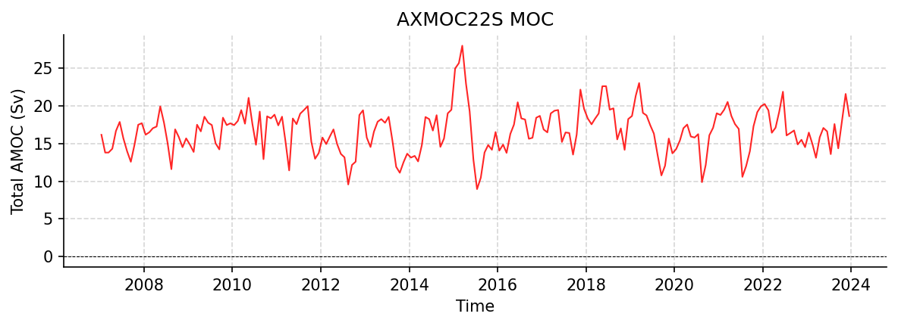

AXMOC22S Datasets
=================

----

AXMOC_22S_timeseries_2007_2023.nc
---------------------------------

Dataset Overview
^^^^^^^^^^^^^^^^

- **Project**: I. Pita, M. Goes - AXMOC: Estimate of AMOC, heat and freshwater transports at 22.5 and 34.5S based on sustained in situ observations
- **Description**: Estimates of AMOC and heat transport at 22.5°S
- **Source File**: AXMOC_22S_timeseries_2007_2023.nc
- **Data Product**: Estimates of AMOC and meridional heat transports at 22.5°S based on sustained in situ observations
- **License**: CC-BY-4.0
- **Date Created**: 21-May-2026
- **Time Coverage**: 2007-01-15 to 2023-12-15
- **Record Length**: 204 observations (16.9 years)
- **Sampling Frequency**: monthly

**Citation:**

    Pita, I., Goes, M., Volkov, D. L., Dong, S., Goni, G., & Cirano, M. (2024). An ARGO and XBT observing system for the Atlantic Meridional Overturning Circulation and Meridional Heat Transport (AXMOC) at 22.5°S. Journal of Geophysical Research: Oceans, 129, e2023JC020010. https://doi.org/10.1029/2023JC020010

**Acknowledgement:**

    This research was carried out in part under the auspices of the Cooperative Institute for Marine and Atmospheric Studies, a cooperative institute of the University of Miami and the National Oceanic and Atmospheric Administration (NOAA), cooperative agreement NA20OAR4320472, and was supported by NOAA's Atlantic Oceanographic and Meteorological Laboratory (AOML). MG and DLV were also supported by the National Oceanic and Atmospheric Administration (NOAA) Climate Variability and Predictability program (Grant NA20OAR4310407).

Dataset Visualization
^^^^^^^^^^^^^^^^^^^^^

   Time series plot for AXMOC22S dataset.

Dataset Statistics
^^^^^^^^^^^^^^^^^^

- **Total Variables**: 6
- **Total Coordinates**: 1
- **Dataset Size**: 0.01 MB

Coordinate Information
^^^^^^^^^^^^^^^^^^^^^^

The following table shows information about the dataset coordinates in the standardised version, including coordinate name remapping from the original, if any:

.. list-table::
   :widths: 14 14 14 14 14 14 14
   :header-rows: 1

   * - Coordinate
     - Description
     - Units
     - Size
     - Min Value
     - Max Value
     - Missing %
   * - *time* → **TIME**
     - Time
     - datetime64[ns]
     - (204,)
     - 2007-01-15
     - 2023-12-15
     - 0.0%

Variable Information
^^^^^^^^^^^^^^^^^^^^

The following table shows the mapping from original variable names to standardized names,
along with key statistics for each variable.

.. list-table::
   :widths: 14 14 14 14 14 14 14
   :header-rows: 1

   * - Variable
     - Description
     - Units
     - Size
     - Min Value
     - Max Value
     - Missing %
   * - *mht_total* → **MHT**
     - **Total MHT**: Total meridional heat transport at 22.5°S
     - PW
     - (204,)
     - 0.30
     - 1.19
     - 0.0%
   * - *mht_ekman* → **MHT_EKMAN**
     - **Ekman MHT**: Ekman component of meridional heat transport at 22.5°S
     - PW
     - (204,)
     - -0.77
     - -0.14
     - 0.0%
   * - *mht_geostrophic* → **MHT_GEOSTROPHIC**
     - **Geostrophic MHT**: Geostrophic component of meridional heat transport at 22.5°S
     - PW
     - (204,)
     - 0.87
     - 1.58
     - 0.0%
   * - *moc_total* → **MOC**
     - **Total AMOC**: Total AMOC transport time series at 22.5°S
     - Sverdrup
     - (204,)
     - 8.95
     - 27.99
     - 0.0%
   * - *moc_ekman* → **TRANS_EKMAN**
     - **Ekman AMOC**: Ekman component of AMOC transport time series at 22.5°S
     - Sverdrup
     - (204,)
     - -10.67
     - -1.90
     - 0.0%
   * - *moc_geostrophic* → **TRANS_GEOSTROPHIC**
     - **Geostrophic AMOC**: Geostrophic component of AMOC transport time series at 22.5°S
     - Sverdrup
     - (204,)
     - 15.90
     - 32.42
     - 0.0%

Metadata (edits applied noted)
^^^^^^^^^^^^^^^^^

The following metadata provides comprehensive information about this dataset:

- **Title**: AXMOC estimates of AMOC, MHT, and Fov (or Mov) at 22.5S
- **Summary**: This file contains monthly estimates of the Atlantic Meridional Overturning Circulation (AMOC), and meridional heat transport (MHT) at 22.5S.
- **Description\***: Estimates of AMOC and heat transport at 22.5°S
- **Program\***: AXMOC22S
- **Project\***: I. Pita, M. Goes - AXMOC: Estimate of AMOC, heat and freshwater transports at 22.5 and 34.5S based on sustained in situ observations
- **License\***: CC-BY-4.0
- **Acknowledgment\***: This research was carried out in part under the auspices of the Cooperative Institute for Marine and Atmospheric Studies, a cooperative institute of the University of Miami and the National Oceanic and Atmospheric Administration (NOAA), cooperative agreement NA20OAR4320472, and was supported by NOAA's Atlantic Oceanographic and Meteorological Laboratory (AOML). MG and DLV were also supported by the National Oceanic and Atmospheric Administration (NOAA) Climate Variability and Predictability program (Grant NA20OAR4310407).
- **Weblink\***: https://zenodo.org/records/18839461
- **Data Product\***: Estimates of AMOC and meridional heat transports at 22.5°S based on sustained in situ observations
- **Time Coverage Start**: 2007-01-15
- **Time Coverage End**: 2023-12-15
- **Contributor Name**: Ivenis Pita
- **Contributor Role**: originator
- **Contributor Role Vocabulary**: https://vocab.nerc.ac.uk/collection/G04/current/
- **Contributor Email**: 
- **Contributor Id**: 
- **Contributing Institutions\***: Rosenstiel School of Marine and Atmospheric Science (University of Miami), NOAA, Rosenstiel School
- **Contributing Institutions Vocabulary**: https://edmo.seadatanet.org/report/1382, , 
- **Contributing Institutions Role**: , , 
- **Conventions**: CF-1.8, ACDD-1.3, OceanSITES-1.5
- **featureType\***: timeSeries
- **featureType_vocabulary**: https://cfconventions.org/cf-conventions/v1.6.0/cf-conventions.html#_features_and_feature_types
- **Source File\***: AXMOC_22S_timeseries_2007_2023.nc
- **Source Path\***: /Users/eddifying/.amocatlas_data/AXMOC_22S_timeseries_2007_2023.nc
- **Source Url\***: https://zenodo.org/records/18839461/files/
- **Date Created**: 21-May-2026
- **Date Modified**: 2026-08-01T00:00:00Z
- **Processing Software**: http://github.com/AMOCcommunity/amocatlas
- **Processing Version**: v0.3.1
- **Processing Datasource\***: axmoc22s
- **Variable Mapping\***: {'time': 'TIME', 'moc_total': 'MOC', 'moc_ekman': 'TRANS_EKMAN', 'moc_geostrophic': 'TRANS_GEOSTROPHIC', 'mht_total': 'MHT', 'mht_ekman': 'MHT_EKMAN', 'mht_geostrophic': 'MHT_GEOSTROPHIC'}
- **Original Variable Metadata\***: [Complex metadata structure - 6 items]
- **Applied Variable Mapping**: [Complex metadata structure - 10 items]
- **Methodology**: AMOC, and MHT were estimated using the AXMOC methodology, which utilizes temperature and salinity fields constructed from sustained in situ observations, including Argo and XBT data. The total transports include Ekman and geostrophic components.
- **Paper Reference**: Pita, I., Goes, M., Volkov, D. L., Dong, S., Goni, G., & Cirano, M. (2024). An ARGO and XBT observing system for the Atlantic Meridional Ocerturning Circulation and Meridional Heat Transport (AXMOC) at 22.5° S. Journal of Geophysical Research: Oceans, 129, e2023JC020010. doi:10.1029/2023JC020010
- **Paper Reference (Updated Timeseries)**: Volkov, D. L., Willis, J. K., Hobbs, W., Fu, Y., Lozier, S. M., Johns, W. E., Smeed, D. A., Moat, B. I., Pita, I., Goes, M., Dong, S., Smith, R. H., & Elipot, S. (2024).Meridional overturning circulation and heat transport in the Atlantic Ocean [in "State of the Climate in 2023". Bull. Am. Meteorol. Soc105, S191–S193. doi: 10.1175/BAMS-D-24-0100.1
- **Zenodo (Database)**: doi:10.5281/zenodo.18839461
