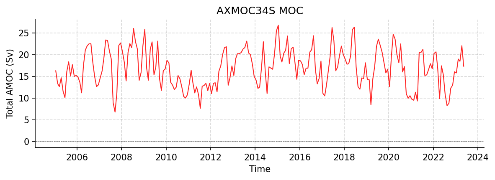

AXMOC34S Datasets
=================

AXMOC_34S_timeseries_2005_2023.nc
---------------------------------

Dataset Overview
^^^^^^^^^^^^^^^^

- **Project**: I. Pita, M. Goes - AXMOC: Estimate of AMOC, heat and freshwater transports at 22.5 and 34.5S based on sustained in situ observations
- **Description**: Estimates of AMOC, heat and freshwater transports at 34.5°S
- **Source File**: AXMOC_34S_timeseries_2005_2023.nc
- **Data Product**: Estimates of AMOC, heat and freshwater transports at 34.5°S based on sustained in situ observations
- **License**: CC-BY-4.0
- **Date Created**: 21-May-2026
- **Time Coverage**: 2005-01-15 to 2023-05-15
- **Record Length**: 221 observations (18.3 years)
- **Sampling Frequency**: monthly

**Citation:**

    Pita I, Goes M, Volkov DL, Dong S and Schmid C (2024) South Atlantic meridional overturning circulation and its respective heat and freshwater transports from sustained observations near 34.5°S. Front. Mar. Sci. 11:1474133. doi: http://doi.org/10.3389/fmars.2024.1474133

**Acknowledgement:**

    The author(s) declare that financial support was received for the research, authorship, and/or publication of this article. This research was carried out in part under the auspices of the Cooperative Institute for Marine and Atmospheric Studies, a cooperative institute of the University of Miami and the National Oceanic and Atmospheric Administration (NOAA), cooperative agreement NA20OAR4320472, and was supported by NOAA's Atlantic Oceanographic and Meteorological Laboratory (AOML). MG and DLV were also supported by the National Oceanic and Atmospheric Administration (NOAA) Climate Variability and Predictability program (Grant NA20OAR4310407)

Dataset Visualization
^^^^^^^^^^^^^^^^^^^^^

   Time series plot for AXMOC34S dataset.

Dataset Statistics
^^^^^^^^^^^^^^^^^^

- **Total Variables**: 9
- **Total Coordinates**: 1
- **Dataset Size**: 0.02 MB

Coordinate Information
^^^^^^^^^^^^^^^^^^^^^^

The following table shows information about the dataset coordinates in the standardised version, including coordinate name remapping from the original, if any:

.. list-table::
   :widths: 14 14 14 14 14 14 14
   :header-rows: 1

   * - Coordinate
     - Description
     - Units
     - Size
     - Min Value
     - Max Value
     - Missing %
   * - *time* → **TIME**
     - Time
     - seconds since 1970-01-01T00:00:00Z
     - (221,)
     - 2005-01-15
     - 2023-05-15
     - 0.0%

Variable Information
^^^^^^^^^^^^^^^^^^^^

The following table shows the mapping from original variable names to standardized names,
along with key statistics for each variable.

.. list-table::
   :widths: 14 14 14 14 14 14 14
   :header-rows: 1

   * - Variable
     - Description
     - Units
     - Size
     - Min Value
     - Max Value
     - Missing %
   * - *fov_total* → **FOV**
     - **northward ocean freshwater transport due to overturning**: Overturning component of freshwater transport at 34.5°S, also referred to as Fov or Mov
     - sverdrup
     - (221,)
     - -0.40
     - 0.05
     - 0.0%
   * - *fov_ekman* → **FOV_EKMAN**
     - **northward ocean freshwater transport due to Ekman transport**: Ekman contribution to overturning freshwater transport at 34.5°S
     - sverdrup
     - (221,)
     - -0.32
     - 0.09
     - 0.0%
   * - *fov_geostrophic* → **FOV_GEOSTROPHIC**
     - **northward ocean freshwater transport due to geostrophic transport**: Geostrophic contribution to overturning freshwater transport at 34.5°S
     - sverdrup
     - (221,)
     - -0.22
     - 0.07
     - 0.0%
   * - *mht_total* → **MHT**
     - **Total MHT**: Total meridional heat transport at 34.5°S
     - PW
     - (221,)
     - 0.10
     - 1.07
     - 0.0%
   * - *mht_ekman* → **MHT_EKMAN**
     - **northward ocean heat transport due to Ekman transport**: Ekman component of meridional heat transport at 34.5°S
     - PW
     - (221,)
     - -0.19
     - 0.67
     - 0.0%
   * - *mht_geostrophic* → **MHT_GEOSTROPHIC**
     - **northward ocean heat transport due to geostrophic transport**: Geostrophic component of meridional heat transport at 34.5°S
     - PW
     - (221,)
     - 0.03
     - 0.81
     - 0.0%
   * - *moc_total* → **MOC**
     - **Total AMOC**: Total AMOC transport time series at 34.5°S
     - sverdrup
     - (221,)
     - 6.80
     - 26.82
     - 0.0%
   * - *moc_ekman* → **TRANS_EKMAN**
     - **Ekman AMOC**: Ekman component of AMOC transport time series at 34.5°S
     - sverdrup
     - (221,)
     - -2.83
     - 10.90
     - 0.0%
   * - *moc_geostrophic* → **TRANS_GEOSTROPHIC**
     - **Geostrophic AMOC**: Geostrophic component of AMOC transport time series at 34.5°S
     - sverdrup
     - (221,)
     - 2.23
     - 27.02
     - 0.0%

Metadata (edits applied noted)
^^^^^^^^^^^^^^^^^^^^^^^^^^^^^^

The following metadata describes this dataset:

- **Title**: AXMOC estimates of AMOC, MHT, and Fov (or Mov) at 34.5S
- **Summary**: This file contains monthly estimates of the Atlantic Meridional Overturning Circulation (AMOC), meridional heat transport (MHT), and overturning freshwater transport (Fov or Mov) at 34.5S.
- **Description\***: Estimates of AMOC, heat and freshwater transports at 34.5°S
- **Program\***: AXMOC34S
- **Project\***: I. Pita, M. Goes - AXMOC: Estimate of AMOC, heat and freshwater transports at 22.5 and 34.5S based on sustained in situ observations
- **License\***: CC-BY-4.0
- **Acknowledgment\***: The author(s) declare that financial support was received for the research, authorship, and/or publication of this article. This research was carried out in part under the auspices of the Cooperative Institute for Marine and Atmospheric Studies, a cooperative institute of the University of Miami and the National Oceanic and Atmospheric Administration (NOAA), cooperative agreement NA20OAR4320472, and was supported by NOAA's Atlantic Oceanographic and Meteorological Laboratory (AOML). MG and DLV were also supported by the National Oceanic and Atmospheric Administration (NOAA) Climate Variability and Predictability program (Grant NA20OAR4310407)
- **Weblink\***: https://zenodo.org/records/18839461
- **Data Product\***: Estimates of AMOC, heat and freshwater transports at 34.5°S based on sustained in situ observations
- **Time Coverage Start**: 2005-01-15
- **Time Coverage End**: 2023-05-15
- **Contributor Name**: Ivenis Pita
- **Contributor Role**: originator
- **Contributor Role Vocabulary**: https://vocab.nerc.ac.uk/collection/G04/current/
- **Contributor Email**: 
- **Contributor Id**: 
- **Contributing Institutions\***: Rosenstiel School of Marine and Atmospheric Science (University of Miami), NOAA, Rosenstiel School
- **Contributing Institutions Vocabulary**: https://edmo.seadatanet.org/report/1382, , 
- **Contributing Institutions Role**: , , 
- **Conventions**: CF-1.8, ACDD-1.3, OceanSITES-1.5
- **featureType\***: timeSeries
- **featureType_vocabulary**: https://cfconventions.org/cf-conventions/v1.6.0/cf-conventions.html#_features_and_feature_types
- **Source File\***: AXMOC_34S_timeseries_2005_2023.nc
- **Source Path\***: ~/.amocatlas_data/AXMOC_34S_timeseries_2005_2023.nc
- **Source Url\***: https://zenodo.org/records/18839461/files/
- **Date Created**: 21-May-2026
- **Date Modified**: 2026-08-01T00:00:00Z
- **Processing Software**: http://github.com/AMOCcommunity/amocatlas
- **Processing Version**: v0.4.0
- **Processing Datasource\***: axmoc34s
- **Applied Variable Mapping**: [Complex metadata structure - 15 items]
- **Methodology**: AMOC, MHT, and Fov were estimated using the AXMOC methodology. Mapped temperature and salinity fields were constructed from sustained in situ observations, including Argo, XBT, and CTD data. The total transports include Ekman and geostrophic components.
- **Paper Reference**: Pita, I., Goes, M., Volkov, D. L., Dong, S., & Schmid, C. (2024). South Atlantic meridional overturning circulation and its respective heat and freshwater transports from sustained observations near 34.5° S. Frontiers in Marine Science, 11, 1474133. doi:10.3389/fmars.2024.1474133
- **Zenodo (Database)**: doi:10.5281/zenodo.18839461
- **Related Publication Note**: These time series are described and analyzed in Pita et al. (2024), where the AXMOC methodology is applied to estimate AMOC, MHT, and Fov at 34.5S.
