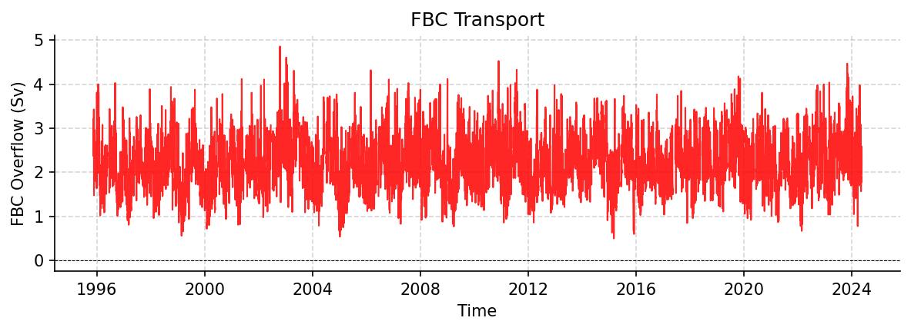

FBC Datasets
============

----

OS_GSR_FBC_D_1995_2024.nc
-------------------------

Dataset Overview
^^^^^^^^^^^^^^^^

- **Project**: B. Hansen, K. M. Larsen: NACLIM - Fluxes: Faroe Bank Channel overflow transport
- **Description**: FBC Overflow transport time series
- **Source File**: OS_GSR_FBC_D_1995_2024.nc
- **Data Product**: Daily averaged kinematic FBC-overflow flux (transport) in Sv
- **License**: CC-BY-4.0
- **Date Created**: 2025-04-22T00:00:00Z
- **Time Coverage**: 1995-11-14 to 2024-05-18
- **Record Length**: 10,414 observations (28.5 years)
- **Sampling Frequency**: daily

**Citation:**

    Larsen, K. M. H., Hansen, B., Hátún, H., Johansen, G. E., Østerhus, S., & Olsen, S.M. (2024). The Coldest and densest overflow branch into the North Atlantic is stable in transport, but warming. Geophysical Research Letters, 51,e2024GL110097. https://doi.org/10.1029/2024GL110097These data were collected and made freely available by the OceanSITES project and the national programs that contribute to it.

**Acknowledgement:**

    The time series was generated by the Faroe Marine Research Institute, Faroe Islands. Funding for the in situ Faroe Bank Channel measurements is from the Environmental Research Programme of the Nordic Council of Ministers (NMR) 1993–1998, from national Nordic research councils, from the Danish DANCEA programme, and from the European Framework Programs, lately under grant agreement no. 633211 (AtlantOS) and under grant agreement no. 101136548 (ObsSea4Clim).

Dataset Visualization
^^^^^^^^^^^^^^^^^^^^^

   Time series plot for FBC dataset.

Dataset Statistics
^^^^^^^^^^^^^^^^^^

- **Total Variables**: 1
- **Total Coordinates**: 4
- **Dataset Size**: 0.12 MB

Coordinate Information
^^^^^^^^^^^^^^^^^^^^^^

The following table shows information about the dataset coordinates in the standardised version, including coordinate name remapping from the original, if any:

.. list-table::
   :widths: 14 14 14 14 14 14 14
   :header-rows: 1

   * - Coordinate
     - Description
     - Units
     - Size
     - Min Value
     - Max Value
     - Missing %
   * - **DEPTH**
     - **Depth**:  Depth below surface of the water
     - m
     - (1,)
     - 9969209968386869046778552952102584320.00
     - 9969209968386869046778552952102584320.00
     - 0.0%
   * - **LATITUDE**
     - **Latitude**: Latitude north (WGS84)
     - degree_north
     - (2,)
     - 61.36
     - 61.50
     - 0.0%
   * - **LONGITUDE**
     - **Longitude**: Longitude east (WGS84)
     - degree_east
     - (2,)
     - -8.36
     - -8.17
     - 0.0%
   * - **TIME**
     - Time
     - seconds since 1970-01-01T00:00:00Z
     - (10414,)
     - 1995-11-14
     - 2024-05-18
     - 0.0%

Variable Information
^^^^^^^^^^^^^^^^^^^^

The following table shows the mapping from original variable names to standardized names,
along with key statistics for each variable.

.. list-table::
   :widths: 14 14 14 14 14 14 14
   :header-rows: 1

   * - Variable
     - Description
     - Units
     - Size
     - Min Value
     - Max Value
     - Missing %
   * - *FBC_tr* → **TRANS_FBC**
     - **FBC Overflow**: FBC Overflow transport time series
     - Sverdrup
     - (10414, 1)
     - 0.50
     - 4.86
     - 5.5%

Metadata (edits applied noted)
^^^^^^^^^^^^^^^^^

The following metadata provides comprehensive information about this dataset:

- **Title**: Faroe Bank Channel Overflow Volume Transport
- **Summary**: Time series of volume transport of the Faroe Bank Channel Overflow (FBCO). The transports are Daily averaged kinematic FBC-overflow as described in Hansen et al, 2016.
- **Description\***: FBC Overflow transport time series
- **Program\***: FBC
- **Project**: B. Hansen, K. M. Larsen: NACLIM - Fluxes: Faroe Bank Channel overflow transport
- **Source**: subsurface moorings
- **Id**: OS_GSR_FBC_D_1995_2024
- **Naming Authority**: OceanSITES
- **License**: CC-BY-4.0
- **Acknowledgment\***: The time series was generated by the Faroe Marine Research Institute, Faroe Islands. Funding for the in situ Faroe Bank Channel measurements is from the Environmental Research Programme of the Nordic Council of Ministers (NMR) 1993–1998, from national Nordic research councils, from the Danish DANCEA programme, and from the European Framework Programs, lately under grant agreement no. 633211 (AtlantOS) and under grant agreement no. 101136548 (ObsSea4Clim).
- **References**: http://www.oceansites.org/tma/index.html
- **Weblink\***: https://zenodo.org/records/19554222
- **Platform Code**: FBCO
- **Wmo Platform Code**: 6801006
- **Processing Level**: Known bad data has been replaced with values based on surrounding data, Data interpolated, Data manually reviewed, Other QC process applied
- **Data Product\***: Daily averaged kinematic FBC-overflow flux (transport) in Sv
- **Site Code**: GSR
- **Array**: GSR
- **Network**: GSR
- **Time Coverage Start**: 1995-11-14
- **Time Coverage End**: 2024-05-18
- **Geospatial Lat Min**: 61.36
- **Geospatial Lat Max**: 61.5
- **Geospatial Lon Min**: -8.36
- **Geospatial Lon Max**: -8.17
- **Geospatial Vertical Min**: 500
- **Geospatial Vertical Max**: 790
- **Creator Institution**: Havstovan - Faroe Marine Research Institute
- **Contributor Name**: Karin Margretha H. Larsen, Karin Margretha H. Larsen, Karin Margretha H. Larsen, Karin Margretha H. Larsen, Bogi Hansen, Hjálmar Hátún, Steffen M. Olsen, Svein Østerhus
- **Contributor Role**: originator, principalInvestigator, publisher, contributor, contributor, contributor, contributor, contributor
- **Contributor Role Vocabulary**: https://vocab.nerc.ac.uk/collection/G04/current/
- **Contributor Email**: KarinL@hav.fo, KarinL@hav.fo, KarinL@hav.fo, KarinL@hav.fo, bogihan@hav.fo, hjalmarh@hav.fo, smo@dmi.dk, svos@norceresearch.no
- **Contributor Id**: 0000-0001-7033-9139, 0000-0001-7033-9139, http://www.hav.fo, , https://orcid.org/0000-0001-8697-0013, , , 
- **Contributing Institutions\***: Faroe Marine Research Institute (FAMRI)
- **Contributing Institutions Vocabulary**: https://edmo.seadatanet.org/report/3084
- **Contributing Institutions Role**: 
- **Conventions**: OceanSITES-1.4, OceanSITES-1.5
- **featureType\***: timeSeries
- **featureType_vocabulary**: https://cfconventions.org/cf-conventions/v1.6.0/cf-conventions.html#_features_and_feature_types
- **Cdm Data Type**: Station
- **Data Type**: OceanSITES time-series data
- **Source File\***: OS_GSR_FBC_D_1995_2024.nc
- **Source Path\***: ~/.amocatlas_data/OS_GSR_FBC_D_1995_2024.nc
- **Source Url\***: https://zenodo.org/records/19554222/files/
- **Date Created**: 2025-04-22T00:00:00Z
- **Date Modified**: 2026-08-01T00:00:00Z
- **Processing Software**: http://github.com/AMOCcommunity/amocatlas
- **Processing Version**: v0.3.1
- **Processing Datasource\***: fbc
- **Format Version**: 1.4
- **Applied Variable Mapping**: {'FBC_tr': 'TRANS_FBC'}
- **Keywords**: OCEANOGRAPHY: PHYSICAL >Currents, OCEANOGRAPHY: GENERAL >North Atlantic oceanography, OCEANOGRAPHY: GENERAL >Time series experiments
- **Keywords Vocabulary**: AGU Index Terms
- **Update Interval**: void
- **Comment**: The array instrument data that the transports are based on are available from the Faroe Marine Research Institute
- **Data Mode**: D
- **Sea Area**: North Atlantic Ocean
- **Geospatial Lat Units**: degree_north
- **Geospatial Lon Units**: degree_east
- **Geospatial Vertical Positive**: down
- **Geospatial Vertical Units**: meter
- **Time Coverage Duration**: P28Y07M04D
- **Time Coverage Resolution**: PT01D
- **Netcdf Version**: 3.5
- **Qc Indicator**: excellent
- **Contributor Institute**: Faroe Marine Research Institute (Faroe Islands); National Centre for Climate Research (Denmark); NORCE Research (Norway)
