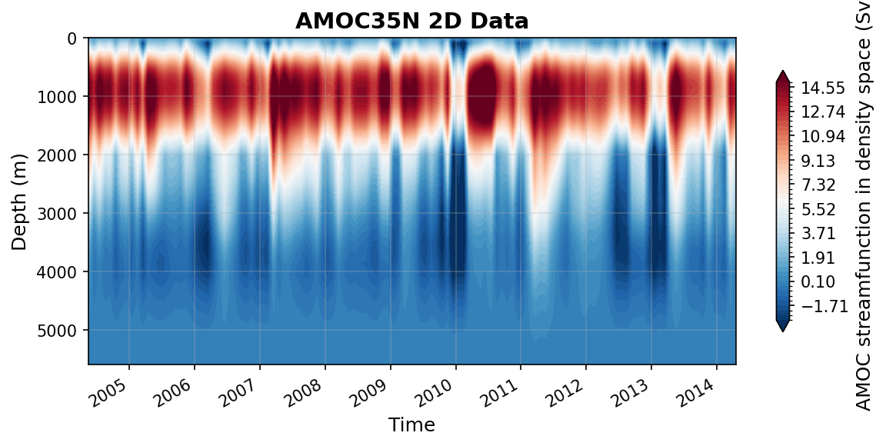

LEBRAS35N Datasets
==================

This report covers all available LEBRAS35N datasets.

----

AMOC35N.nc
----------

Dataset Overview
^^^^^^^^^^^^^^^^

- **Project**: I. Le Bras, J. Willis, J. Fenty: The Atlantic Meridional Overturning Circulation at 35°N From Deep Moorings, Floats, and Satellite Altimeter
- **Description**: The Atlantic meridional overturning circulation at 35N from deep moorings, floats, and satellite altimeter
- **Source File**: AMOC35N.nc
- **Data Product**: AMOC transport at 35N from deep moorings, floats, and satellite altimeter
- **License**: CC-BY-4.0
- **Time Coverage**: 2004-05-16 to 2014-04-17
- **Record Length**: 120 observations (9.9 years)
- **Sampling Frequency**: monthly

**Citation:**

    Le Bras, I. A.-A, Willis, J., & Fenty, I. (2023). The Atlantic meridional overturning circulation at 35°N from deep moorings, floats, and satellite altimeter. Geophysical Research Letters, 50, e2022GL101931. https://doi.org/10.1029/2022GL101931

**Acknowledgement:**

    ILB and JW gratefully acknowledge the National Aeronautics and Space Administration Grant 80NSSC20K0421. This work was done in part at the Jet Propulsion Laboratory, California Institute of Technology under a contract from NASA. The Argo float data were collected and made freely available by the International Argo Program and the national programs that contribute to it (https://argo.ucsd.edu,https://www.ocean-ops.org). The Argo Program is part of the Global Ocean Observing System. ECCO is supported by NASA's Physical Oceanography, Modeling Analysis and Prediction, and Cryosphere programs. We thank John Toole, Magdalena Andres, and the many other scientists and mariners who went to sea to collect the in situ observational data, particularly through the Line W program.

Dataset Visualization
^^^^^^^^^^^^^^^^^^^^^

   Time series plot for AMOC35N dataset.

Dataset Statistics
^^^^^^^^^^^^^^^^^^

- **Total Variables**: 4
- **Total Coordinates**: 4
- **Dataset Size**: 0.53 MB

Coordinate Information
^^^^^^^^^^^^^^^^^^^^^^

The following table shows information about the dataset coordinates in the standardised version, including coordinate name remapping from the original, if any:

.. list-table::
   :widths: 14 14 14 14 14 14 14
   :header-rows: 1

   * - Coordinate
     - Description
     - Units
     - Size
     - Min Value
     - Max Value
     - Missing %
   * - *depth* → **DEPTH**
     - **Depth**:  Depth below surface of the water
     - m
     - (560,)
     - 0.00
     - 5590.00
     - 0.0%
   * - *pressure* → **PRESSURE**
     - No description available
     - unknown
     - (560,)
     - 0.00
     - 4757.83
     - 0.0%
   * - *date* → **TIME**
     - **Time**: Time of each observation in datetime format
     - seconds since 1970-01-01T00:00:00Z
     - (120,)
     - 2004-05-16
     - 2014-04-17
     - 0.0%
   * - *time* → **TIME_FRACTION**
     - **Time in year.fraction of year**: Time of each observation which starts with the year and is followed by the fraction of the year that has passed at the time of the observation. For example, 2004.5 would correspond to June 30, 2004.
     - year.fractionofyear
     - (120,)
     - 2004.38
     - 2014.29
     - 0.0%

Variable Information
^^^^^^^^^^^^^^^^^^^^

The following table shows the mapping from original variable names to standardized names,
along with key statistics for each variable.

.. list-table::
   :widths: 14 14 14 14 14 14 14
   :header-rows: 1

   * - Variable
     - Description
     - Units
     - Size
     - Min Value
     - Max Value
     - Missing %
   * - *MOCdepth* → **MOC_DEPTH**
     - **AMOC transport in depth space**: AMOC transport time series in depth space
     - Sverdrup
     - (120,)
     - 8.72
     - 21.21
     - 0.0%
   * - *MOCsigma* → **MOC_SIGMA2**
     - **AMOC transport in density space**: AMOC transport time series in density space, with potential density referenced to 2000m
     - Sverdrup
     - (120,)
     - 10.88
     - 23.60
     - 0.0%
   * - *psi* → **STREAMFUNCTION_SIGMA2**
     - **AMOC streamfunction in density space**: Integrated across-basin transport streamfunction in depth space
     - Sverdrup
     - (120, 560)
     - -5.76
     - 19.66
     - 0.0%
   * - *Ekman* → **TRANS_EKMAN**
     - **Ekman transport**: Ekman transport time series at 35N derived from CCMP
     - Sverdrup
     - (120,)
     - -8.86
     - 2.28
     - 0.0%

Metadata (edits applied noted)
^^^^^^^^^^^^^^^^^

The following metadata provides comprehensive information about this dataset:

- **Summary**: The Atlantic meridional overturning circulation at 35N from deep moorings, floats, and satellite altimeter
- **Description\***: The Atlantic meridional overturning circulation at 35N from deep moorings, floats, and satellite altimeter
- **Program\***: AMOC at 35°N
- **Project\***: I. Le Bras, J. Willis, J. Fenty: The Atlantic Meridional Overturning Circulation at 35°N From Deep Moorings, Floats, and Satellite Altimeter
- **License\***: CC-BY-4.0
- **Acknowledgment\***: ILB and JW gratefully acknowledge the National Aeronautics and Space Administration Grant 80NSSC20K0421. This work was done in part at the Jet Propulsion Laboratory, California Institute of Technology under a contract from NASA. The Argo float data were collected and made freely available by the International Argo Program and the national programs that contribute to it (https://argo.ucsd.edu,https://www.ocean-ops.org). The Argo Program is part of the Global Ocean Observing System. ECCO is supported by NASA's Physical Oceanography, Modeling Analysis and Prediction, and Cryosphere programs. We thank John Toole, Magdalena Andres, and the many other scientists and mariners who went to sea to collect the in situ observational data, particularly through the Line W program.
- **Weblink\***: https://zenodo.org/records/7262142
- **Data Product\***: AMOC transport at 35N from deep moorings, floats, and satellite altimeter
- **Time Coverage Start\***: 2004-05-16
- **Time Coverage End\***: 2014-04-17
- **Contributing Institutions\***: Woodshole Oceanographic Institution (WHOI), Jet Propulsion Laboratory (JPL) at California Institute of Technology
- **Contributing Institutions Vocabulary**: , 
- **Contributing Institutions Role**: , 
- **Conventions**: CF-1.8, ACDD-1.3, OceanSITES-1.5
- **featureType\***: timeSeries
- **featureType_vocabulary**: https://cfconventions.org/cf-conventions/v1.6.0/cf-conventions.html#_features_and_feature_types
- **Source File\***: AMOC35N.nc
- **Source Path\***: ~/.amocatlas_data/AMOC35N.nc
- **Source Url\***: https://zenodo.org/records/7262142/files/
- **Date Modified**: 2026-08-01T00:00:00Z
- **Processing Software**: http://github.com/AMOCcommunity/amocatlas
- **Processing Version**: v0.3.1
- **Processing Datasource\***: lebras35n
- **Applied Variable Mapping**: [Complex metadata structure - 11 items]

----

AMOC35N_gridded_velocities.nc
-----------------------------

Dataset Overview
^^^^^^^^^^^^^^^^

- **Project**: I. Le Bras, J. Willis, J. Fenty: The Atlantic Meridional Overturning Circulation at 35°N From Deep Moorings, Floats, and Satellite Altimeter
- **Description**: The Atlantic meridional overturning circulation at 35N from deep moorings, floats, and satellite altimeter
- **Source File**: AMOC35N_gridded_velocities.nc
- **Data Product**: Gridded velocities at 35N from deep moorings, floats, and satellite altimeter
- **License**: CC-BY-4.0
- **Time Coverage**: 2004-05-16 to 2014-04-17
- **Record Length**: 120 observations (9.9 years)
- **Sampling Frequency**: monthly

**Citation:**

    Le Bras, I. A.-A, Willis, J., & Fenty, I. (2023). The Atlantic meridional overturning circulation at 35°N from deep moorings, floats, and satellite altimeter. Geophysical Research Letters, 50, e2022GL101931. https://doi.org/10.1029/2022GL101931

**Acknowledgement:**

    ILB and JW gratefully acknowledge the National Aeronautics and Space Administration Grant 80NSSC20K0421. This work was done in part at the Jet Propulsion Laboratory, California Institute of Technology under a contract from NASA. The Argo float data were collected and made freely available by the International Argo Program and the national programs that contribute to it (https://argo.ucsd.edu,https://www.ocean-ops.org). The Argo Program is part of the Global Ocean Observing System. ECCO is supported by NASA's Physical Oceanography, Modeling Analysis and Prediction, and Cryosphere programs. We thank John Toole, Magdalena Andres, and the many other scientists and mariners who went to sea to collect the in situ observational data, particularly through the Line W program.

Dataset Statistics
^^^^^^^^^^^^^^^^^^

- **Total Variables**: 4
- **Total Coordinates**: 7
- **Dataset Size**: 288.32 MB

Coordinate Information
^^^^^^^^^^^^^^^^^^^^^^

The following table shows information about the dataset coordinates in the standardised version, including coordinate name remapping from the original, if any:

.. list-table::
   :widths: 14 14 14 14 14 14 14
   :header-rows: 1

   * - Coordinate
     - Description
     - Units
     - Size
     - Min Value
     - Max Value
     - Missing %
   * - *depth* → **DEPTH**
     - **Depth**:  Depth below surface of the water
     - m
     - (560,)
     - 0.00
     - 5590.00
     - 0.0%
   * - *distance* → **DISTANCE**
     - No description available
     - unknown
     - (280,)
     - 0.00
     - 6163.93
     - 0.0%
   * - *lat* → **LATITUDE**
     - **Latitude**: Latitude north (WGS84)
     - degree_north
     - (280,)
     - 35.00
     - 40.27
     - 0.0%
   * - *lon* → **LONGITUDE**
     - **Longitude**: Longitude east (WGS84)
     - degree_east
     - (280,)
     - -70.20
     - -6.12
     - 0.0%
   * - *pressure* → **PRESSURE**
     - No description available
     - unknown
     - (560,)
     - 0.00
     - 4757.83
     - 0.0%
   * - *date* → **TIME**
     - Time
     - seconds since 1970-01-01T00:00:00Z
     - (120,)
     - 2004-05-16
     - 2014-04-17
     - 0.0%
   * - *time* → **TIME_FRACTION**
     - No description available
     - unknown
     - (120,)
     - 2004.38
     - 2014.29
     - 0.0%

Variable Information
^^^^^^^^^^^^^^^^^^^^

The following table shows the mapping from original variable names to standardized names,
along with key statistics for each variable.

.. list-table::
   :widths: 14 14 14 14 14 14 14
   :header-rows: 1

   * - Variable
     - Description
     - Units
     - Size
     - Min Value
     - Max Value
     - Missing %
   * - *area* → **AREA**
     - **Grid cell area**: Area of each grid cell in the gridded velocity product
     - m^2
     - (280, 560)
     - 85083.94
     - 227713.82
     - 0.4%
   * - *bathymetry* → **BATHYMETRY**
     - **Bathymetry**: Gridded bathymetry through the section
     - m
     - (280,)
     - -5621.35
     - -66.07
     - 0.4%
   * - *sigma2* → **SIGMA2**
     - **Potential density referenced to 2000m**: Gridded potential density time series referenced to 2000m through the section
     - kg/m^3
     - (560, 280, 120)
     - 30.66
     - 37.11
     - 28.2%
   * - *vg* → **V_GEOSTROPHIC**
     - **Geostrophic velocity**: Gridded geostrophic velocity time series through the section
     - m s-1
     - (560, 280, 120)
     - -0.51
     - 1.48
     - 28.5%

Metadata (edits applied noted)
^^^^^^^^^^^^^^^^^

The following metadata provides comprehensive information about this dataset:

- **Summary**: The Atlantic meridional overturning circulation at 35N from deep moorings, floats, and satellite altimeter
- **Description\***: The Atlantic meridional overturning circulation at 35N from deep moorings, floats, and satellite altimeter
- **Program\***: AMOC at 35°N
- **Project\***: I. Le Bras, J. Willis, J. Fenty: The Atlantic Meridional Overturning Circulation at 35°N From Deep Moorings, Floats, and Satellite Altimeter
- **License\***: CC-BY-4.0
- **Acknowledgment\***: ILB and JW gratefully acknowledge the National Aeronautics and Space Administration Grant 80NSSC20K0421. This work was done in part at the Jet Propulsion Laboratory, California Institute of Technology under a contract from NASA. The Argo float data were collected and made freely available by the International Argo Program and the national programs that contribute to it (https://argo.ucsd.edu,https://www.ocean-ops.org). The Argo Program is part of the Global Ocean Observing System. ECCO is supported by NASA's Physical Oceanography, Modeling Analysis and Prediction, and Cryosphere programs. We thank John Toole, Magdalena Andres, and the many other scientists and mariners who went to sea to collect the in situ observational data, particularly through the Line W program.
- **Weblink\***: https://zenodo.org/records/7262142
- **Data Product\***: Gridded velocities at 35N from deep moorings, floats, and satellite altimeter
- **Time Coverage Start\***: 2004-05-16
- **Time Coverage End\***: 2014-04-17
- **Contributing Institutions\***: Woodshole Oceanographic Institution (WHOI), Jet Propulsion Laboratory (JPL) at California Institute of Technology
- **Contributing Institutions Vocabulary**: , 
- **Contributing Institutions Role**: , 
- **Conventions**: CF-1.8, ACDD-1.3, OceanSITES-1.5
- **featureType\***: timeSeries
- **featureType_vocabulary**: https://cfconventions.org/cf-conventions/v1.6.0/cf-conventions.html#_features_and_feature_types
- **Source File\***: AMOC35N_gridded_velocities.nc
- **Source Path\***: ~/.amocatlas_data/AMOC35N_gridded_velocities.nc
- **Source Url\***: https://zenodo.org/records/7262142/files/
- **Date Modified**: 2026-08-01T00:00:00Z
- **Processing Software**: http://github.com/AMOCcommunity/amocatlas
- **Processing Version**: v0.3.1
- **Processing Datasource\***: lebras35n
- **Applied Variable Mapping**: [Complex metadata structure - 18 items]
