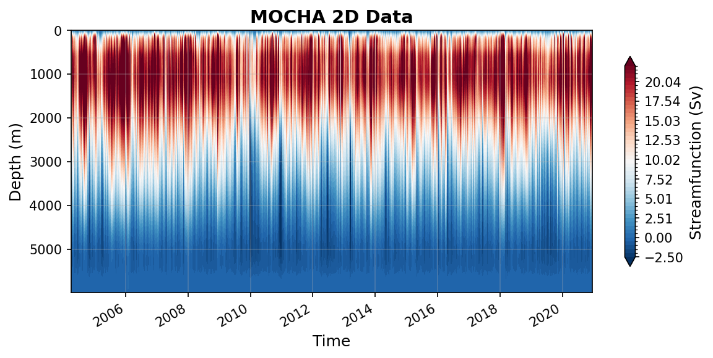

MOCHA Datasets
==============

----

mocha_mht_data_ERA5_v2020.nc
----------------------------

Dataset Overview
^^^^^^^^^^^^^^^^

- **Project**: RAPID-MOCHA
- **Description**: No description available
- **DOI**: https://doi.org/10.17604/3nfq-va20
- **Source File**: mocha_mht_data_ERA5_v2020.nc
- **Data Product**: MOCHA heat transport at 26.5°N
- **License**: ODC-By-1.0
- **Date Created**: 2023-01-01T00:00:00Z
- **Time Coverage**: 2004-04-02 to 2020-12-14
- **Record Length**: 12,202 observations (16.7 years)
- **Sampling Frequency**: 12H

**Citation:**

    Johns, W. E., Elipot, S., Smeed, D. A., Moat, B., King, B., Volkov, D. L., Smith, R. H. 2023. Towards two decades of Atlantic Ocean mass and heat transport at 26.5° N. Phil. Trans. R. Soc. A 381: 20220188. https://doi.org/10.1098/rsta.2022.0188

**Acknowledgement:**

    Data from the RAPID-MOCHA program are funded by the U.S. National Science Foundation and U.K. Natural Environment Research Council and are freely available at www.rapid.ac.uk/data/data-download and mocha.rsmas.miami.edu/mocha.

Dataset Visualization
^^^^^^^^^^^^^^^^^^^^^

   Time series plot for MOCHA dataset.

Dataset Statistics
^^^^^^^^^^^^^^^^^^

- **Total Variables**: 20
- **Total Coordinates**: 2
- **Dataset Size**: 115.63 MB

Coordinate Information
^^^^^^^^^^^^^^^^^^^^^^

The following table shows information about the dataset coordinates in the standardised version, including coordinate name remapping from the original, if any:

.. list-table::
   :widths: 14 14 14 14 14 14 14
   :header-rows: 1

   * - Coordinate
     - Description
     - Units
     - Size
     - Min Value
     - Max Value
     - Missing %
   * - *z* → **DEPTH**
     - **Depth**:  Depth below surface of the water
     - m
     - (307,)
     - 0.00
     - 5995.07
     - 0.0%
   * - *time* → **TIME**
     - **Time**: time array that corresponds to the profile variables 
     - seconds since 1970-01-01T00:00:00Z
     - (12202,)
     - 2004-04-02
     - 2020-12-14
     - 0.0%

Variable Information
^^^^^^^^^^^^^^^^^^^^

The following table shows the mapping from original variable names to standardized names,
along with key statistics for each variable.

.. list-table::
   :widths: 14 14 14 14 14 14 14
   :header-rows: 1

   * - Variable
     - Description
     - Units
     - Size
     - Min Value
     - Max Value
     - Missing %
   * - *Q_sum* → **MHT**
     - **MHT**: Net meridional heat transport 
     - PW
     - (12202,)
     - -0.64
     - 2.52
     - 0.0%
   * - *Q_ek* → **MHT_EKMAN**
     - **MHT_EKMAN**: Ekman heat transports 
     - PW
     - (12202,)
     - -1.16
     - 1.74
     - 0.0%
   * - *Q_fc* → **MHT_FC**
     - **MHT_FC**: Florida Straits heat transports 
     - PW
     - (12202,)
     - 1.50
     - 3.29
     - 0.0%
   * - *Q_gyre* → **MHT_GYRE**
     - **MHT_GYRE**: Basinwide gyre heat transports, as classically defined (e.g. see Johns et al., 2011) 
     - PW
     - (12202,)
     - -0.03
     - 0.23
     - 0.0%
   * - *Q_int* → **MHT_INT**
     - **MHT_INT**: Heat transport for the rest of the interior to Africa (but only represents the contribution by the zonal mean v and T) 
     - PW
     - (12202,)
     - -2.97
     - -0.81
     - 0.0%
   * - *Q_mo* → **MHT_MO**
     - **MHT_MO**: The sum of all the three interior components between the Bahamas and Africa (Q_int + Q_wedge + Q_eddy) 
     - PW
     - (12202,)
     - -2.52
     - -0.92
     - 0.0%
   * - *Q_ot* → **MHT_OT**
     - **MHT_OT**: Basinwide overturning heat transports, as classically defined (e.g. see Johns et al., 2011) 
     - PW
     - (12202,)
     - -0.63
     - 2.47
     - 0.0%
   * - *Q_wedge* → **MHT_WEDGE**
     - **MHT_WEDGE**: Heat transport for the "western boundary wedge" off Abaco 
     - PW
     - (12202,)
     - -0.41
     - 0.72
     - 0.0%
   * - *maxmoc* → **MOC**
     - **MOC_Z**: time-varying maximum value of MOC streamfunction 
     - Sverdrup
     - (12202,)
     - -5.07
     - 32.90
     - 0.0%
   * - **Q_eddy**
     - **MHT_EDDY**: interior gyre component due to spatially correlated v'T' variability across the interior, derived from an objective analysis of interior ARGO T/S data merged with the mooring T/S data from moorings, and smoothly merged into the EN4 climatology along 26.5°N below 2000m 
     - PW
     - (12202,)
     - -0.03
     - 0.13
     - 0.0%
   * - *moc* → **STREAMFUNCTION_Z**
     - **Streamfunction**: Streamfunction across the Atlantic at 26.5°N
     - Sverdrup
     - (12202, 307)
     - -18.92
     - 37.79
     - 0.0%
   * - *T_basin* → **TEMP_BASIN**
     - **Temperature**: time-varying basinwide mean potential temperature profile 
     - degree_C
     - (12202, 307)
     - 1.50
     - 28.55
     - 0.0%
   * - *T_basin_mean* → **TEMP_BASIN_MEAN**
     - **Mean Temperature**: time-mean basinwide mean potential temperature profile 
     - degree_C
     - (307,)
     - 1.51
     - 24.98
     - 0.0%
   * - *T_fc_fwt* → **TEMP_FC_FWT**
     - **FC Temperature**: time-varying Florida Current flow-weighted potential temperature 
     - degree_C
     - (12202,)
     - 18.57
     - 20.76
     - 0.0%
   * - *V_basin* → **TRANSPROF_BASIN**
     - **Transport per unit depth**: time-varying basinwide mean transport profile 
     - Sverdrup/m
     - (12202, 307)
     - -0.39
     - 0.56
     - 0.0%
   * - *V_basin_mean* → **TRANSPROF_BASIN_MEAN**
     - **Mean Transport per unit depth**: time-mean basinwide mean transport profile 
     - Sverdrup/m
     - (307,)
     - -0.01
     - 0.10
     - 0.0%
   * - *V_fc* → **TRANSPROF_FC**
     - **FC Transport per unit depth**: time-varying Florida Current transport profile 
     - Sverdrup/m
     - (12202, 307)
     - -0.00
     - 0.15
     - 0.0%
   * - *V_fc_mean* → **TRANSPROF_FC_MEAN**
     - **Mean FC Transport per unit depth**: time-mean Florida Current transport profile 
     - Sverdrup/m
     - (307,)
     - -0.00
     - 0.11
     - 0.0%
   * - *trans_ek* → **TRANS_EKMAN**
     - **Ekman**: time-varying Ekman transport (calculated from ERA-I winds) 
     - Sverdrup
     - (12202,)
     - -12.92
     - 18.16
     - 0.0%
   * - *trans_fc* → **TRANS_FC**
     - **FC**: time-varying Florida Current transport (from the cable) 
     - Sverdrup
     - (12202,)
     - 19.17
     - 39.53
     - 0.0%

Metadata (edits applied noted)
^^^^^^^^^^^^^^^^^

The following metadata provides comprehensive information about this dataset:

- **Title\***: Atlantic Meridional Overturning Circulation (AMOC) Heat Transport Time Series between April 2004 and December 2020 at 26.5°N
- **Summary**: Total heat transport results for the first 16.8 years of the RAPID/MOCHA program, from April 2004 through December 2020.
- **Program\***: RAPID
- **Project\***: RAPID-MOCHA
- **License\***: ODC-By-1.0
- **Acknowledgment**: Data from the RAPID-MOCHA program are funded by the U.S. National Science Foundation and U.K. Natural Environment Research Council and are freely available at www.rapid.ac.uk/data/data-download and mocha.rsmas.miami.edu/mocha.
- **Doi\***: https://doi.org/10.17604/3nfq-va20
- **Weblink\***: http://mocha.rsmas.miami.edu/mocha
- **Platform**: mooring
- **Platform Vocabulary**: https://vocab.nerc.ac.uk/collection/L06/
- **Data Product\***: MOCHA heat transport at 26.5°N
- **Time Coverage Start\***: 2004-04-02
- **Time Coverage End\***: 2020-12-14
- **Contributor Name\***: William E. Johns, William E. Johns, Shane Elipot, David A. Smeed, Ben I. Moat, Brian King, Denis Volkov, Ryan H. Smith
- **Contributor Role\***: originator, principalInvestigator, coAuthor, coAuthor, coAuthor, coAuthor, coAuthor, coAuthor
- **Contributor Role Vocabulary\***: https://vocab.nerc.ac.uk/collection/G04/current/
- **Contributor Email**: bjohns@rsmas.miami.edu, bjohns@rsmas.miami.edu, , , , , , 
- **Contributor Id\***: https://orcid.org/0000-0002-1093-7871, https://orcid.org/0000-0002-1093-7871, https://orcid.org/0000-0001-6051-5426, https://orcid.org/0000-0003-1740-1778, https://orcid.org/0000-0001-8676-7779, https://orcid.org/0000-0003-1338-3234, https://orcid.org/0000-0002-9290-0502, https://orcid.org/0000-0001-9824-6989
- **Contributing Institutions**: Rosenstiel School of Marine and Atmospheric Science (University of Miami), National Oceanography Centre (Southampton), NOAA AOML
- **Contributing Institutions Vocabulary**: https://edmo.seadatanet.org/report/1382, https://edmo.seadatanet.org/report/17, 
- **Contributing Institutions Role**: , , 
- **Conventions**: CF-1.8, ACDD-1.3, OceanSITES-1.5
- **featureType\***: timeSeriesProfile
- **featureType_vocabulary**: https://cfconventions.org/cf-conventions/v1.6.0/cf-conventions.html#_features_and_feature_types
- **Source File\***: mocha_mht_data_ERA5_v2020.nc
- **Source Path\***: ~/.amocatlas_data/mocha_mht_data_ERA5_v2020.nc
- **Date Created\***: 2023-01-01T00:00:00Z
- **Date Modified**: 2026-08-01T00:00:00Z
- **Processing Software**: http://github.com/AMOCcommunity/amocatlas
- **Processing Version**: v0.3.1
- **Processing Datasource\***: mocha26n
- **Applied Variable Mapping**: [Complex metadata structure - 24 items]
- **Convert To Coord\***: z
- **Methodology Reference**: W.E. Johns, S. Elipot, D.A. Smeed, B. Moat, B. King, D.L. Volkov, R.H. Smith, “Towards Two Decades of Atlantic Ocean Mass and Heat Transports at 26.5ºN”, accepted for publication in Royal Society Philosophical Transactions A, 2023.
- **Methodology Doi**: doi: 10.1098/rsta.2022.0188
