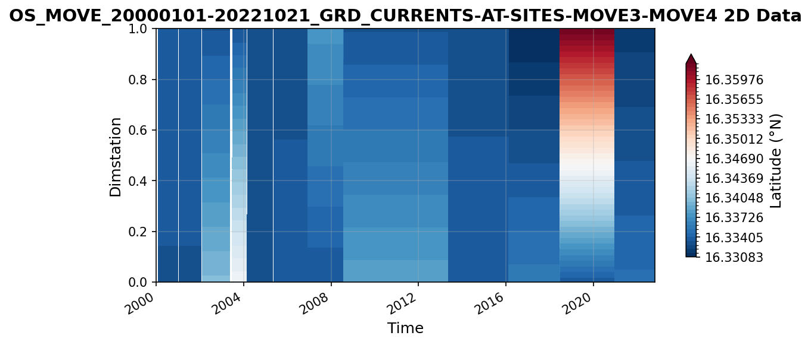
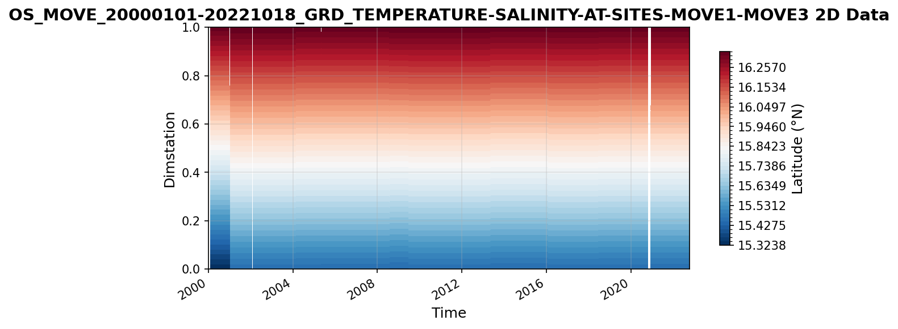

MOVE Datasets
=============

This report covers all available MOVE datasets.

----

OS_MOVE_20000206-20221014_DPR_VOLUMETRANSPORT.nc
------------------------------------------------

Dataset Overview
^^^^^^^^^^^^^^^^

- **Project**: Meridional Overturning Variability Experiment (MOVE)
- **Description**: MOVE transport estimates dataset from UCSD mooring project
- **Source File**: OS_MOVE_20000206-20221014_DPR_VOLUMETRANSPORT.nc
- **Data Product**: MOVE transport time series (2000-2022)
- **License**: CC-BY-4.0
- **Date Created**: 2025-04-23T01:35:26Z
- **Time Coverage**: 2000-02-06 to 2022-10-14
- **Record Length**: 4,144 observations (22.7 years)
- **Sampling Frequency**: 48.0H

**Citation:**

    Send, U., Lankhorst, M., Kanzow, T.: Observation of decadal change in the Atlantic Meridional Overturning Circulation using 10 years of continuous transport data. Geophysical Research Letters, Vol. 38, L24606, 2011. doi: http://doi.org/10.1029/2011GL049801. M. Lankhorst and U. Send: "Ocean Volume Transport across the MOVE Line at 16 N". OceanSITES dataset. NOAA NDBC and Ifremer, 2025. Available online from e.g.: https://dods.ndbc.noaa.gov/thredds/catalog/oceansites/DATA_GRIDDED/MOVE/catalog.html

**Acknowledgement:**

    MOVE was supported by the U.S. NOAA's Global Ocean Monitoring and Observing (GOMO) program under award NA20OAR4320278 and earlier awards. Initially, MOVE was funded by the German BMBF.

Dataset Visualization
^^^^^^^^^^^^^^^^^^^^^

   Time series plot for OS_MOVE_20000206-20221014_DPR_VOLUMETRANSPORT dataset.

Dataset Statistics
^^^^^^^^^^^^^^^^^^

- **Total Variables**: 8
- **Total Coordinates**: 4
- **Dataset Size**: 0.16 MB

Coordinate Information
^^^^^^^^^^^^^^^^^^^^^^

The following table shows information about the dataset coordinates in the standardised version, including coordinate name remapping from the original, if any:

.. list-table::
   :widths: 14 14 14 14 14 14 14
   :header-rows: 1

   * - Coordinate
     - Description
     - Units
     - Size
     - Min Value
     - Max Value
     - Missing %
   * - *location_center_latitude* → **LATITUDE**
     - **Latitude**: Latitude north (WGS84)
     - degree_north
     - ()
     - 16.04
     - 16.04
     - 0.0%
   * - *location_center_longitude* → **LONGITUDE**
     - **Longitude**: Longitude east (WGS84)
     - degree_east
     - ()
     - -57.56
     - -57.56
     - 0.0%
   * - *location_center_vertical* → **PRESSURE**
     - No description available
     - dbar
     - ()
     - 2750.00
     - 2750.00
     - 0.0%
   * - **TIME**
     - Time
     - seconds since 1970-01-01T00:00:00Z
     - (4164,)
     - NaT
     - NaT
     - 0.0%

Variable Information
^^^^^^^^^^^^^^^^^^^^

The following table shows the mapping from original variable names to standardized names,
along with key statistics for each variable.

.. list-table::
   :widths: 14 14 14 14 14 14 14
   :header-rows: 1

   * - Variable
     - Description
     - Units
     - Size
     - Min Value
     - Max Value
     - Missing %
   * - *TRANSPORT_TOTAL* → **MOC**
     - **MOC_z**: Ocean volume transport across the MOVE line
     - Sverdrup
     - (4164,)
     - -31.86
     - -3.34
     - 4.3%
   * - *transport_component_boundary* → **MOC_BOUNDARY**
     - **Boundary transport**: Boundary component of ocean volume transport across the MOVE line
     - Sverdrup
     - (4164,)
     - -10.98
     - 7.42
     - 1.6%
   * - *transport_component_internal* → **MOC_INTERNAL**
     - **Internal transport**: Internal component of ocean volume transport across the MOVE line
     - Sverdrup
     - (4164,)
     - -35.46
     - -3.76
     - 4.0%
   * - *transport_component_internal_offset* → **MOC_INTERNAL_OFFSET**
     - **Transport offset**: Offset to be added to internal component of ocean volume transport across the MOVE line
     - Sverdrup
     - (4164,)
     - 5.78
     - 5.78
     - 2.3%
   * - **location_geometry**
     - No description available
     - unknown
     - ()
     - 0.00
     - 0.00
     - 0.0%
   * - **location_vertices_latitude**
     - **Latitude of location vertices**: Latitude of location vertices for transport estimates across the MOVE line
     - degrees_north
     - (6,)
     - 15.45
     - 16.33
     - 0.0%
   * - **location_vertices_longitude**
     - **Longitude of location vertices**: Longitude of location vertices for transport estimates across the MOVE line
     - degrees_east
     - (6,)
     - -60.72
     - -51.51
     - 0.0%
   * - **location_vertices_vertical**
     - **Vertical coordinate of location vertices**: Vertical coordinate of location vertices for transport estimates across the MOVE line
     - dbar
     - (6,)
     - 1200.00
     - 4950.00
     - 0.0%

Metadata (edits applied noted)
^^^^^^^^^^^^^^^^^

The following metadata provides comprehensive information about this dataset:

- **Title**: Ocean Volume Transport across the MOVE Line at 16 N
- **Summary**: The Meridional Overturning Variability Experiment (MOVE) has been making mooring observations in the tropical Atlantic since 2000. Here, the derived ocean volume transports across the array are given. These represent the deep flow across the line spanned by the MOVE mooring array, approximately at 16 N from Guadeloupe island in the west to Researcher Ridge (part of the Mid-Atlantic Ridge) in the east and covering the vertical range defined by pressures of 1200-4950 dbar. The strength of this flow is thought to represent the Atlantic Meridional Overturning Circulation (AMOC). Results here are computed from gridded temperature, salinity, and velocity observations that are available separately through the OceanSITES data system. Earlier versions of the data have been discussed by Kanzow et al. (Deep-Sea Research I, 2006) as well as Send et al. (Geophys. Res. Letters, 2011), both linked in the 'references'.
- **Description\***: MOVE transport estimates dataset from UCSD mooring project
- **Program\***: MOVE
- **Project**: Meridional Overturning Variability Experiment (MOVE)
- **Source**: Derived using the following files: OceanSITES file OS_MOVE_20000101-20221018_GRD_TEMPERATURE-SALINITY-AT-SITES-MOVE1-MOVE3.nc, created 20230112T194648Z OceanSITES file OS_MOVE_20000101-20221021_GRD_CURRENTS-AT-SITES-MOVE3-MOVE4.nc, created 20230112T233946Z
- **License**: CC-BY-4.0
- **Acknowledgment**: MOVE was supported by the U.S. NOAA's Global Ocean Monitoring and Observing (GOMO) program under award NA20OAR4320278 and earlier awards. Initially, MOVE was funded by the German BMBF.
- **References**: https://doi.org/10.1016/j.dsr.2005.12.007, https://doi.org/10.1029/2011GL049801, https://dods.ndbc.noaa.gov/thredds/catalog/oceansites/DATA_GRIDDED/MOVE/catalog.html
- **Weblink\***: https://mooring.ucsd.edu/move/
- **Platform**: mooring
- **Platform Vocabulary**: https://vocab.nerc.ac.uk/collection/L06/
- **Data Product\***: MOVE transport time series (2000-2022)
- **Time Coverage Start\***: 2000-02-06
- **Time Coverage End\***: 2022-10-14
- **Contributor Name**: Matthias Lankhorst, Uwe Send
- **Contributor Role**: originator, Principal Investigator
- **Contributor Role Vocabulary**: https://vocab.nerc.ac.uk/collection/G04/current/
- **Contributor Email**: , 
- **Contributor Id**: https://orcid.org/0000-0002-4166-4044, https://orcid.org/0000-0002-7682-5688
- **Contributing Institutions**: Scripps Institution of Oceanography
- **Contributing Institutions Vocabulary**: https://edmo.seadatanet.org/report/1390
- **Contributing Institutions Role**: 
- **Conventions**: CF-1.7, ACDD-1.3, OceanSITES-1.5
- **featureType**: timeSeries
- **featureType_vocabulary**: https://cfconventions.org/cf-conventions/v1.6.0/cf-conventions.html#_features_and_feature_types
- **Source File\***: OS_MOVE_20000206-20221014_DPR_VOLUMETRANSPORT.nc
- **Source Path\***: ~/.amocatlas_data/OS_MOVE_20000206-20221014_DPR_VOLUMETRANSPORT.nc
- **Date Created**: 2025-04-23T01:35:26Z
- **Date Modified**: 2026-08-01T00:00:00Z
- **Processing Software**: http://github.com/AMOCcommunity/amocatlas
- **Processing Version**: v0.3.1
- **Processing Datasource\***: move16n
- **Applied Variable Mapping**: [Complex metadata structure - 7 items]
- **Comment**: The primary scientific data here have variable names in CAPITAL LETTERS; ancillary data are given in lower-case.

----

OS_MOVE_20000101-20221021_GRD_CURRENTS-AT-SITES-MOVE3-MOVE4.nc
--------------------------------------------------------------

Dataset Overview
^^^^^^^^^^^^^^^^

- **Project**: Meridional Overturning Variability Experiment (MOVE)
- **Description**: MOVE transport estimates dataset from UCSD mooring project
- **Source File**: OS_MOVE_20000101-20221021_GRD_CURRENTS-AT-SITES-MOVE3-MOVE4.nc
- **Data Product**: MOVE gridded currents at sites MOVE3-MOVE4
- **License**: CC-BY-4.0
- **Date Created**: 20230112T233946Z
- **Time Coverage**: 2000-01-01 to 2022-10-21
- **Record Length**: 8,330 observations (22.8 years)
- **Sampling Frequency**: daily

**Citation:**

    Send, U., Lankhorst, M., Kanzow, T.: Observation of decadal change in the Atlantic Meridional Overturning Circulation using 10 years of continuous transport data. Geophysical Research Letters, Vol. 38, L24606, 2011. doi: http://doi.org/10.1029/2011GL049801. M. Lankhorst and U. Send: "Ocean Volume Transport across the MOVE Line at 16 N". OceanSITES dataset. NOAA NDBC and Ifremer, 2025. Available online from e.g.: https://dods.ndbc.noaa.gov/thredds/catalog/oceansites/DATA_GRIDDED/MOVE/catalog.html

**Acknowledgement:**

    MOVE was supported by the U.S. NOAA's Global Ocean Monitoring and Observing (GOMO) program under award NA20OAR4320278 and earlier awards. Initially, MOVE was funded by the German BMBF.

Dataset Visualization
^^^^^^^^^^^^^^^^^^^^^

   Time series plot for OS_MOVE_20000101-20221021_GRD_CURRENTS-AT-SITES-MOVE3-MOVE4 dataset.

Dataset Statistics
^^^^^^^^^^^^^^^^^^

- **Total Variables**: 6
- **Total Coordinates**: 4
- **Dataset Size**: 10.99 MB

Coordinate Information
^^^^^^^^^^^^^^^^^^^^^^

The following table shows information about the dataset coordinates in the standardised version, including coordinate name remapping from the original, if any:

.. list-table::
   :widths: 14 14 14 14 14 14 14
   :header-rows: 1

   * - Coordinate
     - Description
     - Units
     - Size
     - Min Value
     - Max Value
     - Missing %
   * - **LATITUDE**
     - **Latitude**: Latitude north (WGS84)
     - degree_north
     - (2,)
     - 16.33
     - 16.34
     - 0.0%
   * - **LONGITUDE**
     - **Longitude**: Longitude east (WGS84)
     - degree_east
     - (2,)
     - -60.61
     - -60.51
     - 0.0%
   * - **PRESSURE**
     - Sea water pressure due to sea water, i.e. air pressure removed
     - dbar
     - (38,)
     - 1250.00
     - 4950.00
     - 0.0%
   * - **TIME**
     - Time
     - seconds since 1970-01-01T00:00:00Z
     - (8330,)
     - 2000-01-01
     - 2022-10-21
     - 0.0%

Variable Information
^^^^^^^^^^^^^^^^^^^^

The following table shows the mapping from original variable names to standardized names,
along with key statistics for each variable.

.. list-table::
   :widths: 14 14 14 14 14 14 14
   :header-rows: 1

   * - Variable
     - Description
     - Units
     - Size
     - Min Value
     - Max Value
     - Missing %
   * - *instrument_depth_time_varying* → **DEPTH**
     - **Depth**: Depth of velocity measurements at MOVE sites MOVE3-MOVE4
     - m
     - (2, 8330, 8)
     - 160.17
     - 4970.03
     - 1.2%
   * - *latitude_time_varying* → **LATITUDE_VARYING**
     - **Latitude**: Latitude of site, including differences between deployments
     - degree_north
     - (2, 8330)
     - 16.33
     - 16.36
     - 1.1%
   * - *longitude_time_varying* → **LONGITUDE_VARYING**
     - **Longitude**: Longitude of site, including differences between deployments
     - degree_east
     - (2, 8330)
     - -60.61
     - -60.49
     - 1.1%
   * - *VELOCITY_U* → **UCUR**
     - **Zonal velocity**: Zonal velocity at MOVE sites MOVE3-MOVE4
     - m s-1
     - (2, 8330, 38)
     - -0.31
     - 0.41
     - 1.2%
   * - *VELOCITY_V* → **VCUR**
     - **Meridional velocity**: Meridional velocity at MOVE sites MOVE3-MOVE4
     - m s-1
     - (2, 8330, 38)
     - -0.56
     - 0.35
     - 1.2%
   * - **platform_name**
     - Official OceanSITES platform names
     - unknown
     - (5, 2)
     - N/A
     - N/A
     - 0.0%

Metadata (edits applied noted)
^^^^^^^^^^^^^^^^^

The following metadata provides comprehensive information about this dataset:

- **Title**: Gridded Velocity Data from the MOVE Moorings
- **Summary**: The Meridional Overturning Variability Experiment (MOVE) has been making mooring observations in the tropical Atlantic since 2000. Here, the direct velocity observations from a subset of these moorings are presented on an easy-to-use grid in space and time. The underlying data at the original resolution in time, deployment-by-deployment, are available in separate files with more detailed and deployment-specific metadata.
- **Description\***: MOVE transport estimates dataset from UCSD mooring project
- **Program\***: MOVE
- **Project**: Meridional Overturning Variability Experiment (MOVE)
- **Source**: Uses OceanSITES file: id=OS_MOVE4_01_D_CURRENTMETER date_update=2011-11-29T01:12:35Z Uses OceanSITES file: id=OS_MOVE3_01_D_CURRENTMETERPART01 date_update=2011-11-29T01:12:35Z Uses OceanSITES file: id=OS_MOVE3_01_D_CURRENTMETERPART02 date_update=2011-11-29T01:12:35Z Uses OceanSITES file: id=OS_MOVE4_02_D_CURRENTMETER date_update=2011-11-29T01:12:35Z Uses OceanSITES file: id=OS_MOVE3_02_D_CURRENTMETERPART01 date_update=2011-11-29T01:12:35Z Uses OceanSITES file: id=OS_MOVE3_02_D_CURRENTMETERPART02 date_update=2011-11-29T01:12:35Z Uses OceanSITES file: id=OS_MOVE4_03_D_CURRENTMETER date_update=2011-11-29T01:12:35Z Uses OceanSITES file: id=OS_MOVE3_03_D_CURRENTMETERPART01 date_update=2011-11-29T01:12:35Z Uses OceanSITES file: id=OS_MOVE3_03_D_CURRENTMETERPART02 date_update=2011-11-29T01:12:35Z Uses OceanSITES file: id=OS_MOVE3_04_D_CURRENTMETER date_update=2011-11-29T01:12:35Z Uses OceanSITES file: id=OS_MOVE4_04_D_CURRENTMETERPART01 date_update=2011-11-29T01:12:35Z Uses OceanSITES file: id=OS_MOVE4_04_D_CURRENTMETERPART02 date_update=2011-11-29T01:12:35Z Uses OceanSITES file: id=OS_MOVE4_05_D_CURRENTMETER date_update=2011-11-29T01:12:35Z Uses OceanSITES file: id=OS_MOVE3_05_D_CURRENTMETER date_update=2011-11-29T01:12:35Z Uses OceanSITES file: id=OS_MOVE4_06_D_CURRENTMETER date_update=2011-11-29T01:12:35Z Uses OceanSITES file: id=OS_MOVE3_06_D_CURRENTMETER date_update=2011-11-29T01:12:35Z Uses OceanSITES file: id=OS_MOVE4_07_D_CURRENTMETER date_update=2011-11-29T01:12:35Z Uses OceanSITES file: id=OS_MOVE3_07_D_CURRENTMETER date_update=2011-11-29T01:12:35Z Uses OceanSITES file: id=OS_MOVE4_08_D_CURRENTMETER date_update=2011-11-18T21:29:04Z Uses OceanSITES file: id=OS_MOVE3_08_D_CURRENTMETER date_update=2011-11-18T19:51:53Z Uses OceanSITES file: id=OS_MOVE4_09_D_CURRENTMETER date_update=2011-11-18T19:28:46Z Uses OceanSITES file: id=OS_MOVE3_09_D_CURRENTMETER date_update=2011-11-18T19:16:20Z Uses OceanSITES file: id=OS_MOVE4_10_D_CURRENTMETER date_update=2013-05-03T17:38:24Z Uses OceanSITES file: id=OS_MOVE3_10_D_CURRENTMETER date_update=2013-05-03T17:35:33Z Uses OceanSITES file: id=OS_MOVE4_11_D_CURRENTMETER date_created=2016-03-11T18:39:32Z Uses OceanSITES file: id=OS_MOVE3_11_D_CURRENTMETER date_created=2016-03-11T18:29:29Z Uses OceanSITES file: id=OS_MOVE4_12_R_CURRENTMETER date_created=2018-06-20T01:58:35Z Uses OceanSITES file: id=OS_MOVE3_12_D_CURRENTMETER date_created=2018-06-20T01:22:09Z Uses OceanSITES file: id=OS_MOVE4_13_D_CURRENTMETER date_created=2021-01-26T22:12:45Z Uses OceanSITES file: id=OS_MOVE3_13_D_CURRENTMETER date_created=2021-01-26T21:57:22Z Uses OceanSITES file: id=OS_MOVE4_14_D_CURRENTMETER date_created=2023-01-12T23:23:40Z Uses OceanSITES file: id=OS_MOVE3_14_D_CURRENTMETER date_created=2023-01-12T20:16:58Z
- **Id**: OS_MOVE_20000101-20221021_GRD_CURRENTS-AT-SITES-MOVE3-MOVE4
- **Naming Authority**: OceanSITES
- **License**: CC-BY-4.0
- **Acknowledgment**: MOVE was supported by the U.S. NOAA's Global Ocean Monitoring and Observing (GOMO) program under award NA20OAR4320278 and earlier awards. Initially, MOVE was funded by the German BMBF.
- **References**: https://doi.org/10.1016/j.dsr.2005.12.007, https://doi.org/10.1029/2011GL049801, https://dods.ndbc.noaa.gov/thredds/catalog/oceansites/DATA_GRIDDED/MOVE/catalog.html
- **Weblink\***: https://mooring.ucsd.edu/move/
- **Platform**: mooring
- **Platform Vocabulary**: https://vocab.nerc.ac.uk/collection/L06/
- **Data Product\***: MOVE gridded currents at sites MOVE3-MOVE4
- **Time Coverage Start**: 2000-01-01
- **Time Coverage End**: 2022-10-21
- **Geospatial Lat Min**: 16.330833435058594
- **Geospatial Lat Max**: 16.362333333333336
- **Geospatial Lon Min**: -60.61249923706055
- **Geospatial Lon Max**: -60.494327545166016
- **Geospatial Vertical Min**: 1250.0
- **Geospatial Vertical Max**: 4950.0
- **Contributor Name**: Matthias Lankhorst, Uwe Send
- **Contributor Role**: originator, Principal Investigator
- **Contributor Role Vocabulary**: https://vocab.nerc.ac.uk/collection/G04/current/
- **Contributor Email**: , 
- **Contributor Id**: https://orcid.org/0000-0002-4166-4044, https://orcid.org/0000-0002-7682-5688
- **Contributing Institutions**: Scripps Institution of Oceanography
- **Contributing Institutions Vocabulary**: https://edmo.seadatanet.org/report/1390
- **Contributing Institutions Role**: 
- **Conventions**: CF-1.7, ACDD-1.3, OceanSITES-1.5
- **featureType**: timeSeriesProfile
- **featureType_vocabulary**: https://cfconventions.org/cf-conventions/v1.6.0/cf-conventions.html#_features_and_feature_types
- **Data Type**: OceanSITES time-series data
- **Source File\***: OS_MOVE_20000101-20221021_GRD_CURRENTS-AT-SITES-MOVE3-MOVE4.nc
- **Source Path\***: ~/.amocatlas_data/OS_MOVE_20000101-20221021_GRD_CURRENTS-AT-SITES-MOVE3-MOVE4.nc
- **Date Created**: 20230112T233946Z
- **Date Modified**: 2026-08-01T00:00:00Z
- **Processing Software**: http://github.com/AMOCcommunity/amocatlas
- **Processing Version**: v0.3.1
- **Processing Datasource\***: move16n
- **Format Version**: 1.5
- **Applied Variable Mapping**: {'VELOCITY_U': 'UCUR', 'VELOCITY_V': 'VCUR', 'instrument_depth_time_varying': 'DEPTH', 'latitude_time_varying': 'LATITUDE_VARYING', 'longitude_time_varying': 'LONGITUDE_VARYING'}
- **Update Interval**: void
- **Comment**: The primary scientific data here have variable names in CAPITAL LETTERS; ancillary data are given in lower-case.
- **Qc Indicator**: excellent
- **Area**: Tropical Atlantic Ocean
- **Geospatial Vertical Positive**: down
- **Geospatial Vertical Units**: dbar

----

OS_MOVE_20000101-20221018_GRD_TEMPERATURE-SALINITY-AT-SITES-MOVE1-MOVE3.nc
--------------------------------------------------------------------------

Dataset Overview
^^^^^^^^^^^^^^^^

- **Project**: Meridional Overturning Variability Experiment (MOVE)
- **Description**: MOVE transport estimates dataset from UCSD mooring project
- **Source File**: OS_MOVE_20000101-20221018_GRD_TEMPERATURE-SALINITY-AT-SITES-MOVE1-MOVE3.nc
- **Data Product**: MOVE gridded temperature and salinity at sites MOVE1-MOVE3
- **License**: CC-BY-4.0
- **Date Created**: 20230112T194648Z
- **Time Coverage**: 2000-01-01 to 2022-10-18
- **Record Length**: 4,164 observations (22.8 years)
- **Sampling Frequency**: 48.0H

**Citation:**

    Send, U., Lankhorst, M., Kanzow, T.: Observation of decadal change in the Atlantic Meridional Overturning Circulation using 10 years of continuous transport data. Geophysical Research Letters, Vol. 38, L24606, 2011. doi: http://doi.org/10.1029/2011GL049801. M. Lankhorst and U. Send: "Ocean Volume Transport across the MOVE Line at 16 N". OceanSITES dataset. NOAA NDBC and Ifremer, 2025. Available online from e.g.: https://dods.ndbc.noaa.gov/thredds/catalog/oceansites/DATA_GRIDDED/MOVE/catalog.html

**Acknowledgement:**

    MOVE was supported by the U.S. NOAA's Global Ocean Monitoring and Observing (GOMO) program under award NA20OAR4320278 and earlier awards. Initially, MOVE was funded by the German BMBF.

Dataset Visualization
^^^^^^^^^^^^^^^^^^^^^

   Time series plot for OS_MOVE_20000101-20221018_GRD_TEMPERATURE-SALINITY-AT-SITES-MOVE1-MOVE3 dataset.

Dataset Statistics
^^^^^^^^^^^^^^^^^^

- **Total Variables**: 6
- **Total Coordinates**: 4
- **Dataset Size**: 14.14 MB

Coordinate Information
^^^^^^^^^^^^^^^^^^^^^^

The following table shows information about the dataset coordinates in the standardised version, including coordinate name remapping from the original, if any:

.. list-table::
   :widths: 14 14 14 14 14 14 14
   :header-rows: 1

   * - Coordinate
     - Description
     - Units
     - Size
     - Min Value
     - Max Value
     - Missing %
   * - **LATITUDE**
     - **Latitude**: Latitude north (WGS84)
     - degree_north
     - (2,)
     - 15.45
     - 16.34
     - 0.0%
   * - **LONGITUDE**
     - **Longitude**: Longitude east (WGS84)
     - degree_east
     - (2,)
     - -60.51
     - -51.51
     - 0.0%
   * - **PRESSURE**
     - Sea water pressure due to sea water, i.e. air pressure removed
     - dbar
     - (99,)
     - 50.00
     - 4950.00
     - 0.0%
   * - **TIME**
     - Time
     - seconds since 1970-01-01T00:00:00Z
     - (4164,)
     - 2000-01-01
     - 2022-10-18
     - 0.0%

Variable Information
^^^^^^^^^^^^^^^^^^^^

The following table shows the mapping from original variable names to standardized names,
along with key statistics for each variable.

.. list-table::
   :widths: 14 14 14 14 14 14 14
   :header-rows: 1

   * - Variable
     - Description
     - Units
     - Size
     - Min Value
     - Max Value
     - Missing %
   * - *instrument_depth_time_varying* → **DEPTH**
     - **Depth**: Depth of temperature and salinity measurements at MOVE sites MOVE1-MOVE3
     - m
     - (2, 4164, 22)
     - 4.97
     - 5312.91
     - 0.6%
   * - *latitude_time_varying* → **LATITUDE_VARYING**
     - **Latitude**: Latitude of site, including differences between deployments
     - degree_north
     - (2, 4164)
     - 15.32
     - 16.34
     - 0.6%
   * - *longitude_time_varying* → **LONGITUDE_VARYING**
     - **Longitude**: Longitude of site, including differences between deployments
     - degree_east
     - (2, 4164)
     - -60.52
     - -51.50
     - 0.6%
   * - *SALINITY* → **PSAL**
     - **Salinity**: Salinity at MOVE sites MOVE1-MOVE3
     - 1
     - (2, 4164, 99)
     - 33.88
     - 37.48
     - 0.6%
   * - *TEMPERATURE* → **TEMP**
     - **Temperature (ITS-90)**: Temperature at MOVE sites MOVE1-MOVE3 (ITS-90)
     - degree_C
     - (2, 4164, 99)
     - 1.84
     - 29.26
     - 0.6%
   * - **platform_name**
     - Official OceanSITES platform name
     - unknown
     - (5, 2)
     - N/A
     - N/A
     - 0.0%

Metadata (edits applied noted)
^^^^^^^^^^^^^^^^^

The following metadata provides comprehensive information about this dataset:

- **Title**: Gridded Temperature and Salinity Data from the MOVE Moorings
- **Summary**: The Meridional Overturning Variability Experiment (MOVE) has been making mooring observations in the tropical Atlantic since 2000. Here, the temperature and salinity observations from the western and eastern mooring sites are presented on an easy-to-use grid in space and time. The underlying data at the original resolution in time, deployment-by-deployment, are available in separate files with more detailed and deployment-specific metadata.
- **Description\***: MOVE transport estimates dataset from UCSD mooring project
- **Program\***: MOVE
- **Project**: Meridional Overturning Variability Experiment (MOVE)
- **Source**: Uses OceanSITES file: id=OS_MOVE1_01_D_MICROCAT-PART01 date_created=2022-03-29T21:58:02Z Uses OceanSITES file: id=OS_MOVE1_01_D_MICROCAT-PART02 date_created=2022-03-29T21:58:26Z Uses OceanSITES file: id=OS_MOVE1_01_D_MICROCAT-PART03 date_created=2022-03-29T21:58:49Z Uses OceanSITES file: id=OS_MOVE1_01_D_MICROCAT-PART04 date_created=2022-03-29T22:00:48Z Uses OceanSITES file: id=OS_MOVE1_01_D_MICROCAT-PART05 date_created=2022-03-29T22:01:25Z Uses OceanSITES file: id=OS_MOVE1_01_D_MICROCAT-PART06 date_created=2022-03-29T22:01:50Z Uses OceanSITES file: id=OS_MOVE1_01_D_MICROCAT-PART07 date_created=2022-03-29T22:04:00Z Uses OceanSITES file: id=OS_MOVE1_01_D_MICROCAT-PART08 date_created=2022-03-29T22:04:29Z Uses OceanSITES file: id=OS_MOVE1_01_D_MICROCAT-PART09 date_created=2022-03-29T22:04:57Z Uses OceanSITES file: id=OS_MOVE1_01_D_MICROCAT-PART10 date_created=2022-03-29T22:05:43Z Uses OceanSITES file: id=OS_MOVE1_02_D_MICROCAT date_created=2022-03-24T21:57:34Z Uses OceanSITES file: id=OS_MOVE1_03_D_MICROCAT-PART01 date_created=2022-03-24T03:30:34Z Uses OceanSITES file: id=OS_MOVE1_03_D_MICROCAT-PART02 date_created=2022-03-24T03:30:48Z Uses OceanSITES file: id=OS_MOVE1_03_D_MICROCAT-PART03 date_created=2022-03-24T03:31:03Z Uses OceanSITES file: id=OS_MOVE1_03_D_MICROCAT-PART04 date_created=2022-03-24T03:31:17Z Uses OceanSITES file: id=OS_MOVE1_03_D_MICROCAT-PART05 date_created=2022-03-24T03:31:31Z Uses OceanSITES file: id=OS_MOVE1_03_D_MICROCAT-PART06 date_created=2022-03-24T03:31:45Z Uses OceanSITES file: id=OS_MOVE1_03_D_MICROCAT-PART07 date_created=2022-03-24T03:32:00Z Uses OceanSITES file: id=OS_MOVE1_03_D_MICROCAT-PART08 date_created=2022-03-24T03:32:13Z Uses OceanSITES file: id=OS_MOVE1_03_D_MICROCAT-PART09 date_created=2022-03-24T03:32:27Z Uses OceanSITES file: id=OS_MOVE1_03_D_MICROCAT-PART10 date_created=2022-03-24T03:32:42Z Uses OceanSITES file: id=OS_MOVE1_03_D_MICROCAT-PART11 date_created=2022-03-24T03:32:56Z Uses OceanSITES file: id=OS_MOVE1_03_D_MICROCAT-PART12 date_created=2022-03-24T03:33:11Z Uses OceanSITES file: id=OS_MOVE1_03_D_MICROCAT-PART13 date_created=2022-03-24T03:33:26Z Uses OceanSITES file: id=OS_MOVE1_03_D_MICROCAT-PART14 date_created=2022-03-24T03:33:40Z Uses OceanSITES file: id=OS_MOVE1_03_D_MICROCAT-PART15 date_created=2022-03-24T03:33:55Z Uses OceanSITES file: id=OS_MOVE1_03_D_MICROCAT-PART16 date_created=2022-03-24T03:34:10Z Uses OceanSITES file: id=OS_MOVE1_03_D_MICROCAT-PART17 date_created=2022-03-24T03:34:24Z Uses OceanSITES file: id=OS_MOVE1_03_D_MICROCAT-PART18 date_created=2022-03-24T03:34:41Z Uses OceanSITES file: id=OS_MOVE1_03_D_MICROCAT-PART19 date_created=2022-03-24T03:34:57Z Uses OceanSITES file: id=OS_MOVE1_03_D_MICROCAT-PART20 date_created=2022-03-24T03:35:13Z Uses OceanSITES file: id=OS_MOVE1_03_D_MICROCAT-PART21 date_created=2022-03-24T03:35:30Z Uses OceanSITES file: id=OS_MOVE1_03_D_MICROCAT-PART22 date_created=2022-03-24T03:35:51Z Uses OceanSITES file: id=OS_MOVE1_04_D_MICROCAT date_created=2022-03-21T23:43:30Z Uses OceanSITES file: id=OS_MOVE1_05_D_MICROCAT date_created=2022-04-15T19:19:32Z Uses OceanSITES file: id=OS_MOVE1_06_D_MICROCAT date_created=2022-04-15T19:35:03Z Uses OceanSITES file: id=OS_MOVE1_07_D_MICROCAT date_created=2022-02-22T20:40:16Z Uses OceanSITES file: id=OS_MOVE1_08_MICROCAT date_created=2022-02-17T01:35:17Z Uses OceanSITES file: id=OS_MOVE1_09_D_MICROCAT date_created=2022-02-14T23:23:01Z Uses OceanSITES file: id=OS_MOVE1_10_D_MICROCAT date_created=2022-02-11T17:56:47Z Uses OceanSITES file: id=OS_MOVE1_11_D_MICROCAT date_created=2022-02-11T19:00:48Z Uses OceanSITES file: id=OS_MOVE1_12_D_MICROCAT date_created=2022-01-31T23:06:51Z Uses OceanSITES file: id=OS_MOVE1_13_D_MICROCAT date_created=2022-01-31T22:28:43Z Uses OceanSITES file: id=OS_MOVE1_14_D_MICROCAT date_created=2023-01-12T00:17:54Z Uses OceanSITES file: id=OS_MOVE3_01_D_MICROCAT-PART01 date_created=2022-03-30T20:11:00Z Uses OceanSITES file: id=OS_MOVE3_01_D_MICROCAT-PART02 date_created=2022-03-30T20:11:27Z Uses OceanSITES file: id=OS_MOVE3_01_D_MICROCAT-PART03 date_created=2022-03-30T20:12:10Z Uses OceanSITES file: id=OS_MOVE3_01_D_MICROCAT-PART04 date_created=2022-03-30T20:13:00Z Uses OceanSITES file: id=OS_MOVE3_01_D_MICROCAT-PART05 date_created=2022-03-30T20:13:32Z Uses OceanSITES file: id=OS_MOVE3_01_D_MICROCAT-PART06 date_created=2022-03-30T20:14:14Z Uses OceanSITES file: id=OS_MOVE3_01_D_MICROCAT-PART07 date_created=2022-03-30T20:14:49Z Uses OceanSITES file: id=OS_MOVE3_01_D_MICROCAT-PART08 date_created=2022-03-30T20:15:31Z Uses OceanSITES file: id=OS_MOVE3_01_D_MICROCAT-PART09 date_created=2022-03-30T20:16:04Z Uses OceanSITES file: id=OS_MOVE3_01_D_MICROCAT-PART10 date_created=2022-03-30T20:16:37Z Uses OceanSITES file: id=OS_MOVE3_01_D_MICROCAT-PART11 date_created=2022-03-30T20:17:04Z Uses OceanSITES file: id=OS_MOVE3_01_D_MICROCAT-PART12 date_created=2022-03-30T20:17:30Z Uses OceanSITES file: id=OS_MOVE3_01_D_MICROCAT-PART13 date_created=2022-03-30T20:17:59Z Uses OceanSITES file: id=OS_MOVE3_01_D_MICROCAT-PART14 date_created=2022-03-30T20:18:23Z Uses OceanSITES file: id=OS_MOVE3_01_D_MICROCAT-PART15 date_created=2022-03-30T20:19:01Z Uses OceanSITES file: id=OS_MOVE3_02_D_MICROCAT date_created=2022-03-28T23:17:35Z Uses OceanSITES file: id=OS_MOVE3_03_D_MICROCAT-PART01 date_created=2022-03-22T22:15:56Z Uses OceanSITES file: id=OS_MOVE3_03_D_MICROCAT-PART02 date_created=2022-03-22T22:16:31Z Uses OceanSITES file: id=OS_MOVE3_03_D_MICROCAT-PART03 date_created=2022-03-22T22:17:17Z Uses OceanSITES file: id=OS_MOVE3_03_D_MICROCAT-PART04 date_created=2022-03-22T22:17:37Z Uses OceanSITES file: id=OS_MOVE3_03_D_MICROCAT-PART05 date_created=2022-03-22T22:17:59Z Uses OceanSITES file: id=OS_MOVE3_03_D_MICROCAT-PART06 date_created=2022-03-22T22:18:34Z Uses OceanSITES file: id=OS_MOVE3_03_D_MICROCAT-PART07 date_created=2022-03-22T22:18:58Z Uses OceanSITES file: id=OS_MOVE3_03_D_MICROCAT-PART08 date_created=2022-03-22T22:19:24Z Uses OceanSITES file: id=OS_MOVE3_03_D_MICROCAT-PART09 date_created=2022-03-22T22:19:55Z Uses OceanSITES file: id=OS_MOVE3_03_D_MICROCAT-PART10 date_created=2022-03-22T22:20:45Z Uses OceanSITES file: id=OS_MOVE3_03_D_MICROCAT-PART11 date_created=2022-03-22T22:21:48Z Uses OceanSITES file: id=OS_MOVE3_03_D_MICROCAT-PART12 date_created=2022-03-22T22:22:41Z Uses OceanSITES file: id=OS_MOVE3_03_D_MICROCAT-PART13 date_created=2022-03-22T22:23:39Z Uses OceanSITES file: id=OS_MOVE3_03_D_MICROCAT-PART14 date_created=2022-03-22T22:24:34Z Uses OceanSITES file: id=OS_MOVE3_03_D_MICROCAT-PART15 date_created=2022-03-22T22:25:17Z Uses OceanSITES file: id=OS_MOVE3_03_D_MICROCAT-PART16 date_created=2022-03-22T22:26:09Z Uses OceanSITES file: id=OS_MOVE3_03_D_MICROCAT-PART17 date_created=2022-03-22T22:26:57Z Uses OceanSITES file: id=OS_MOVE3_03_D_MICROCAT-PART18 date_created=2022-03-22T22:28:10Z Uses OceanSITES file: id=OS_MOVE3_03_D_MICROCAT-PART19 date_created=2022-03-22T22:29:03Z Uses OceanSITES file: id=OS_MOVE3_03_D_MICROCAT-PART20 date_created=2022-03-22T22:29:51Z Uses OceanSITES file: id=OS_MOVE3_03_D_MICROCAT-PART21 date_created=2022-03-22T22:30:56Z Uses OceanSITES file: id=OS_MOVE3_03_D_MICROCAT-PART22 date_created=2022-03-22T22:32:06Z Uses OceanSITES file: id=OS_MOVE3_04_D_MICROCAT date_created=2022-03-22T17:49:57Z Uses OceanSITES file: id=OS_MOVE3_05_D_MICROCAT-PART01 date_created=2022-04-15T19:50:20Z Uses OceanSITES file: id=OS_MOVE3_05_D_MICROCAT-PART02 date_created=2022-04-15T19:52:19Z Uses OceanSITES file: id=OS_MOVE3_06_D_MICROCAT date_created=2022-04-15T20:09:17Z Uses OceanSITES file: id=OS_MOVE3_07_D_MICROCAT date_created=2022-02-23T01:18:40Z Uses OceanSITES file: id=OS_MOVE3_08_D_MICROCAT date_created=2022-02-17T19:44:16Z Uses OceanSITES file: id=OS_MOVE3_09_D_MICROCAT date_created=2022-02-15T00:53:00Z Uses OceanSITES file: id=OS_MOVE3_10_D_MICROCAT date_created=2022-02-12T00:37:36Z Uses OceanSITES file: id=OS_MOVE3_11_D_MICROCAT date_created=2022-02-11T21:06:53Z Uses OceanSITES file: id=OS_MOVE3_12_D_MICROCAT date_created=2022-02-11T21:44:24Z Uses OceanSITES file: id=OS_MOVE3_13_D_MICROCAT date_created=2022-02-11T23:15:48Z Uses OceanSITES file: id=OS_MOVE3_14_D_MICROCAT date_created=2023-01-12T19:28:17Z
- **Id**: OS_MOVE_20000101-20221018_GRD_TEMPERATURE-SALINITY-AT-SITES-MOVE1-MOVE3
- **Naming Authority**: OceanSITES
- **License**: CC-BY-4.0
- **Acknowledgment**: MOVE was supported by the U.S. NOAA's Global Ocean Monitoring and Observing (GOMO) program under award NA20OAR4320278 and earlier awards. Initially, MOVE was funded by the German BMBF.
- **References**: https://doi.org/10.1016/j.dsr.2005.12.007, https://doi.org/10.1029/2011GL049801, https://dods.ndbc.noaa.gov/thredds/catalog/oceansites/DATA_GRIDDED/MOVE/catalog.html
- **Weblink\***: https://mooring.ucsd.edu/move/
- **Platform**: mooring
- **Platform Vocabulary**: https://vocab.nerc.ac.uk/collection/L06/
- **Data Product\***: MOVE gridded temperature and salinity at sites MOVE1-MOVE3
- **Time Coverage Start**: 2000-01-01
- **Time Coverage End**: 2022-10-18
- **Geospatial Lat Min**: 15.323833333333333
- **Geospatial Lat Max**: 16.34
- **Geospatial Lon Min**: -60.516666666666666
- **Geospatial Lon Max**: -51.5
- **Geospatial Vertical Min**: 50.0
- **Geospatial Vertical Max**: 4950.0
- **Contributor Name**: Matthias Lankhorst, Uwe Send
- **Contributor Role**: originator, Principal Investigator
- **Contributor Role Vocabulary**: https://vocab.nerc.ac.uk/collection/G04/current/
- **Contributor Email**: , 
- **Contributor Id**: https://orcid.org/0000-0002-4166-4044, https://orcid.org/0000-0002-7682-5688
- **Contributing Institutions**: Scripps Institution of Oceanography
- **Contributing Institutions Vocabulary**: https://edmo.seadatanet.org/report/1390
- **Contributing Institutions Role**: 
- **Conventions**: CF-1.7, ACDD-1.3, OceanSITES-1.5
- **featureType**: timeSeriesProfile
- **featureType_vocabulary**: https://cfconventions.org/cf-conventions/v1.6.0/cf-conventions.html#_features_and_feature_types
- **Data Type**: OceanSITES time-series data
- **Source File\***: OS_MOVE_20000101-20221018_GRD_TEMPERATURE-SALINITY-AT-SITES-MOVE1-MOVE3.nc
- **Source Path\***: ~/.amocatlas_data/OS_MOVE_20000101-20221018_GRD_TEMPERATURE-SALINITY-AT-SITES-MOVE1-MOVE3.nc
- **Date Created**: 20230112T194648Z
- **Date Modified**: 2026-08-01T00:00:00Z
- **Processing Software**: http://github.com/AMOCcommunity/amocatlas
- **Processing Version**: v0.3.1
- **Processing Datasource\***: move16n
- **Format Version**: 1.5
- **Applied Variable Mapping**: {'TEMPERATURE': 'TEMP', 'SALINITY': 'PSAL', 'instrument_depth_time_varying': 'DEPTH', 'latitude_time_varying': 'LATITUDE_VARYING', 'longitude_time_varying': 'LONGITUDE_VARYING'}
- **Update Interval**: void
- **Comment**: The primary scientific data here have variable names in CAPITAL LETTERS; ancillary data are given in lower-case.
- **Qc Indicator**: excellent
- **Area**: Tropical Atlantic Ocean
- **Geospatial Vertical Positive**: down
- **Geospatial Vertical Units**: dbar
