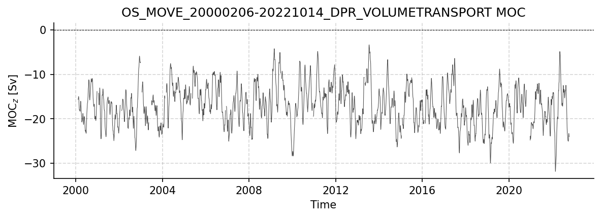
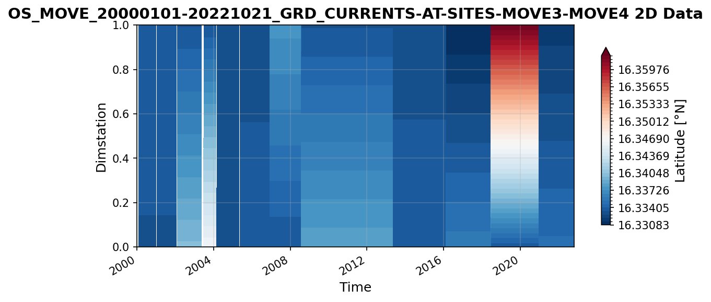
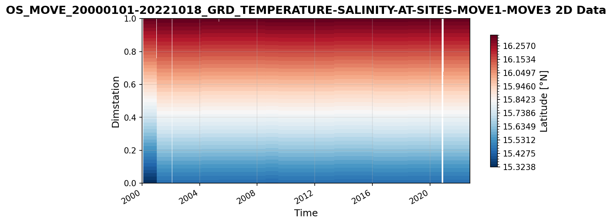

MOVE Dataset Report
===================

*Generated: 2026-02-07*

This report covers all available MOVE datasets.

----

OS_MOVE_20000206-20221014_DPR_VOLUMETRANSPORT.nc
------------------------------------------------

Dataset Overview
^^^^^^^^^^^^^^^^

- **Project**: Meridional Overturning Variability Experiment (MOVE)
- **Description**: MOVE transport estimates dataset from UCSD mooring project
- **DOI**: http://dx.doi.org/10.1016/j.dsr.2005.12.007 http://dx.doi.org/10.1029/2011GL049801
- **Source File**: OS_MOVE_20000206-20221014_DPR_VOLUMETRANSPORT.nc
- **Data Product**: MOVE transport time series (2000-2022)
- **Time Coverage**: 2000-02-06 to 2022-10-14
- **Record Length**: 4,144 observations (22.7 years)
- **Sampling Frequency**: 48.0H

**Citation:**

    Send, U., Lankhorst, M., Kanzow, T.: Observation of decadal change in the Atlantic Meridional Overturning Circulation using 10 years of continuous transport data. Geophysical Research Letters, Vol. 38, L24606, 2011. doi: http://doi.org/10.1029/2011GL049801.

Dataset Visualization
^^^^^^^^^^^^^^^^^^^^^

   Time series plot for OS_MOVE_20000206-20221014_DPR_VOLUMETRANSPORT dataset.

Dataset Statistics
^^^^^^^^^^^^^^^^^^

- **Total Variables**: 8
- **Total Coordinates**: 4
- **Dataset Size**: 0.16 MB

Coordinate Information
^^^^^^^^^^^^^^^^^^^^^^

The following table shows information about the dataset coordinates in the standardised version, including coordinate name remapping from the original, if any:

.. list-table::
   :widths: 14 14 14 14 14 14 14
   :header-rows: 1

   * - Coordinate
     - Description
     - Units
     - Size
     - Min Value
     - Max Value
     - Missing %
   * - *location_center_latitude* → **LATITUDE**
     - **Latitude**: Latitude north (WGS84)
     - degrees_north
     - ()
     - 16.04
     - 16.04
     - 0.0%
   * - *location_center_longitude* → **LONGITUDE**
     - **Longitude**: Longitude east (WGS84)
     - degrees_east
     - ()
     - -57.56
     - -57.56
     - 0.0%
   * - *location_center_vertical* → **PRESSURE**
     - No description available
     - dbar
     - ()
     - 2750.00
     - 2750.00
     - 0.0%
   * - **TIME**
     - Time
     - datetime64[ns]
     - (4164,)
     - NaT
     - NaT
     - 0.0%

Variable Information
^^^^^^^^^^^^^^^^^^^^

The following table shows the mapping from original variable names to standardized names,
along with key statistics for each variable.

.. list-table::
   :widths: 14 14 14 14 14 14 14
   :header-rows: 1

   * - Variable
     - Description
     - Units
     - Size
     - Min Value
     - Max Value
     - Missing %
   * - *TRANSPORT_TOTAL* → **MOC**
     - **MOC_z**: Ocean volume transport across the MOVE line
     - Sverdrup
     - (4164,)
     - -31.86
     - -3.34
     - 4.3%
   * - *transport_component_boundary* → **MOC_BOUNDARY**
     - **Boundary transport**: Boundary component of ocean volume transport across the MOVE line
     - Sverdrup
     - (4164,)
     - -10.98
     - 7.42
     - 1.6%
   * - *transport_component_internal* → **MOC_INTERNAL**
     - **Internal transport**: Internal component of ocean volume transport across the MOVE line
     - Sverdrup
     - (4164,)
     - -35.46
     - -3.76
     - 4.0%
   * - *transport_component_internal_offset* → **MOC_INTERNAL_OFFSET**
     - **Transport offset**: Offset to be added to internal component of ocean volume transport across the MOVE line
     - Sverdrup
     - (4164,)
     - 5.78
     - 5.78
     - 2.3%
   * - **location_geometry**
     - No description available
     - unknown
     - ()
     - 0.00
     - 0.00
     - 0.0%
   * - **location_vertices_latitude**
     - **Latitude of location vertices**: Latitude of location vertices for transport estimates across the MOVE line
     - degrees_north
     - (6,)
     - 15.45
     - 16.33
     - 0.0%
   * - **location_vertices_longitude**
     - **Longitude of location vertices**: Longitude of location vertices for transport estimates across the MOVE line
     - degrees_east
     - (6,)
     - -60.72
     - -51.51
     - 0.0%
   * - **location_vertices_vertical**
     - **Vertical coordinate of location vertices**: Vertical coordinate of location vertices for transport estimates across the MOVE line
     - dbar
     - (6,)
     - 1200.00
     - 4950.00
     - 0.0%

Metadata (edits applied noted)
^^^^^^^^^^^^^^^^^

The following metadata provides comprehensive information about this dataset:

- **Title**: Ocean Volume Transport across the MOVE Line at 16 N
- **Summary**: MOVE transport estimates dataset from UCSD mooring project
- **Description\***: MOVE transport estimates dataset from UCSD mooring project
- **Program\***: MOVE
- **Project**: Meridional Overturning Variability Experiment (MOVE)
- **Source**: Derived using the following files: OceanSITES file OS_MOVE_MULTISITE_GRIDDED_TS.nc, created 2019-01-30T18:11:12Z OceanSITES file OS_MOVE_MULTISITE_GRIDDED_V.nc, created 2019-01-17T00:40:57Z
- **License**: Data freely available. User assumes all risk for use of data. Please give due credit to the authors, project, and funding sources when using these data, e.g. by including the 'citation' text provided here.
- **Acknowledgment**: The MOVE project is made possible with funding from the NOAA Climate Program Office under award NA15OAR4320071 and carried out by principal investigators Uwe Send and Matthias Lankhorst. Initial funding came from the German Bundesministerium fuer Bildung und Forschung. MOVE data are made freely available through the international OceanSITES program.
- **Doi\***: http://dx.doi.org/10.1016/j.dsr.2005.12.007 http://dx.doi.org/10.1029/2011GL049801
- **References**: http://dx.doi.org/10.1016/j.dsr.2005.12.007 http://dx.doi.org/10.1029/2011GL049801
- **Weblink\***: https://mooring.ucsd.edu/move/
- **Platform**: mooring
- **Platform Vocabulary**: https://vocab.nerc.ac.uk/collection/L06/
- **Data Product\***: MOVE transport time series (2000-2022)
- **Time Coverage Start\***: 2000-02-06
- **Time Coverage End\***: 2022-10-14
- **Contributor Name**: Uwe Send, Matthias Lankhorst, Matthias Lankhorst
- **Contributor Role**: Principal Investigator, Creator
- **Contributor Email**: , , 
- **Contributor Id**: _, http://orcid.org/0000-0002-4166-4044, http://orcid.org/0000-0002-4166-4044
- **Contributing Institutions**: Scripps Institution of Oceanography
- **Contributing Institutions Vocabulary**: https://edmo.seadatanet.org/report/1390
- **Contributing Institutions Role**: 
- **Contributing Institutions Role Vocabulary**: 
- **Conventions**: CF-1.7, ACDD-1.3, OceanSITES-1.5
- **featureType**: timeSeries
- **featureType_vocabulary**: https://cfconventions.org/cf-conventions/v1.6.0/cf-conventions.html#_features_and_feature_types
- **Source File\***: OS_MOVE_20000206-20221014_DPR_VOLUMETRANSPORT.nc
- **Source Path\***: ~/AMOCatlas/data/OS_MOVE_20000206-20221014_DPR_VOLUMETRANSPORT.nc
- **Date Created**: 2019-01-30T18:13:16Z
- **Date Modified**: 2026-02-07T22:15:35Z
- **Processing Software**: http://github.com/AMOCcommunity/amocatlas
- **Processing Version**: v0.2.0
- **Processing Datasource\***: move16n
- **Variable Mapping\***: [Complex metadata structure - 7 items]
- **Original Variable Metadata\***: [Complex metadata structure - 7 items]
- **Applied Variable Mapping**: [Complex metadata structure - 7 items]

----

OS_MOVE_20000101-20221021_GRD_CURRENTS-AT-SITES-MOVE3-MOVE4.nc
--------------------------------------------------------------

Dataset Overview
^^^^^^^^^^^^^^^^

- **Project**: Meridional Overturning Variability Experiment (MOVE)
- **Description**: MOVE transport estimates dataset from UCSD mooring project
- **DOI**: http://dx.doi.org/10.1016/j.dsr.2005.12.007 http://dx.doi.org/10.1029/2011GL049801
- **Source File**: OS_MOVE_20000101-20221021_GRD_CURRENTS-AT-SITES-MOVE3-MOVE4.nc
- **Data Product**: MOVE gridded currents at sites MOVE3-MOVE4
- **Time Coverage**: 2000-01-01 to 2022-10-21
- **Record Length**: 8,330 observations (22.8 years)
- **Sampling Frequency**: daily

**Citation:**

    Send, U., Lankhorst, M., Kanzow, T.: Observation of decadal change in the Atlantic Meridional Overturning Circulation using 10 years of continuous transport data. Geophysical Research Letters, Vol. 38, L24606, 2011. doi: http://doi.org/10.1029/2011GL049801.

Dataset Visualization
^^^^^^^^^^^^^^^^^^^^^

   Time series plot for OS_MOVE_20000101-20221021_GRD_CURRENTS-AT-SITES-MOVE3-MOVE4 dataset.

Dataset Statistics
^^^^^^^^^^^^^^^^^^

- **Total Variables**: 6
- **Total Coordinates**: 4
- **Dataset Size**: 10.99 MB

Coordinate Information
^^^^^^^^^^^^^^^^^^^^^^

The following table shows information about the dataset coordinates in the standardised version, including coordinate name remapping from the original, if any:

.. list-table::
   :widths: 14 14 14 14 14 14 14
   :header-rows: 1

   * - Coordinate
     - Description
     - Units
     - Size
     - Min Value
     - Max Value
     - Missing %
   * - **LATITUDE**
     - **Latitude**: Latitude north (WGS84)
     - degrees_north
     - (2,)
     - 16.33
     - 16.34
     - 0.0%
   * - **LONGITUDE**
     - **Longitude**: Longitude east (WGS84)
     - degrees_east
     - (2,)
     - -60.61
     - -60.51
     - 0.0%
   * - **PRESSURE**
     - Sea water pressure due to sea water, i.e. air pressure removed
     - dbar
     - (38,)
     - 1250.00
     - 4950.00
     - 0.0%
   * - **TIME**
     - Time
     - datetime64[ns]
     - (8330,)
     - 2000-01-01
     - 2022-10-21
     - 0.0%

Variable Information
^^^^^^^^^^^^^^^^^^^^

The following table shows the mapping from original variable names to standardized names,
along with key statistics for each variable.

.. list-table::
   :widths: 14 14 14 14 14 14 14
   :header-rows: 1

   * - Variable
     - Description
     - Units
     - Size
     - Min Value
     - Max Value
     - Missing %
   * - *instrument_depth_time_varying* → **DEPTH**
     - **Depth**: Depth of velocity measurements at MOVE sites MOVE3-MOVE4
     - meters
     - (2, 8330, 8)
     - 160.17
     - 4970.03
     - 1.2%
   * - *latitude_time_varying* → **LATITUDE_VARYING**
     - **Latitude**: Latitude of site, including differences between deployments
     - degrees_north
     - (2, 8330)
     - 16.33
     - 16.36
     - 1.1%
   * - *longitude_time_varying* → **LONGITUDE_VARYING**
     - **Longitude**: Longitude of site, including differences between deployments
     - degrees_east
     - (2, 8330)
     - -60.61
     - -60.49
     - 1.1%
   * - *VELOCITY_U* → **UCUR**
     - **Zonal velocity**: Zonal velocity at MOVE sites MOVE3-MOVE4
     - m s-1
     - (2, 8330, 38)
     - -0.31
     - 0.41
     - 1.2%
   * - *VELOCITY_V* → **VCUR**
     - **Meridional velocity**: Meridional velocity at MOVE sites MOVE3-MOVE4
     - m s-1
     - (2, 8330, 38)
     - -0.56
     - 0.35
     - 1.2%
   * - **platform_name**
     - Official OceanSITES platform names
     - unknown
     - (5, 2)
     - N/A
     - N/A
     - 0.0%

Metadata (edits applied noted)
^^^^^^^^^^^^^^^^^

The following metadata provides comprehensive information about this dataset:

- **Title**: Gridded Velocity Data from the MOVE Moorings
- **Summary**: MOVE transport estimates dataset from UCSD mooring project
- **Description\***: MOVE transport estimates dataset from UCSD mooring project
- **Program\***: MOVE
- **Project**: Meridional Overturning Variability Experiment (MOVE)
- **Source**: Derived using the following files: OceanSITES file OS_MOVE_MULTISITE_GRIDDED_TS.nc, created 2019-01-30T18:11:12Z OceanSITES file OS_MOVE_MULTISITE_GRIDDED_V.nc, created 2019-01-17T00:40:57Z
- **Id**: OS_MOVE_20000101-20221021_GRD_CURRENTS-AT-SITES-MOVE3-MOVE4
- **Naming Authority**: OceanSITES
- **License**: Data freely available. User assumes all risk for use of data. Please give due credit to the authors, project, and funding sources when using these data, e.g. by including the 'citation' text provided here.
- **Acknowledgment**: The MOVE project is made possible with funding from the NOAA Climate Program Office under award NA15OAR4320071 and carried out by principal investigators Uwe Send and Matthias Lankhorst. Initial funding came from the German Bundesministerium fuer Bildung und Forschung. MOVE data are made freely available through the international OceanSITES program.
- **Doi\***: http://dx.doi.org/10.1016/j.dsr.2005.12.007 http://dx.doi.org/10.1029/2011GL049801
- **References**: http://dx.doi.org/10.1016/j.dsr.2005.12.007 http://dx.doi.org/10.1029/2011GL049801
- **Weblink\***: https://mooring.ucsd.edu/move/
- **Platform**: mooring
- **Platform Vocabulary**: https://vocab.nerc.ac.uk/collection/L06/
- **Data Product\***: MOVE gridded currents at sites MOVE3-MOVE4
- **Time Coverage Start**: 2000-01-01
- **Time Coverage End**: 2022-10-21
- **Geospatial Lat Min**: 16.330833435058594
- **Geospatial Lat Max**: 16.362333333333336
- **Geospatial Lon Min**: -60.61249923706055
- **Geospatial Lon Max**: -60.494327545166016
- **Geospatial Vertical Min**: 1250.0
- **Geospatial Vertical Max**: 4950.0
- **Contributor Name**: Uwe Send, Matthias Lankhorst, Matthias Lankhorst
- **Contributor Role**: Principal Investigator, Creator
- **Contributor Email**: , , 
- **Contributor Id**: _, http://orcid.org/0000-0002-4166-4044, http://orcid.org/0000-0002-4166-4044
- **Contributing Institutions**: Scripps Institution of Oceanography
- **Contributing Institutions Vocabulary**: https://edmo.seadatanet.org/report/1390
- **Contributing Institutions Role**: 
- **Contributing Institutions Role Vocabulary**: 
- **Conventions**: CF-1.7, ACDD-1.3, OceanSITES-1.5
- **featureType**: timeSeries
- **featureType_vocabulary**: https://cfconventions.org/cf-conventions/v1.6.0/cf-conventions.html#_features_and_feature_types
- **Data Type**: OceanSITES time-series data
- **Source File\***: OS_MOVE_20000101-20221021_GRD_CURRENTS-AT-SITES-MOVE3-MOVE4.nc
- **Source Path\***: ~/AMOCatlas/data/OS_MOVE_20000101-20221021_GRD_CURRENTS-AT-SITES-MOVE3-MOVE4.nc
- **Date Created**: 2019-01-30T18:13:16Z
- **Date Modified**: 2026-02-07T22:15:35Z
- **Processing Software**: http://github.com/AMOCcommunity/amocatlas
- **Processing Version**: v0.2.0
- **Processing Datasource\***: move16n
- **Format Version**: 1.5
- **Variable Mapping\***: {'VELOCITY_U': 'UCUR', 'VELOCITY_V': 'VCUR', 'instrument_depth_time_varying': 'DEPTH', 'latitude_time_varying': 'LATITUDE_VARYING', 'longitude_time_varying': 'LONGITUDE_VARYING'}
- **Original Variable Metadata\***: [Complex metadata structure - 5 items]
- **Applied Variable Mapping**: {'VELOCITY_U': 'UCUR', 'VELOCITY_V': 'VCUR', 'instrument_depth_time_varying': 'DEPTH', 'latitude_time_varying': 'LATITUDE_VARYING', 'longitude_time_varying': 'LONGITUDE_VARYING'}
- **Update Interval**: void
- **Qc Indicator**: excellent
- **Area**: Tropical Atlantic Ocean
- **Geospatial Vertical Positive**: down
- **Geospatial Vertical Units**: dbar

----

OS_MOVE_20000101-20221018_GRD_TEMPERATURE-SALINITY-AT-SITES-MOVE1-MOVE3.nc
--------------------------------------------------------------------------

Dataset Overview
^^^^^^^^^^^^^^^^

- **Project**: Meridional Overturning Variability Experiment (MOVE)
- **Description**: MOVE transport estimates dataset from UCSD mooring project
- **DOI**: http://dx.doi.org/10.1016/j.dsr.2005.12.007 http://dx.doi.org/10.1029/2011GL049801
- **Source File**: OS_MOVE_20000101-20221018_GRD_TEMPERATURE-SALINITY-AT-SITES-MOVE1-MOVE3.nc
- **Data Product**: MOVE gridded temperature and salinity at sites MOVE1-MOVE3
- **Time Coverage**: 2000-01-01 to 2022-10-18
- **Record Length**: 4,164 observations (22.8 years)
- **Sampling Frequency**: 48.0H

**Citation:**

    Send, U., Lankhorst, M., Kanzow, T.: Observation of decadal change in the Atlantic Meridional Overturning Circulation using 10 years of continuous transport data. Geophysical Research Letters, Vol. 38, L24606, 2011. doi: http://doi.org/10.1029/2011GL049801.

Dataset Visualization
^^^^^^^^^^^^^^^^^^^^^

   Time series plot for OS_MOVE_20000101-20221018_GRD_TEMPERATURE-SALINITY-AT-SITES-MOVE1-MOVE3 dataset.

Dataset Statistics
^^^^^^^^^^^^^^^^^^

- **Total Variables**: 6
- **Total Coordinates**: 4
- **Dataset Size**: 14.14 MB

Coordinate Information
^^^^^^^^^^^^^^^^^^^^^^

The following table shows information about the dataset coordinates in the standardised version, including coordinate name remapping from the original, if any:

.. list-table::
   :widths: 14 14 14 14 14 14 14
   :header-rows: 1

   * - Coordinate
     - Description
     - Units
     - Size
     - Min Value
     - Max Value
     - Missing %
   * - **LATITUDE**
     - **Latitude**: Latitude north (WGS84)
     - degrees_north
     - (2,)
     - 15.45
     - 16.34
     - 0.0%
   * - **LONGITUDE**
     - **Longitude**: Longitude east (WGS84)
     - degrees_east
     - (2,)
     - -60.51
     - -51.51
     - 0.0%
   * - **PRESSURE**
     - Sea water pressure due to sea water, i.e. air pressure removed
     - dbar
     - (99,)
     - 50.00
     - 4950.00
     - 0.0%
   * - **TIME**
     - Time
     - datetime64[ns]
     - (4164,)
     - 2000-01-01
     - 2022-10-18
     - 0.0%

Variable Information
^^^^^^^^^^^^^^^^^^^^

The following table shows the mapping from original variable names to standardized names,
along with key statistics for each variable.

.. list-table::
   :widths: 14 14 14 14 14 14 14
   :header-rows: 1

   * - Variable
     - Description
     - Units
     - Size
     - Min Value
     - Max Value
     - Missing %
   * - *instrument_depth_time_varying* → **DEPTH**
     - **Depth**: Depth of temperature and salinity measurements at MOVE sites MOVE1-MOVE3
     - meters
     - (2, 4164, 22)
     - 4.97
     - 5312.91
     - 0.6%
   * - *latitude_time_varying* → **LATITUDE_VARYING**
     - **Latitude**: Latitude of site, including differences between deployments
     - degrees_north
     - (2, 4164)
     - 15.32
     - 16.34
     - 0.6%
   * - *longitude_time_varying* → **LONGITUDE_VARYING**
     - **Longitude**: Longitude of site, including differences between deployments
     - degrees_east
     - (2, 4164)
     - -60.52
     - -51.50
     - 0.6%
   * - *SALINITY* → **PSAL**
     - **Salinity**: Salinity at MOVE sites MOVE1-MOVE3
     - PSU
     - (2, 4164, 99)
     - 33.88
     - 37.48
     - 0.6%
   * - *TEMPERATURE* → **TEMP**
     - **Temperature (ITS-90)**: Temperature at MOVE sites MOVE1-MOVE3 (ITS-90)
     - degrees_Celsius
     - (2, 4164, 99)
     - 1.84
     - 29.26
     - 0.6%
   * - **platform_name**
     - Official OceanSITES platform name
     - unknown
     - (5, 2)
     - N/A
     - N/A
     - 0.0%

Metadata (edits applied noted)
^^^^^^^^^^^^^^^^^

The following metadata provides comprehensive information about this dataset:

- **Title**: Gridded Temperature and Salinity Data from the MOVE Moorings
- **Summary**: MOVE transport estimates dataset from UCSD mooring project
- **Description\***: MOVE transport estimates dataset from UCSD mooring project
- **Program\***: MOVE
- **Project**: Meridional Overturning Variability Experiment (MOVE)
- **Source**: Derived using the following files: OceanSITES file OS_MOVE_MULTISITE_GRIDDED_TS.nc, created 2019-01-30T18:11:12Z OceanSITES file OS_MOVE_MULTISITE_GRIDDED_V.nc, created 2019-01-17T00:40:57Z
- **Id**: OS_MOVE_20000101-20221018_GRD_TEMPERATURE-SALINITY-AT-SITES-MOVE1-MOVE3
- **Naming Authority**: OceanSITES
- **License**: Data freely available. User assumes all risk for use of data. Please give due credit to the authors, project, and funding sources when using these data, e.g. by including the 'citation' text provided here.
- **Acknowledgment**: The MOVE project is made possible with funding from the NOAA Climate Program Office under award NA15OAR4320071 and carried out by principal investigators Uwe Send and Matthias Lankhorst. Initial funding came from the German Bundesministerium fuer Bildung und Forschung. MOVE data are made freely available through the international OceanSITES program.
- **Doi\***: http://dx.doi.org/10.1016/j.dsr.2005.12.007 http://dx.doi.org/10.1029/2011GL049801
- **References**: http://dx.doi.org/10.1016/j.dsr.2005.12.007 http://dx.doi.org/10.1029/2011GL049801
- **Weblink\***: https://mooring.ucsd.edu/move/
- **Platform**: mooring
- **Platform Vocabulary**: https://vocab.nerc.ac.uk/collection/L06/
- **Data Product\***: MOVE gridded temperature and salinity at sites MOVE1-MOVE3
- **Time Coverage Start**: 2000-01-01
- **Time Coverage End**: 2022-10-18
- **Geospatial Lat Min**: 15.323833333333333
- **Geospatial Lat Max**: 16.34
- **Geospatial Lon Min**: -60.516666666666666
- **Geospatial Lon Max**: -51.5
- **Geospatial Vertical Min**: 50.0
- **Geospatial Vertical Max**: 4950.0
- **Contributor Name**: Uwe Send, Matthias Lankhorst, Matthias Lankhorst
- **Contributor Role**: Principal Investigator, Creator
- **Contributor Email**: , , 
- **Contributor Id**: _, http://orcid.org/0000-0002-4166-4044, http://orcid.org/0000-0002-4166-4044
- **Contributing Institutions**: Scripps Institution of Oceanography
- **Contributing Institutions Vocabulary**: https://edmo.seadatanet.org/report/1390
- **Contributing Institutions Role**: 
- **Contributing Institutions Role Vocabulary**: 
- **Conventions**: CF-1.7, ACDD-1.3, OceanSITES-1.5
- **featureType**: timeSeries
- **featureType_vocabulary**: https://cfconventions.org/cf-conventions/v1.6.0/cf-conventions.html#_features_and_feature_types
- **Data Type**: OceanSITES time-series data
- **Source File\***: OS_MOVE_20000101-20221018_GRD_TEMPERATURE-SALINITY-AT-SITES-MOVE1-MOVE3.nc
- **Source Path\***: ~/AMOCatlas/data/OS_MOVE_20000101-20221018_GRD_TEMPERATURE-SALINITY-AT-SITES-MOVE1-MOVE3.nc
- **Date Created**: 2019-01-30T18:13:16Z
- **Date Modified**: 2026-02-07T22:15:35Z
- **Processing Software**: http://github.com/AMOCcommunity/amocatlas
- **Processing Version**: v0.2.0
- **Processing Datasource\***: move16n
- **Format Version**: 1.5
- **Variable Mapping\***: {'TEMPERATURE': 'TEMP', 'SALINITY': 'PSAL', 'instrument_depth_time_varying': 'DEPTH', 'latitude_time_varying': 'LATITUDE_VARYING', 'longitude_time_varying': 'LONGITUDE_VARYING'}
- **Original Variable Metadata\***: [Complex metadata structure - 5 items]
- **Applied Variable Mapping**: {'TEMPERATURE': 'TEMP', 'SALINITY': 'PSAL', 'instrument_depth_time_varying': 'DEPTH', 'latitude_time_varying': 'LATITUDE_VARYING', 'longitude_time_varying': 'LONGITUDE_VARYING'}
- **Update Interval**: void
- **Qc Indicator**: excellent
- **Area**: Tropical Atlantic Ocean
- **Geospatial Vertical Positive**: down
- **Geospatial Vertical Units**: dbar
