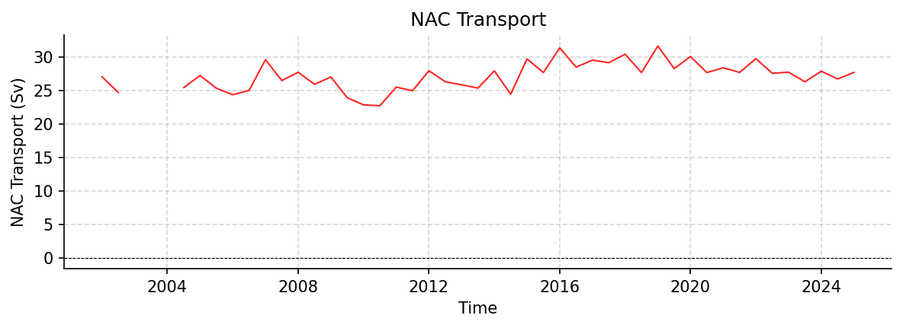

NAC Datasets
============

----

_2_1.nc
-------

Dataset Overview
^^^^^^^^^^^^^^^^

- **Project**: Lankhorst, Matthias (2025). North Atlantic Current Time Series from Satellite and Float Observations (1993-2025).
- **Description**: North Atlantic Current Time Series from Satellite and Float Observations (1993-2025)
- **Source File**: _2_1.nc
- **Data Product**: 6-monthly mean NAC transport time series (1993-2025) estimated from satellite and float observations
- **License**: https://creativecommons.org/licenses/by/4.0/
- **Date Created**: 2025-10-07T00:00:00Z
- **Time Coverage**: 1993-01-01 to 2025-07-02
- **Record Length**: 66 observations (32.5 years)
- **Sampling Frequency**: 6-monthly

**Citation:**

    Lankhorst, Matthias (2025). North Atlantic Current Time Series from Satellite and Float Observations (1993-2025). In North Atlantic Current Time Series from Satellite and Float Observations. UC San Diego Library Digital Collections. https://doi.org/10.6075/J0D79CCG

**Acknowledgement:**

    Earlier versions of this dataset were created with support from the European Commission through awards EVK2-CT-2000-00087 and EVR1-CT-2001-40014 (projects 'GYROSCOPE' and 'ANIMATE'). Updated versions were partially supported through award NA15OAR4320071 from U.S. NOAA OOMD.

Dataset Visualization
^^^^^^^^^^^^^^^^^^^^^

   Time series plot for NAC dataset.

Dataset Statistics
^^^^^^^^^^^^^^^^^^

- **Total Variables**: 8
- **Total Coordinates**: 4
- **Dataset Size**: 0.00 MB

Coordinate Information
^^^^^^^^^^^^^^^^^^^^^^

The following table shows information about the dataset coordinates in the standardised version, including coordinate name remapping from the original, if any:

.. list-table::
   :widths: 14 14 14 14 14 14 14
   :header-rows: 1

   * - Coordinate
     - Description
     - Units
     - Size
     - Min Value
     - Max Value
     - Missing %
   * - **DEPTH_SECTION_MIDPOINT**
     - No description available
     - m
     - (1,)
     - 494.90
     - 494.90
     - 0.0%
   * - **LATITUDE_SECTION_MIDPOINT**
     - No description available
     - degree_north
     - (1,)
     - 54.90
     - 54.90
     - 0.0%
   * - **LONGITUDE_SECTION_MIDPOINT**
     - No description available
     - degree_east
     - (1,)
     - -26.56
     - -26.56
     - 0.0%
   * - **TIME**
     - Time
     - datetime64[ns]
     - (66,)
     - 1993-01-01
     - 2025-07-02
     - 0.0%

Variable Information
^^^^^^^^^^^^^^^^^^^^

The following table shows the mapping from original variable names to standardized names,
along with key statistics for each variable.

.. list-table::
   :widths: 14 14 14 14 14 14 14
   :header-rows: 1

   * - Variable
     - Description
     - Units
     - Size
     - Min Value
     - Max Value
     - Missing %
   * - **GEOMETRY**
     - No description available
     - unknown
     - ()
     - 0.00
     - 0.00
     - 0.0%
   * - **GEOMETRY_NODES_DEPTH**
     - No description available
     - m
     - (4,)
     - 0.00
     - 988.61
     - 0.0%
   * - **GEOMETRY_NODES_LATITUDE**
     - No description available
     - degree_north
     - (4,)
     - 49.00
     - 59.70
     - 0.0%
   * - **GEOMETRY_NODES_LONGITUDE**
     - No description available
     - degree_east
     - (4,)
     - -39.70
     - -16.50
     - 0.0%
   * - **GEOMETRY_NODE_COUNT**
     - No description available
     - unknown
     - (1,)
     - 4.00
     - 4.00
     - 0.0%
   * - *NAC* → **TRANS_NAC**
     - **NAC Transport**: North Atlantic Current transport time series from satellite and float observations
     - Sverdrup
     - (66, 1)
     - 22.74
     - 31.65
     - 33.3%
   * - *NAC_PROXY* → **TRANS_NAC_PROXY**
     - **NAC Transport Proxy**: Proxy for North Atlantic Current transport time series from satellite altimetry
     - Sverdrup
     - (66, 1)
     - 23.30
     - 30.63
     - 0.0%
   * - *NAC_UNCERTAINTY* → **TRANS_NAC_UNCERTAINTY**
     - **Uncertainty of values in NAC variable**: Uncertainty of North Atlantic Current transport time series
     - Sverdrup
     - (66, 1)
     - 1.47
     - 2.17
     - 33.3%

Metadata (edits applied noted)
^^^^^^^^^^^^^^^^^

The following metadata provides comprehensive information about this dataset:

- **Title**: North Atlantic Current Time Series from Satellite and Float Observations
- **Summary**: The North Atlantic Current (NAC) is the continuation of the Gulf Stream on its path towards Europe. Here, a time series of its strength is reported that is calculated from two observational datasets: One is the sea surface height from satellite altimetry, the other consists of watercolumn temperature and salinity profiles from Argo floats. The NAC flow is given as the total volume transport of water in a depth layer defined by pressure ranges of 0 - 1000 dbar, across a section that spans from a site in the Central Irminger Sea (CIS) to another in the Porcupine Abyssal Plain (PAP) area. Uncertainty estimates of the flow are included, as is a proxy time series of longer duration that is estimated from satellite data alone. The corresponding variables in this file are NAC and NAC_UNCERTAINTY for the main volume transport time series and its uncertainy, and NAC_PROXY for the satellite-only time series. The methodology is described in a publication by Lankhorst and Send (Progress in Oceanography, 2020; see 'references'); the data here represent an updated version of what is shown in figure 6a of this publication.
- **Description\***: North Atlantic Current Time Series from Satellite and Float Observations (1993-2025)
- **Program\***: NAC
- **Project\***: Lankhorst, Matthias (2025). North Atlantic Current Time Series from Satellite and Float Observations (1993-2025).
- **License**: https://creativecommons.org/licenses/by/4.0/
- **Acknowledgment\***: Earlier versions of this dataset were created with support from the European Commission through awards EVK2-CT-2000-00087 and EVR1-CT-2001-40014 (projects 'GYROSCOPE' and 'ANIMATE'). Updated versions were partially supported through award NA15OAR4320071 from U.S. NOAA OOMD.
- **References**: https://doi.org/10.1016/j.pocean.2020.102402 https://doi.org/10.21941/E8RT-MQ80 https://doi.org/10.48670/moi-00148 https://doi.org/10.48670/moi-00149 https://doi.org/10.48670/moi-00150 https://doi.org/10.17882/42182#121877
- **Weblink\***: https://library.ucsd.edu/dc/object/bb6635909m
- **Data Product\***: 6-monthly mean NAC transport time series (1993-2025) estimated from satellite and float observations
- **Time Coverage Start**: 1993-01-01
- **Time Coverage End**: 2025-07-02
- **Geospatial Lat Min**: 49.0
- **Geospatial Lat Max**: 59.7
- **Geospatial Lon Min**: -39.7
- **Geospatial Lon Max**: -16.5
- **Geospatial Vertical Min**: 0.0
- **Geospatial Vertical Max**: 1000.0
- **Contributor Name**: Matthias Lankhorst
- **Contributor Role**: originator
- **Contributor Role Vocabulary**: https://vocab.nerc.ac.uk/collection/G04/current/
- **Contributor Email**: 
- **Contributor Id**: https://orcid.org/0000-0002-4166-4044
- **Contributing Institutions**: Scripps Institution of Oceanography
- **Contributing Institutions Vocabulary**: https://edmo.seadatanet.org/report/1390
- **Contributing Institutions Role**: 
- **Conventions**: CF-1.12, ACDD-1.3, OceanSITES-1.5
- **Standard Name Vocabulary**: CF Standard Name Table v92
- **featureType\***: timeSeries
- **featureType_vocabulary**: https://cfconventions.org/cf-conventions/v1.6.0/cf-conventions.html#_features_and_feature_types
- **Source File\***: _2_1.nc
- **Source Path\***: ~/AMOCatlas/data/_2_1.nc
- **Source Url\***: https://library.ucsd.edu/dc/object/bb6635909m/
- **Date Created**: 2025-10-07T00:00:00Z
- **Date Modified**: 2026-06-01T00:00:00Z
- **Processing Software**: http://github.com/AMOCcommunity/amocatlas
- **Processing Version**: v0.0.4
- **Processing Datasource\***: nac
- **Variable Mapping\***: {'NAC': 'TRANS_NAC', 'NAC_UNCERTAINTY': 'TRANS_NAC_UNCERTAINTY', 'NAC_PROXY': 'TRANS_NAC_PROXY'}
- **Original Variable Metadata\***: [Complex metadata structure - 3 items]
- **Applied Variable Mapping**: {'NAC': 'TRANS_NAC', 'NAC_UNCERTAINTY': 'TRANS_NAC_UNCERTAINTY', 'NAC_PROXY': 'TRANS_NAC_PROXY'}
- **Keywords**: geostrophic current, North Atlantic Current, altimetry, Argo, Irminger Sea, Porcupine Abyssal Plain
- **Geospatial Vertical Units**: dbar
- **Geospatial Vertical Positive**: down
