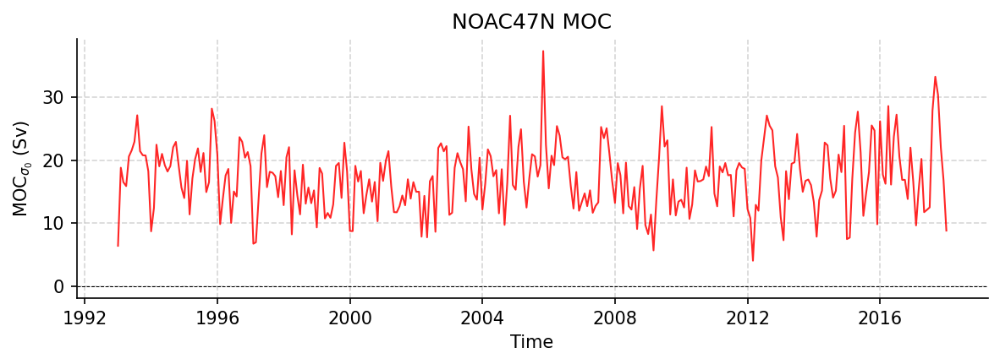

NOAC47N Datasets
================

----

NOAC_AMOC.tab
-------------

Dataset Overview
^^^^^^^^^^^^^^^^

- **Project**: Meridional Connectivity of a 25-Year Observational AMOC Record at 47°N
- **Description**: No description available
- **Source File**: NOAC_AMOC.tab
- **Data Product**: Basin-wide AMOC volume transport from the NOAC array at 47°N in the subpolar North Atlantic (1993-2018)
- **License**: CC-BY-4.0
- **Time Coverage**: 1993-01-01 to 2018-01-01
- **Record Length**: 301 observations (25.0 years)
- **Sampling Frequency**: monthly

**Citation:**

    Wett, Simon; Rhein, Monika; Kieke, Dagmar; Mertens, Christian; Moritz, Martin; Nowitzki, Hannah (2023): Basin-wide AMOC volume transport from the NOAC array at 47°N in the subpolar North Atlantic (1993-2018) [dataset]. PANGAEA, https://doi.org/10.1594/PANGAEA.959558

Dataset Visualization
^^^^^^^^^^^^^^^^^^^^^

   Time series plot for NOAC47N dataset.

Dataset Statistics
^^^^^^^^^^^^^^^^^^

- **Total Variables**: 2
- **Total Coordinates**: 1
- **Dataset Size**: 0.01 MB

Coordinate Information
^^^^^^^^^^^^^^^^^^^^^^

The following table shows information about the dataset coordinates in the standardised version, including coordinate name remapping from the original, if any:

.. list-table::
   :widths: 14 14 14 14 14 14 14
   :header-rows: 1

   * - Coordinate
     - Description
     - Units
     - Size
     - Min Value
     - Max Value
     - Missing %
   * - **TIME**
     - Time
     - datetime64[ns]
     - (301,)
     - 1993-01-01
     - 2018-01-01
     - 0.0%

Variable Information
^^^^^^^^^^^^^^^^^^^^

The following table shows the mapping from original variable names to standardized names,
along with key statistics for each variable.

.. list-table::
   :widths: 14 14 14 14 14 14 14
   :header-rows: 1

   * - Variable
     - Description
     - Units
     - Size
     - Min Value
     - Max Value
     - Missing %
   * - *Trans vol [Sv]* → **MOC_SIGMA0**
     - **MOC_sigma0**: AMOC volume transport at 47N
     - Sverdrup
     - (301,)
     - 4.08
     - 37.33
     - 0.0%
   * - *Trans vol [Sv].1* → **MOC_SIGMA0_LPF**
     - **MOC_sigma0 (filtered)**: AMOC volume transport at 47N, low-pass filtered
     - Sverdrup
     - (301,)
     - 13.85
     - 21.50
     - 0.0%

Metadata (edits applied noted)
^^^^^^^^^^^^^^^^^

The following metadata provides comprehensive information about this dataset:

- **Program\***: NOAC 47N array
- **Project\***: Meridional Connectivity of a 25-Year Observational AMOC Record at 47°N
- **License\***: CC-BY-4.0
- **References\***: Wett, S., Rhein, M., Kieke, D., Mertens, C., & Moritz, M. (2023). Meridional connectivity of a 25-year observational AMOC record at 47°N. Geophysical Research Letters, 50, e2023GL103284. https://doi.org/10.1029/2023GL103284
- **Weblink\***: https://doi.pangaea.de/10.1594/PANGAEA.959558
- **Data Product\***: Basin-wide AMOC volume transport from the NOAC array at 47°N in the subpolar North Atlantic (1993-2018)
- **Time Coverage Start\***: 1993-01-01
- **Time Coverage End\***: 2018-01-01
- **Contributor Name\***: Simon Wett, Monika Rhein
- **Contributor Role\***: originator, principalInvestigator
- **Contributor Role Vocabulary\***: https://vocab.nerc.ac.uk/collection/G04/current/
- **Contributor Email**: , 
- **Contributor Id\***: https://orcid.org/0000-0003-3876-2206, https://orcid.org/0000-0003-1496-2828
- **Contributing Institutions**: 
- **Contributing Institutions Vocabulary**: 
- **Contributing Institutions Role**: 
- **Conventions**: CF-1.8, ACDD-1.3, OceanSITES-1.5
- **featureType\***: timeSeries
- **featureType_vocabulary**: https://cfconventions.org/cf-conventions/v1.6.0/cf-conventions.html#_features_and_feature_types
- **Source File\***: NOAC_AMOC.tab
- **Source Path\***: ~/AMOCatlas/data/NOAC_AMOC.tab
- **Source Url\***: https://doi.pangaea.de/10.1594/PANGAEA.959558
- **Date Modified**: 2026-02-01T00:00:00Z
- **Processing Software**: http://github.com/AMOCcommunity/amocatlas
- **Processing Version**: v0.3.0
- **Processing Datasource\***: noac47n
- **Variable Mapping\***: {'Trans vol [Sv]': 'MOC_SIGMA0', 'Trans vol [Sv].1': 'MOC_SIGMA0_LPF'}
- **Original Variable Metadata\***: [Complex metadata structure - 2 items]
- **Applied Variable Mapping**: {'Trans vol [Sv]': 'MOC_SIGMA0', 'Trans vol [Sv].1': 'MOC_SIGMA0_LPF'}
- **Comment\***: (Note: date_modified has been set to a canonical value for documentation generation to avoid git churn)
