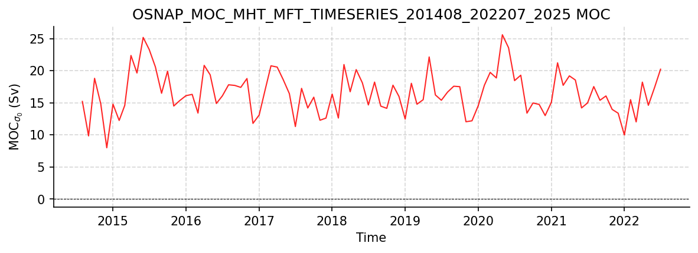
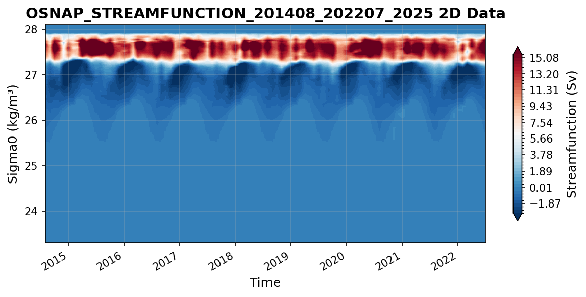

OSNAP Datasets
==============

This report covers all available OSNAP datasets.

----

OSNAP_MOC_MHT_MFT_TimeSeries_201408_202207_2025.nc
--------------------------------------------------

Dataset Overview
^^^^^^^^^^^^^^^^

- **Project**: Overturning in the Subpolar North Atlantic Program (OSNAP)
- **Description**: OSNAP transport and hydrographic estimates dataset, 2014-2020
- **DOI**: https://doi.org/10.35090/gatech/70342
- **Source File**: OSNAP_MOC_MHT_MFT_TimeSeries_201408_202207_2025.nc
- **Data Product**: Time series of MOC, MHT, and MFT (2014-2022)
- **License**: CC-BY-4.0
- **Date Created**: 2025-05-21T15:09:24Z
- **Time Coverage**: 2014-08-01 to 2022-07-01
- **Record Length**: 96 observations (7.9 years)
- **Sampling Frequency**: monthly

**Distribution Statement:**

    Any person making use of OSNAP observational data and/or numerical results must communicate with the responsible investigators at the start of the analysis and anticipate that the data collectors will be co-authors of published results. In cases where investigators choose not to be co-authors on publications that rely on their data, the parties responsible for collecting the data and the sponsoring funding agencies should be acknowledged, including reference to any relevant publications by the originating authors describing the data sets and a reference to the data set itself using its DOI. OSNAP data are intended for scholarly use by the academic and scientific community, with the express understanding that any such use will properly acknowledge the originating investigator.

**Citation:**

    Fu, Y., Lozier, M. S., Bower, A., Burmeister, K., Carrilho Biló, T., Cyr, F., et al. (2025). Characterizing the interannual variability of North Atlantic subpolar overturning. Geophysical Research Letters, 52, e2025GL114672. https://doi.org/10.1029/2025GL114672

**Acknowledgement:**

    OSNAP data were collected and made freely available by the OSNAP (Overturning in the Subpolar North Atlantic Program) project and all the national programs that contribute to it (www.o-snap.org).

Dataset Visualization
^^^^^^^^^^^^^^^^^^^^^

   Time series plot for OSNAP_MOC_MHT_MFT_TIMESERIES_201408_202207_2025 dataset.

Dataset Statistics
^^^^^^^^^^^^^^^^^^

- **Total Variables**: 18
- **Total Coordinates**: 1
- **Dataset Size**: 0.01 MB

Coordinate Information
^^^^^^^^^^^^^^^^^^^^^^

The following table shows information about the dataset coordinates in the standardised version, including coordinate name remapping from the original, if any:

.. list-table::
   :widths: 14 14 14 14 14 14 14
   :header-rows: 1

   * - Coordinate
     - Description
     - Units
     - Size
     - Min Value
     - Max Value
     - Missing %
   * - **TIME**
     - **Time**: Time in days since 1950-01-01
     - seconds since 1970-01-01T00:00:00Z
     - (96,)
     - 2014-08-01
     - 2022-07-01
     - 0.0%

Variable Information
^^^^^^^^^^^^^^^^^^^^

The following table shows the mapping from original variable names to standardized names,
along with key statistics for each variable.

.. list-table::
   :widths: 14 14 14 14 14 14 14
   :header-rows: 1

   * - Variable
     - Description
     - Units
     - Size
     - Min Value
     - Max Value
     - Missing %
   * - *MFT_ALL* → **MFT**
     - Meridional freshwater transport across the full OSNAP array
     - Sverdrup
     - (96,)
     - -0.48
     - -0.23
     - 0.0%
   * - **MFT_EAST**
     - **MFTeast**: Meridional freshwater transport across OSNAP East
     - Sverdrup
     - (96,)
     - -0.28
     - -0.09
     - 0.0%
   * - **MFT_EAST_ERR**
     - **MFTeast error**: Uncertainty in MFT_EAST
     - Sverdrup
     - (96,)
     - 0.03
     - 0.07
     - 0.0%
   * - *MFT_ALL_ERR* → **MFT_ERR**
     - **MFT error**: Uncertainty in MFT
     - Sverdrup
     - (96,)
     - 0.04
     - 0.08
     - 0.0%
   * - **MFT_WEST**
     - **MFTwest**: Meridional freshwater transport across OSNAP West
     - Sverdrup
     - (96,)
     - -0.24
     - -0.08
     - 0.0%
   * - **MFT_WEST_ERR**
     - **MFTwest error**: Uncertainty in MFT_WEST
     - Sverdrup
     - (96,)
     - 0.01
     - 0.04
     - 0.0%
   * - *MHT_ALL* → **MHT**
     - **MHT**: Meridional heat transport across full OSNAP array
     - PW
     - (96,)
     - 0.35
     - 0.64
     - 0.0%
   * - **MHT_EAST**
     - **MHT east**: Meridional heat transport across OSNAP East
     - PW
     - (96,)
     - 0.28
     - 0.57
     - 0.0%
   * - **MHT_EAST_ERR**
     - **MHT east uncertainty**: Uncertainty in MHT_EAST
     - PW
     - (96,)
     - 0.07
     - 0.15
     - 0.0%
   * - *MHT_ALL_ERR* → **MHT_ERR**
     - **MHT uncertainty**: Uncertainty in MHT
     - PW
     - (96,)
     - 0.07
     - 0.15
     - 0.0%
   * - **MHT_WEST**
     - **MHT west**: Meridional heat transport across OSNAP West
     - PW
     - (96,)
     - 0.03
     - 0.13
     - 0.0%
   * - **MHT_WEST_ERR**
     - **MHT west uncertainty**: Uncertainty in MHT_WEST
     - PW
     - (96,)
     - 0.01
     - 0.02
     - 0.0%
   * - *MOC_EAST* → **MOC_EAST_SIGMA0**
     - **Eastern MOC_sigma0**: Maximum overturning streamfunction across OSNAP East
     - Sverdrup
     - (96,)
     - 10.36
     - 23.66
     - 0.0%
   * - *MOC_EAST_ERR* → **MOC_EAST_SIGMA0_ERR**
     - **Eastern MOC_sigma0 uncertainty**: Uncertainty in MOC_SIGMA0_EAST
     - Sverdrup
     - (96,)
     - 2.33
     - 5.68
     - 0.0%
   * - *MOC_ALL* → **MOC_SIGMA0**
     - **MOC_sigma0**: Maximum overturning streamfunction across full OSNAP array
     - Sverdrup
     - (96,)
     - 7.98
     - 25.59
     - 0.0%
   * - *MOC_ALL_ERR* → **MOC_SIGMA0_ERR**
     - **MOC_sigma0 uncertainty**: Uncertainty in MOC_ALL
     - Sverdrup
     - (96,)
     - 2.87
     - 5.99
     - 0.0%
   * - *MOC_WEST* → **MOC_WEST_SIGMA0**
     - **Western MOC_sigma0**: Maximum overturning streamfunction across OSNAP West
     - Sverdrup
     - (96,)
     - 0.36
     - 7.78
     - 0.0%
   * - *MOC_WEST_ERR* → **MOC_WEST_SIGMA0_ERR**
     - **Western MOC_sigma0 uncertainty**: Uncertainty in MOC_WEST
     - Sverdrup
     - (96,)
     - 0.90
     - 3.05
     - 0.0%

Metadata (edits applied noted)
^^^^^^^^^^^^^^^^^

The following metadata provides comprehensive information about this dataset:

- **Title**: OSNAP MOC MHT MFT time series (2014-2022)
- **Summary**: OSNAP transport and hydrographic estimates dataset, 2014-2020
- **Description\***: OSNAP transport and hydrographic estimates dataset, 2014-2020
- **Program\***: OSNAP
- **Project**: Overturning in the Subpolar North Atlantic Program (OSNAP)
- **License\***: CC-BY-4.0
- **Acknowledgment**: OSNAP data were collected and made freely available by the OSNAP (Overturning in the Subpolar North Atlantic Program) project and all the national programs that contribute to it (www.o-snap.org).
- **Doi\***: https://doi.org/10.35090/gatech/70342
- **References**: Lozier et al. (2019), Science, doi:10.1126/science.aau6592; Li et al. (2017), JTECH, doi:10.1175/JTECH-D-16-0247.1; Li et al. (2021), Nature Communications, doi:10.1038/s41467-021-23350-2; Fu et al. (2023), Communications Earth & Environment, doi:10.1038/s43247-023-00848-9
- **Weblink\***: https://www.o-snap.org
- **Distribution Statement**: Any person making use of OSNAP observational data and/or numerical results must communicate with the responsible investigators at the start of the analysis and anticipate that the data collectors will be co-authors of published results. In cases where investigators choose not to be co-authors on publications that rely on their data, the parties responsible for collecting the data and the sponsoring funding agencies should be acknowledged, including reference to any relevant publications by the originating authors describing the data sets and a reference to the data set itself using its DOI. OSNAP data are intended for scholarly use by the academic and scientific community, with the express understanding that any such use will properly acknowledge the originating investigator.
- **Platform**: mooring
- **Platform Vocabulary**: https://vocab.nerc.ac.uk/collection/L06/
- **Data Product\***: Time series of MOC, MHT, and MFT (2014-2022)
- **Time Coverage Start**: 2014-08-01
- **Time Coverage End**: 2022-07-01
- **Contributor Name**: OSNAP investigators, M. Susan Lozier, Yao Fu, Yao Fu, M. Susan Lozier, Amy Bower, Kristin Burmeister, Tiago Carrilho Biló, Frederic Cyr, Stuart A. Cunningham, Brad deYoung, Ahmad Fehmi Dilmahamod, M. Femke de Jong, Nora Fried, N. Penny Holliday, Neil Fraser, William E. Johns, Feili Li, Johannes Karstensen, Robert Pickart, Fiammetta Straneo, Igor Yashayaev
- **Contributor Role**: originator, publisher, publisher, data design, collection and/or processing, , , , , , , , , , , , , , , , , 
- **Contributor Role Vocabulary**: https://vocab.nerc.ac.uk/collection/G04/current/
- **Contributor Email**: , susan.lozier@gatech.edu, yaofu@usf.edu, yaofu@usf.edu, , , , , , , , , , , , , , , , , , 
- **Contributor Id**: , , https://orcid.org/0000-0003-2227-3694, https://orcid.org/0000-0003-2227-3694, , https://orcid.org/0000-0003-0902-4984, https://orcid.org/0000-0003-3881-0298, https://orcid.org/0000-0002-4007-5862, https://orcid.org/0000-0002-1581-7502, https://orcid.org/0000-0001-9439-5442, https://scholar.google.com/citations?user=c6SCfzAAAAAJ&hl=en, https://orcid.org/0000-0003-1110-940X, https://orcid.org/0000-0001-5683-0570, https://orcid.org/0000-0001-5457-1026, https://orcid.org/0000-0002-9733-8002, https://orcid.org/0000-0002-2171-9060, https://orcid.org/0000-0002-1093-7871, https://orcid.org/0000-0002-3073-9813, https://orcid.org/0000-0001-5044-7079, https://orcid.org/0000-0002-7826-911X, https://orcid.org/0000-0002-1735-2366, https://orcid.org/0000-0002-6976-7803
- **Contributing Institutions**: Multiple contributing institutions, Georgia Institute of Technology, National Oceanography Centre (Southampton), Woods Hole Oceanographic Institution, Scottish Association for Marine Science (SAMS), Royal Netherlands Institute for Sea Research (NIOZ), Memorial University of Newfoundland, Fisheries and Oceans Canada, Northwest Atlantic Fisheries Centre, Institute of Ocean Sciences (DFO), Scripps Institution of Oceanography, Rosenstiel School of Marine and Atmospheric Science, Rosenstiel School of Marine and Atmospheric Science (University of Miami), Helmholtz Centre for Ocean Research Kiel (GEOMAR), Bedford Institute of Oceanography, Xiamen University - State Key Laboratory of Marine Environmental Science, State Key Laboratory of Marine Environmental Science, University of South Florida
- **Contributing Institutions Vocabulary**: , https://edmo.seadatanet.org/report/3075, https://edmo.seadatanet.org/report/17, https://edmo.seadatanet.org/report/3844, https://edmo.seadatanet.org/report/44, https://edmo.seadatanet.org/report/630, , https://edmo.seadatanet.org/report/5370, https://edmo.seadatanet.org/report/4157, https://edmo.seadatanet.org/report/4155, https://edmo.seadatanet.org/report/1390, , https://edmo.seadatanet.org/report/1382, https://edmo.seadatanet.org/report/2947, https://edmo.seadatanet.org/report/1811, https://edmo.seadatanet.org/report/2401, , https://edmo.seadatanet.org/report/3838
- **Contributing Institutions Role**: , , , , , , , , , , , , , , , , , 
- **Conventions\***: CF-1.8, ACDD-1.3, OceanSITES-1.5
- **featureType\***: timeSeries
- **featureType_vocabulary**: https://cfconventions.org/cf-conventions/v1.6.0/cf-conventions.html#_features_and_feature_types
- **Source File\***: OSNAP_MOC_MHT_MFT_TimeSeries_201408_202207_2025.nc
- **Source Path\***: ~/.amocatlas_data/OSNAP_MOC_MHT_MFT_TimeSeries_201408_202207_2025.nc
- **Date Created**: 2025-05-21T15:09:24Z
- **Date Modified**: 2026-08-01T00:00:00Z
- **Processing Software**: http://github.com/AMOCcommunity/amocatlas
- **Processing Version**: v0.3.1
- **Processing Datasource\***: osnap55n
- **Applied Variable Mapping**: [Complex metadata structure - 10 items]
- **Data Assembly Center**: Georgia Institute of Technology

----

OSNAP_Streamfunction_201408_202207_2025.nc
------------------------------------------

Dataset Overview
^^^^^^^^^^^^^^^^

- **Project**: Overturning in the Subpolar North Atlantic Program (OSNAP)
- **Description**: OSNAP transport and hydrographic estimates dataset, 2014-2020
- **DOI**: https://doi.org/10.35090/gatech/70342
- **Source File**: OSNAP_Streamfunction_201408_202207_2025.nc
- **Data Product**: Meridional overturning streamfunction (2014-2022)
- **License**: CC-BY-4.0
- **Date Created**: 2025-05-21T15:16:52Z
- **Time Coverage**: 2014-08-01 to 2022-07-01
- **Record Length**: 96 observations (7.9 years)
- **Sampling Frequency**: monthly

**Distribution Statement:**

    Any person making use of OSNAP observational data and/or numerical results must communicate with the responsible investigators at the start of the analysis and anticipate that the data collectors will be co-authors of published results. In cases where investigators choose not to be co-authors on publications that rely on their data, the parties responsible for collecting the data and the sponsoring funding agencies should be acknowledged, including reference to any relevant publications by the originating authors describing the data sets and a reference to the data set itself using its DOI. OSNAP data are intended for scholarly use by the academic and scientific community, with the express understanding that any such use will properly acknowledge the originating investigator.

**Citation:**

    Fu, Y., Lozier, M. S., Bower, A., Burmeister, K., Carrilho Biló, T., Cyr, F., et al. (2025). Characterizing the interannual variability of North Atlantic subpolar overturning. Geophysical Research Letters, 52, e2025GL114672. https://doi.org/10.1029/2025GL114672

**Acknowledgement:**

    OSNAP data were collected and made freely available by the OSNAP (Overturning in the Subpolar North Atlantic Program) project and all the national programs that contribute to it (www.o-snap.org).

Dataset Visualization
^^^^^^^^^^^^^^^^^^^^^

   Time series plot for OSNAP_STREAMFUNCTION_201408_202207_2025 dataset.

Dataset Statistics
^^^^^^^^^^^^^^^^^^

- **Total Variables**: 3
- **Total Coordinates**: 2
- **Dataset Size**: 1.06 MB

Coordinate Information
^^^^^^^^^^^^^^^^^^^^^^

The following table shows information about the dataset coordinates in the standardised version, including coordinate name remapping from the original, if any:

.. list-table::
   :widths: 14 14 14 14 14 14 14
   :header-rows: 1

   * - Coordinate
     - Description
     - Units
     - Size
     - Min Value
     - Max Value
     - Missing %
   * - *LEVEL* → **SIGMA0**
     - **Sigma0**: Potential density anomaly to 1000 kg/m3, surface reference
     - kg m-3
     - (481,)
     - 23.30
     - 28.10
     - 0.0%
   * - **TIME**
     - **Time**: Start date of each monthly period
     - seconds since 1970-01-01T00:00:00Z
     - (96,)
     - 2014-08-01
     - 2022-07-01
     - 0.0%

Variable Information
^^^^^^^^^^^^^^^^^^^^

The following table shows the mapping from original variable names to standardized names,
along with key statistics for each variable.

.. list-table::
   :widths: 14 14 14 14 14 14 14
   :header-rows: 1

   * - Variable
     - Description
     - Units
     - Size
     - Min Value
     - Max Value
     - Missing %
   * - *T_ALL* → **STREAMFUNCTION_SIGMA0**
     - **Streamfunction**: Streamfunction in σθ coordinates across full OSNAP
     - Sverdrup
     - (481, 96)
     - -5.16
     - 25.34
     - 0.0%
   * - *T_EAST* → **STREAMFUNCTION_SIGMA0_EAST**
     - **Streamfunction east**: Streamfunction in σθ at OSNAP East
     - Sverdrup
     - (481, 96)
     - -1.77
     - 23.82
     - 0.0%
   * - *T_WEST* → **STREAMFUNCTION_SIGMA0_WEST**
     - **Streamfunction west**: Streamfunction in σθ at OSNAP West
     - Sverdrup
     - (481, 96)
     - -5.72
     - 7.67
     - 0.0%

Metadata (edits applied noted)
^^^^^^^^^^^^^^^^^

The following metadata provides comprehensive information about this dataset:

- **Title**: OSNAP Streamfunction (2014-2022)
- **Summary**: OSNAP transport and hydrographic estimates dataset, 2014-2020
- **Description\***: OSNAP transport and hydrographic estimates dataset, 2014-2020
- **Program\***: OSNAP
- **Project**: Overturning in the Subpolar North Atlantic Program (OSNAP)
- **License\***: CC-BY-4.0
- **Acknowledgment**: OSNAP data were collected and made freely available by the OSNAP (Overturning in the Subpolar North Atlantic Program) project and all the national programs that contribute to it (www.o-snap.org).
- **Doi\***: https://doi.org/10.35090/gatech/70342
- **References**: Lozier et al. (2019), Science, doi:10.1126/science.aau6592; Li et al. (2017), JTECH, doi:10.1175/JTECH-D-16-0247.1; Li et al. (2021), Nature Communications, doi:10.1038/s41467-021-23350-2; Fu et al. (2023), Communications Earth & Environment, doi:10.1038/s43247-023-00848-9
- **Weblink\***: https://www.o-snap.org
- **Distribution Statement**: Any person making use of OSNAP observational data and/or numerical results must communicate with the responsible investigators at the start of the analysis and anticipate that the data collectors will be co-authors of published results. In cases where investigators choose not to be co-authors on publications that rely on their data, the parties responsible for collecting the data and the sponsoring funding agencies should be acknowledged, including reference to any relevant publications by the originating authors describing the data sets and a reference to the data set itself using its DOI. OSNAP data are intended for scholarly use by the academic and scientific community, with the express understanding that any such use will properly acknowledge the originating investigator.
- **Platform**: mooring
- **Platform Vocabulary**: https://vocab.nerc.ac.uk/collection/L06/
- **Data Product\***: Meridional overturning streamfunction (2014-2022)
- **Time Coverage Start**: 2014-08-01
- **Time Coverage End**: 2022-07-01
- **Contributor Name**: OSNAP investigators, M. Susan Lozier, Yao Fu, Yao Fu, M. Susan Lozier, Amy Bower, Kristin Burmeister, Tiago Carrilho Biló, Frederic Cyr, Stuart A. Cunningham, Brad deYoung, Ahmad Fehmi Dilmahamod, M. Femke de Jong, Nora Fried, N. Penny Holliday, Neil Fraser, William E. Johns, Feili Li, Johannes Karstensen, Robert Pickart, Fiammetta Straneo, Igor Yashayaev
- **Contributor Role**: originator, publisher, publisher, data design, collection and/or processing, , , , , , , , , , , , , , , , , 
- **Contributor Role Vocabulary**: https://vocab.nerc.ac.uk/collection/G04/current/
- **Contributor Email**: , susan.lozier@gatech.edu, yaofu@usf.edu, yaofu@usf.edu, , , , , , , , , , , , , , , , , , 
- **Contributor Id**: , , https://orcid.org/0000-0003-2227-3694, https://orcid.org/0000-0003-2227-3694, , https://orcid.org/0000-0003-0902-4984, https://orcid.org/0000-0003-3881-0298, https://orcid.org/0000-0002-4007-5862, https://orcid.org/0000-0002-1581-7502, https://orcid.org/0000-0001-9439-5442, https://scholar.google.com/citations?user=c6SCfzAAAAAJ&hl=en, https://orcid.org/0000-0003-1110-940X, https://orcid.org/0000-0001-5683-0570, https://orcid.org/0000-0001-5457-1026, https://orcid.org/0000-0002-9733-8002, https://orcid.org/0000-0002-2171-9060, https://orcid.org/0000-0002-1093-7871, https://orcid.org/0000-0002-3073-9813, https://orcid.org/0000-0001-5044-7079, https://orcid.org/0000-0002-7826-911X, https://orcid.org/0000-0002-1735-2366, https://orcid.org/0000-0002-6976-7803
- **Contributing Institutions**: Multiple contributing institutions, Georgia Institute of Technology, National Oceanography Centre (Southampton), Woods Hole Oceanographic Institution, Scottish Association for Marine Science (SAMS), Royal Netherlands Institute for Sea Research (NIOZ), Memorial University of Newfoundland, Fisheries and Oceans Canada, Northwest Atlantic Fisheries Centre, Institute of Ocean Sciences (DFO), Scripps Institution of Oceanography, Rosenstiel School of Marine and Atmospheric Science, Rosenstiel School of Marine and Atmospheric Science (University of Miami), Helmholtz Centre for Ocean Research Kiel (GEOMAR), Bedford Institute of Oceanography, Xiamen University - State Key Laboratory of Marine Environmental Science, State Key Laboratory of Marine Environmental Science, University of South Florida
- **Contributing Institutions Vocabulary**: , https://edmo.seadatanet.org/report/3075, https://edmo.seadatanet.org/report/17, https://edmo.seadatanet.org/report/3844, https://edmo.seadatanet.org/report/44, https://edmo.seadatanet.org/report/630, , https://edmo.seadatanet.org/report/5370, https://edmo.seadatanet.org/report/4157, https://edmo.seadatanet.org/report/4155, https://edmo.seadatanet.org/report/1390, , https://edmo.seadatanet.org/report/1382, https://edmo.seadatanet.org/report/2947, https://edmo.seadatanet.org/report/1811, https://edmo.seadatanet.org/report/2401, , https://edmo.seadatanet.org/report/3838
- **Contributing Institutions Role**: , , , , , , , , , , , , , , , , , 
- **Conventions\***: CF-1.8, ACDD-1.3, OceanSITES-1.5
- **featureType\***: timeSeriesProfile
- **featureType_vocabulary**: https://cfconventions.org/cf-conventions/v1.6.0/cf-conventions.html#_features_and_feature_types
- **Source File\***: OSNAP_Streamfunction_201408_202207_2025.nc
- **Source Path\***: ~/.amocatlas_data/OSNAP_Streamfunction_201408_202207_2025.nc
- **Date Created**: 2025-05-21T15:16:52Z
- **Date Modified**: 2026-08-01T00:00:00Z
- **Processing Software**: http://github.com/AMOCcommunity/amocatlas
- **Processing Version**: v0.3.1
- **Processing Datasource\***: osnap55n
- **Applied Variable Mapping**: {'LEVEL': 'SIGMA0', 'T_ALL': 'STREAMFUNCTION_SIGMA0', 'T_WEST': 'STREAMFUNCTION_SIGMA0_WEST', 'T_EAST': 'STREAMFUNCTION_SIGMA0_EAST'}
- **Data Assembly Center**: Georgia Institute of Technology

----

OSNAP_Gridded_TSV_201408_202207_2025.nc
---------------------------------------

Dataset Overview
^^^^^^^^^^^^^^^^

- **Project**: Overturning in the Subpolar North Atlantic Program (OSNAP)
- **Description**: OSNAP transport and hydrographic estimates dataset, 2014-2020
- **DOI**: https://doi.org/10.35090/gatech/70342
- **Source File**: OSNAP_Gridded_TSV_201408_202207_2025.nc
- **Data Product**: Gridded velocity, temperature, and salinity (2014-2022)
- **License**: CC-BY-4.0
- **Date Created**: 2025-05-21T15:11:05Z
- **Time Coverage**: 2014-08-01 to 2022-07-01
- **Record Length**: 96 observations (7.9 years)
- **Sampling Frequency**: monthly

**Distribution Statement:**

    Any person making use of OSNAP observational data and/or numerical results must communicate with the responsible investigators at the start of the analysis and anticipate that the data collectors will be co-authors of published results. In cases where investigators choose not to be co-authors on publications that rely on their data, the parties responsible for collecting the data and the sponsoring funding agencies should be acknowledged, including reference to any relevant publications by the originating authors describing the data sets and a reference to the data set itself using its DOI. OSNAP data are intended for scholarly use by the academic and scientific community, with the express understanding that any such use will properly acknowledge the originating investigator.

**Citation:**

    Fu, Y., Lozier, M. S., Bower, A., Burmeister, K., Carrilho Biló, T., Cyr, F., et al. (2025). Characterizing the interannual variability of North Atlantic subpolar overturning. Geophysical Research Letters, 52, e2025GL114672. https://doi.org/10.1029/2025GL114672

**Acknowledgement:**

    OSNAP data were collected and made freely available by the OSNAP (Overturning in the Subpolar North Atlantic Program) project and all the national programs that contribute to it (www.o-snap.org).

Dataset Statistics
^^^^^^^^^^^^^^^^^^

- **Total Variables**: 3
- **Total Coordinates**: 4
- **Dataset Size**: 55.97 MB

Coordinate Information
^^^^^^^^^^^^^^^^^^^^^^

The following table shows information about the dataset coordinates in the standardised version, including coordinate name remapping from the original, if any:

.. list-table::
   :widths: 14 14 14 14 14 14 14
   :header-rows: 1

   * - Coordinate
     - Description
     - Units
     - Size
     - Min Value
     - Max Value
     - Missing %
   * - **DEPTH**
     - **Depth**:  Depth below surface of the water
     - m
     - (199,)
     - 15.00
     - 3975.00
     - 0.0%
   * - **LATITUDE**
     - **Latitude**: Latitude north (WGS84)
     - degree_north
     - (256,)
     - 52.02
     - 60.23
     - 0.0%
   * - **LONGITUDE**
     - **Longitude**: Longitude east (WGS84)
     - degree_east
     - (256,)
     - -56.88
     - -6.12
     - 0.0%
   * - **TIME**
     - **Time**: Start date of each monthly period
     - seconds since 1970-01-01T00:00:00Z
     - (96,)
     - 2014-08-01
     - 2022-07-01
     - 0.0%

Variable Information
^^^^^^^^^^^^^^^^^^^^

The following table shows the mapping from original variable names to standardized names,
along with key statistics for each variable.

.. list-table::
   :widths: 14 14 14 14 14 14 14
   :header-rows: 1

   * - Variable
     - Description
     - Units
     - Size
     - Min Value
     - Max Value
     - Missing %
   * - *SAL* → **PSAL**
     - **Salinity**: Practical salinity along OSNAP
     - 1
     - (96, 199, 256)
     - 31.13
     - 35.59
     - 13.0%
   * - **TEMP**
     - **Temperature**: In-situ temperature along OSNAP
     - degree_C
     - (96, 199, 256)
     - -4.23
     - 14.73
     - 13.0%
   * - *VELO* → **VCUR**
     - **Velocity**: Cross-sectional velocity along OSNAP
     - m s-1
     - (96, 199, 256)
     - -0.82
     - 0.77
     - 13.0%

Metadata (edits applied noted)
^^^^^^^^^^^^^^^^^

The following metadata provides comprehensive information about this dataset:

- **Title**: OSNAP Gridded Temperature Salinity and Velocity data 2014-2020
- **Summary**: OSNAP transport and hydrographic estimates dataset, 2014-2020
- **Description\***: OSNAP transport and hydrographic estimates dataset, 2014-2020
- **Program\***: OSNAP
- **Project**: Overturning in the Subpolar North Atlantic Program (OSNAP)
- **License\***: CC-BY-4.0
- **Acknowledgment**: OSNAP data were collected and made freely available by the OSNAP (Overturning in the Subpolar North Atlantic Program) project and all the national programs that contribute to it (www.o-snap.org).
- **Doi\***: https://doi.org/10.35090/gatech/70342
- **References**: Lozier et al. (2019), Science, doi:10.1126/science.aau6592; Li et al. (2017), JTECH, doi:10.1175/JTECH-D-16-0247.1; Li et al. (2021), Nature Communications, doi:10.1038/s41467-021-23350-2; Fu et al. (2023), Communications Earth & Environment, doi:10.1038/s43247-023-00848-9
- **Weblink\***: https://www.o-snap.org
- **Distribution Statement**: Any person making use of OSNAP observational data and/or numerical results must communicate with the responsible investigators at the start of the analysis and anticipate that the data collectors will be co-authors of published results. In cases where investigators choose not to be co-authors on publications that rely on their data, the parties responsible for collecting the data and the sponsoring funding agencies should be acknowledged, including reference to any relevant publications by the originating authors describing the data sets and a reference to the data set itself using its DOI. OSNAP data are intended for scholarly use by the academic and scientific community, with the express understanding that any such use will properly acknowledge the originating investigator.
- **Platform**: mooring
- **Platform Vocabulary**: https://vocab.nerc.ac.uk/collection/L06/
- **Data Product\***: Gridded velocity, temperature, and salinity (2014-2022)
- **Time Coverage Start**: 2014-08-01
- **Time Coverage End**: 2022-07-01
- **Contributor Name**: OSNAP investigators, M. Susan Lozier, Yao Fu, Yao Fu, M. Susan Lozier, Amy Bower, Kristin Burmeister, Tiago Carrilho Biló, Frederic Cyr, Stuart A. Cunningham, Brad deYoung, Ahmad Fehmi Dilmahamod, M. Femke de Jong, Nora Fried, N. Penny Holliday, Neil Fraser, William E. Johns, Feili Li, Johannes Karstensen, Robert Pickart, Fiammetta Straneo, Igor Yashayaev
- **Contributor Role**: originator, publisher, publisher, data design, collection and/or processing, , , , , , , , , , , , , , , , , 
- **Contributor Role Vocabulary**: https://vocab.nerc.ac.uk/collection/G04/current/
- **Contributor Email**: , susan.lozier@gatech.edu, yaofu@usf.edu, yaofu@usf.edu, , , , , , , , , , , , , , , , , , 
- **Contributor Id**: , , https://orcid.org/0000-0003-2227-3694, https://orcid.org/0000-0003-2227-3694, , https://orcid.org/0000-0003-0902-4984, https://orcid.org/0000-0003-3881-0298, https://orcid.org/0000-0002-4007-5862, https://orcid.org/0000-0002-1581-7502, https://orcid.org/0000-0001-9439-5442, https://scholar.google.com/citations?user=c6SCfzAAAAAJ&hl=en, https://orcid.org/0000-0003-1110-940X, https://orcid.org/0000-0001-5683-0570, https://orcid.org/0000-0001-5457-1026, https://orcid.org/0000-0002-9733-8002, https://orcid.org/0000-0002-2171-9060, https://orcid.org/0000-0002-1093-7871, https://orcid.org/0000-0002-3073-9813, https://orcid.org/0000-0001-5044-7079, https://orcid.org/0000-0002-7826-911X, https://orcid.org/0000-0002-1735-2366, https://orcid.org/0000-0002-6976-7803
- **Contributing Institutions**: Multiple contributing institutions, Georgia Institute of Technology, National Oceanography Centre (Southampton), Woods Hole Oceanographic Institution, Scottish Association for Marine Science (SAMS), Royal Netherlands Institute for Sea Research (NIOZ), Memorial University of Newfoundland, Fisheries and Oceans Canada, Northwest Atlantic Fisheries Centre, Institute of Ocean Sciences (DFO), Scripps Institution of Oceanography, Rosenstiel School of Marine and Atmospheric Science, Rosenstiel School of Marine and Atmospheric Science (University of Miami), Helmholtz Centre for Ocean Research Kiel (GEOMAR), Bedford Institute of Oceanography, Xiamen University - State Key Laboratory of Marine Environmental Science, State Key Laboratory of Marine Environmental Science, University of South Florida
- **Contributing Institutions Vocabulary**: , https://edmo.seadatanet.org/report/3075, https://edmo.seadatanet.org/report/17, https://edmo.seadatanet.org/report/3844, https://edmo.seadatanet.org/report/44, https://edmo.seadatanet.org/report/630, , https://edmo.seadatanet.org/report/5370, https://edmo.seadatanet.org/report/4157, https://edmo.seadatanet.org/report/4155, https://edmo.seadatanet.org/report/1390, , https://edmo.seadatanet.org/report/1382, https://edmo.seadatanet.org/report/2947, https://edmo.seadatanet.org/report/1811, https://edmo.seadatanet.org/report/2401, , https://edmo.seadatanet.org/report/3838
- **Contributing Institutions Role**: , , , , , , , , , , , , , , , , , 
- **Conventions\***: CF-1.8, ACDD-1.3, OceanSITES-1.5
- **featureType\***: timeSeriesProfile
- **featureType_vocabulary**: https://cfconventions.org/cf-conventions/v1.6.0/cf-conventions.html#_features_and_feature_types
- **Source File\***: OSNAP_Gridded_TSV_201408_202207_2025.nc
- **Source Path\***: ~/.amocatlas_data/OSNAP_Gridded_TSV_201408_202207_2025.nc
- **Date Created**: 2025-05-21T15:11:05Z
- **Date Modified**: 2026-08-01T00:00:00Z
- **Processing Software**: http://github.com/AMOCcommunity/amocatlas
- **Processing Version**: v0.3.1
- **Processing Datasource\***: osnap55n
- **Applied Variable Mapping**: {'SAL': 'PSAL', 'VELO': 'VCUR'}
- **Url\***: https://repository.gatech.edu/bitstreams/af6a47f7-f705-49b4-a64f-5cd086b9b9fb/download
- **Size\***: 55.98 MB
- **Data Assembly Center**: Georgia Institute of Technology
