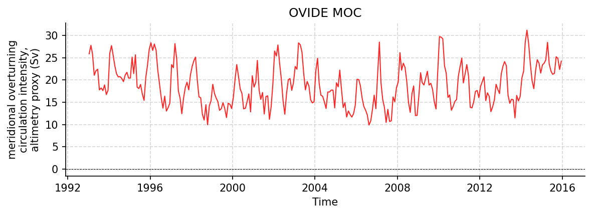

OVIDE Datasets
==============

46195.nc
--------

Dataset Overview
^^^^^^^^^^^^^^^^

- **Project**: OVIDE
- **Description**: Time series of the Meridional Overturning Circulation intensity across the Greenland-Portugal A25 OVIDE line
- **Source File**: 46195.nc
- **Data Product**: Monthly MOC-intensity time series across the Greenland-Portugal A25 OVIDE line, derived from AVISO altimetry and Argo/ISAS temperature and salinity
- **License**: CC-BY-NC-4.0
- **Date Created**: 10-Oct-2016 11:37:48
- **Time Coverage**: 1993-01-15 to 2015-12-15
- **Record Length**: 276 observations (22.9 years)
- **Sampling Frequency**: monthly

**Citation:**

    Mercier Herle, Daniault Nathalie, Lherminier Pascale (2016). Time series of the Meridional Overturning Circulation intensity at OVIDE. SEANOE. https://doi.org/10.17882/46445

**Acknowledgement:**

    The authors request that Mercier et al. (2015, Progress in Oceanography) be cited alongside this dataset.

Dataset Visualization
^^^^^^^^^^^^^^^^^^^^^

   Time series plot for OVIDE dataset.

Dataset Statistics
^^^^^^^^^^^^^^^^^^

- **Total Variables**: 3
- **Total Coordinates**: 1
- **Dataset Size**: 0.01 MB

Coordinate Information
^^^^^^^^^^^^^^^^^^^^^^

The following table shows information about the dataset coordinates in the standardised version, including coordinate name remapping from the original, if any:

.. list-table::
   :widths: 14 14 14 14 14 14 14
   :header-rows: 1

   * - Coordinate
     - Description
     - Units
     - Size
     - Min Value
     - Max Value
     - Missing %
   * - *date_AVISO* → **TIME**
     - Time
     - seconds since 1970-01-01T00:00:00Z
     - (276,)
     - 1993-01-15
     - 2015-12-15
     - 0.0%

Variable Information
^^^^^^^^^^^^^^^^^^^^

The following table shows the mapping from original variable names to standardized names,
along with key statistics for each variable.

.. list-table::
   :widths: 14 14 14 14 14 14 14
   :header-rows: 1

   * - Variable
     - Description
     - Units
     - Size
     - Min Value
     - Max Value
     - Missing %
   * - *MOC_index_ISAS* → **MOC_SIGMA1**
     - **meridional overturning circulation intensity**: MOC index over 2002-2015: AVISO surface velocities combined with the time-varying Argo/ISAS-derived geostrophic velocity shear; maximum of the overturning streamfunction in sigma1 density space
     - sverdrup
     - (276,)
     - 8.49
     - 30.61
     - 39.1%
   * - *err_index_ISAS* → **MOC_SIGMA1_ERR**
     - **meridional overturning circulation intensity, ensemble standard deviation**: Standard deviation of a 100-member ensemble of MOC index estimates over 2002-2015, from random perturbations of the ISAS fields and altimetry-derived surface dynamic heights
     - sverdrup
     - (276,)
     - 1.81
     - 3.03
     - 39.1%
   * - *MOC_index_AVISO* → **MOC_SIGMA1_PROXY**
     - **meridional overturning circulation intensity, altimetry proxy**: MOC index over 1993-2015: AVISO surface velocities combined with the 2002-2015 mean Argo/ISAS interior (fixed-interior altimetry proxy); maximum of the overturning streamfunction in sigma1 density space
     - sverdrup
     - (276,)
     - 9.91
     - 31.18
     - 0.0%

Metadata (edits applied noted)
^^^^^^^^^^^^^^^^^^^^^^^^^^^^^^

The following metadata describes this dataset:

- **Title**: Time series of the MOC intensity across the Greenland-Portugal A25 OVIDE line
- **Summary**: Time series of the Meridional Overturning Circulation intensity across the Greenland-Portugal A25 OVIDE line
- **Description\***: Time series of the Meridional Overturning Circulation intensity across the Greenland-Portugal A25 OVIDE line
- **Program\***: OVIDE
- **Project\***: OVIDE
- **License\***: CC-BY-NC-4.0
- **Acknowledgment**: The authors request that Mercier et al. (2015, Progress in Oceanography) be cited alongside this dataset.
- **References**: Mercier et al., PIO 2015 http://dx.doi.org/10.1016/j.pocean.2013.11.001
- **Weblink\***: https://www.seanoe.org/data/00353/46445/
- **Data Product\***: Monthly MOC-intensity time series across the Greenland-Portugal A25 OVIDE line, derived from AVISO altimetry and Argo/ISAS temperature and salinity
- **Time Coverage Start\***: 1993-01-15
- **Time Coverage End\***: 2015-12-15
- **Contributor Name\***: Herlé Mercier, Nathalie Daniault, Pascale Lherminier
- **Contributor Role\***: originator, originator, originator
- **Contributor Role Vocabulary\***: https://vocab.nerc.ac.uk/collection/G04/current/
- **Contributor Email**: , , 
- **Contributor Id**: https://orcid.org/0000-0002-1940-617X, https://orcid.org/0000-0001-8357-6627, https://orcid.org/0000-0001-9007-2160
- **Contributing Institutions\***: Laboratory for Ocean Physics and Satellite remote sensing (LOPS)
- **Contributing Institutions Vocabulary**: https://edmo.seadatanet.org/report/4536
- **Contributing Institutions Role**: 
- **Conventions\***: CF-1.8, ACDD-1.3, OceanSITES-1.5
- **featureType\***: timeSeries
- **featureType_vocabulary**: https://cfconventions.org/cf-conventions/v1.6.0/cf-conventions.html#_features_and_feature_types
- **Source File\***: 46195.nc
- **Source Path\***: ~/.amocatlas_data/46195.nc
- **Source Url\***: https://www.seanoe.org/data/00353/46445/data/46195.nc
- **Date Created**: 10-Oct-2016 11:37:48
- **Date Modified**: 2026-08-01T00:00:00Z
- **Processing Software**: http://github.com/AMOCcommunity/amocatlas
- **Processing Version**: v0.4.0
- **Processing Datasource\***: ovide
- **Applied Variable Mapping**: {'date_AVISO': 'TIME', 'MOC_index_ISAS': 'MOC_SIGMA1', 'MOC_index_AVISO': 'MOC_SIGMA1_PROXY', 'err_index_ISAS': 'MOC_SIGMA1_ERR'}
- **Description1**: The MOC monthly time series was generated following the method described in Mercier et al. (2015).
- **Description2**: It combines sea surface velocities from altimetry with geostrophic velocity vertical shear from Argo to compute a meridional overturning stream function.
- **Description3**: MOC index is defined as the maximum of this meridional overturning stream function.
- **Description4**: The sea surface velocities and the geostrophic velocity shear are estimated from AVISO and from ISAS data, respectively.
- **Description5**: The ISAS time series starts on January 2002 and ends on December 2015 (one MOC estimate per month).
- **Description6**: Two MOC indexes are provided: The first index (MOC_index_AVISO) was computed over 1993-2015, combining AVISO with the 2002-2015 monthly mean velocity field derived from ISAS.
- **Description7**: The second index (MOC_index_ISAS) was computed over 2002-2015, combining AVISO with the monthly velocity fields derived from ISAS.
