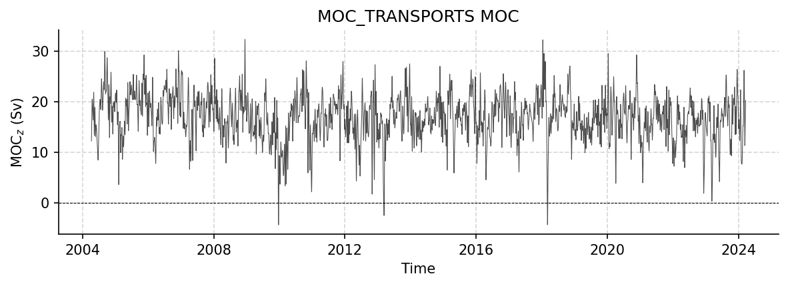
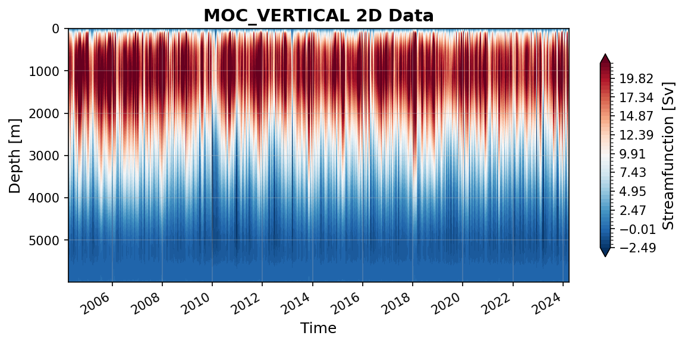
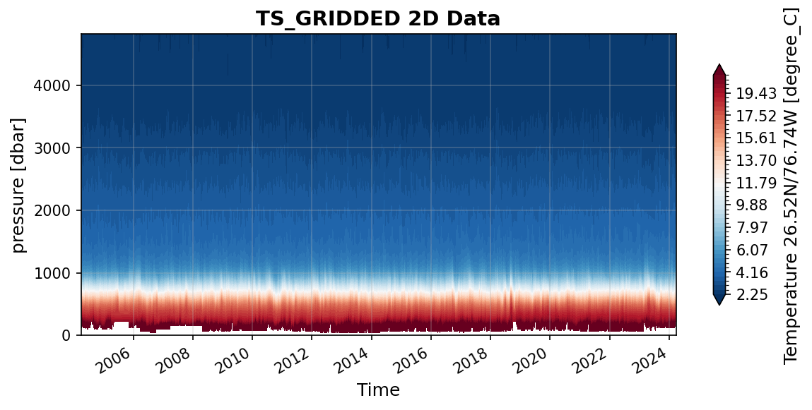
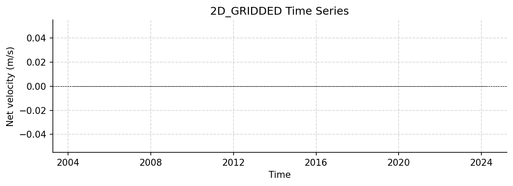
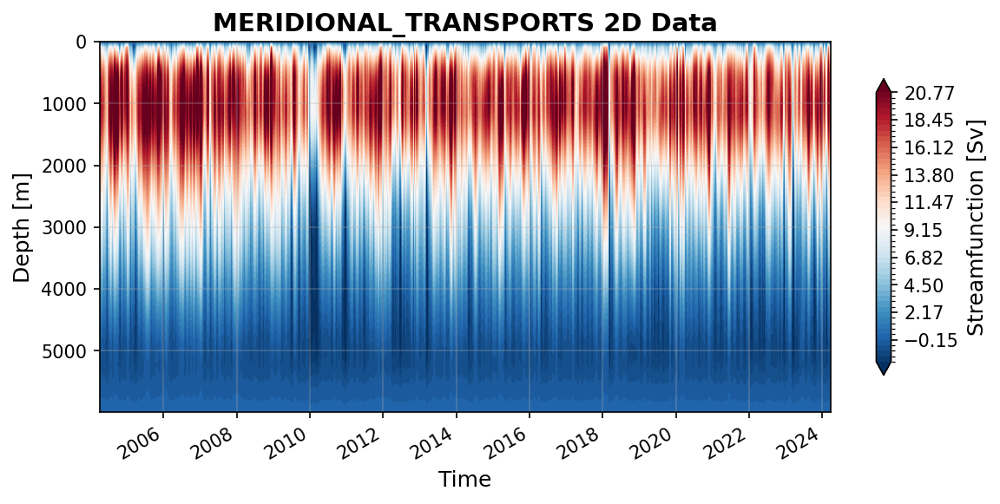

RAPID Datasets
==============

This report covers all available RAPID datasets.

----

moc_transports.nc
-----------------

Dataset Overview
^^^^^^^^^^^^^^^^

- **Project**: RAPID-AMOC 26°N array
- **Description**: RAPID 26N transport estimates dataset
- **DOI**: https://doi.org/10.5285/223b34a32dc5c945e0637086abc0f274
- **Source File**: moc_transports.nc
- **Data Product**: RAPID layer transport time series
- **License**: UK Open Government Licence v3.0 https://www.nationalarchives.gov.uk/doc/open-government-licence/version/3/
- **Date Created**: 23-Sep-2025
- **Time Coverage**: 2004-04-02 to 2024-03-27
- **Record Length**: 14,599 observations (20.0 years)
- **Sampling Frequency**: 12H

**Distribution Statement:**

    Data from RAPID MOC monitoring project are made freely available to the public. Continued funding of this project depends on us being able to justify the usefulness of the data to the Natural Environment Research Council. The project scientists would appreciate it if you would use the data DOI (see "citation") and add the following acknowledgment (see "acknowledgment") to any publications that use this data.

**Citation:**

    Moat B.I.; Smeed D.A.; Rayner D.; Johns W.E.; Smith, R.; Volkov, D.; Elipot S.; Petit T.; Kajtar J.; Baringer M. O.; and Collins, J. (2026). Atlantic meridional overturning circulation observed by the RAPID-MOCHA-WBTS (RAPID-Meridional Overturning Circulation and Heatflux Array-Western Boundary Time Series) array at 26N from 2004 to 2024 (v2024.1a), British Oceanographic Data Centre - Natural Environment Research Council, UK. doi: http://doi.org/10.5285/48d0bf43-0598-ceb2-e063-7086abc062f1

**Acknowledgement:**

    Data from the RAPID MOC monitoring project are funded by the Natural Environment Research Council, the National Science Foundation (NSF) with support from NOAA. They are freely available from www.rapid.ac.uk/.

Dataset Visualization
^^^^^^^^^^^^^^^^^^^^^

   Time series plot for MOC_TRANSPORTS dataset.

Dataset Statistics
^^^^^^^^^^^^^^^^^^

- **Total Variables**: 9
- **Total Coordinates**: 1
- **Dataset Size**: 1.11 MB

Coordinate Information
^^^^^^^^^^^^^^^^^^^^^^

The following table shows information about the dataset coordinates in the standardised version, including coordinate name remapping from the original, if any:

.. list-table::
   :widths: 14 14 14 14 14 14 14
   :header-rows: 1

   * - Coordinate
     - Description
     - Units
     - Size
     - Min Value
     - Max Value
     - Missing %
   * - *time* → **TIME**
     - Time
     - datetime64[ns]
     - (14599,)
     - 2004-04-02
     - 2024-03-27
     - 0.0%

Variable Information
^^^^^^^^^^^^^^^^^^^^

The following table shows the mapping from original variable names to standardized names,
along with key statistics for each variable.

.. list-table::
   :widths: 14 14 14 14 14 14 14
   :header-rows: 1

   * - Variable
     - Description
     - Units
     - Size
     - Min Value
     - Max Value
     - Missing %
   * - *moc_mar_hc10* → **MOC**
     - **MOC_z**: MOC strength
     - Sverdrup
     - (14599,)
     - -4.35
     - 32.34
     - 0.1%
   * - *t_therm10* → **TRANS_0_800**
     - **Transport (0-800m)**: Thermocline recirculation 0-800m
     - Sverdrup
     - (14599,)
     - -28.85
     - -7.63
     - 0.1%
   * - *t_ud10* → **TRANS_1100_3000**
     - **Transport (1100-3000m)**: upper NADW 1100-3000m
     - Sverdrup
     - (14599,)
     - -22.20
     - -0.38
     - 0.1%
   * - *t_ld10* → **TRANS_3000_5000**
     - **Transport (3000-5000m)**: lower NADW 3000-5000m
     - Sverdrup
     - (14599,)
     - -14.41
     - 7.14
     - 0.1%
   * - *t_aiw10* → **TRANS_800_1100**
     - **Transport (800-1100m)**: Intermediate water 800-1100m
     - Sverdrup
     - (14599,)
     - -2.17
     - 2.82
     - 0.1%
   * - *t_ek10* → **TRANS_EKMAN**
     - **Ekman**: Ekman transport from wind stress
     - Sverdrup
     - (14599,)
     - -13.00
     - 18.29
     - 0.1%
   * - *t_gs10* → **TRANS_FC**
     - **Florida Current**: Florida Current from cable measurements
     - Sverdrup
     - (14599,)
     - 21.01
     - 39.65
     - 0.1%
   * - *t_umo10* → **TRANS_UMO**
     - **Upper mid-ocean**: Upper Mid-Ocean transport
     - Sverdrup
     - (14599,)
     - -28.24
     - -6.65
     - 0.1%
   * - *t_bw10* → **TRANS_below_5000**
     - **Transport (AABW)**: AABW > 5000m
     - Sverdrup
     - (14599,)
     - -0.60
     - 3.46
     - 0.1%

Metadata (edits applied noted)
^^^^^^^^^^^^^^^^^

The following metadata provides comprehensive information about this dataset:

- **Title**: RAPID MOC timeseries
- **Summary**: RAPID 26N transport estimates dataset
- **Description\***: RAPID 26N transport estimates dataset
- **Program\***: RAPID
- **Project\***: RAPID-AMOC 26°N array
- **License\***: UK Open Government Licence v3.0 https://www.nationalarchives.gov.uk/doc/open-government-licence/version/3/
- **Acknowledgment\***: Data from the RAPID MOC monitoring project are funded by the Natural Environment Research Council, the National Science Foundation (NSF) with support from NOAA. They are freely available from www.rapid.ac.uk/.
- **Doi\***: https://doi.org/10.5285/223b34a32dc5c945e0637086abc0f274
- **Weblink\***: https://rapid.ac.uk/rapidmoc
- **Distribution Statement\***: Data from RAPID MOC monitoring project are made freely available to the public. Continued funding of this project depends on us being able to justify the usefulness of the data to the Natural Environment Research Council. The project scientists would appreciate it if you would use the data DOI (see "citation") and add the following acknowledgment (see "acknowledgment") to any publications that use this data.
- **Platform**: mooring
- **Platform Vocabulary**: https://vocab.nerc.ac.uk/collection/L06/
- **Data Product\***: RAPID layer transport time series
- **Time Coverage Start\***: 2004-04-02
- **Time Coverage End\***: 2024-03-27
- **Contributor Name**: Ben I. Moat, Ben I. Moat
- **Contributor Role**: originator, principalInvestigator
- **Contributor Role Vocabulary**: https://vocab.nerc.ac.uk/collection/G04/current/
- **Contributor Email**: , 
- **Contributor Id**: https://orcid.org/0000-0001-8676-7779, https://orcid.org/0000-0001-8676-7779
- **Contributing Institutions**: National Oceanography Centre (Southampton)
- **Contributing Institutions Vocabulary**: https://edmo.seadatanet.org/report/17
- **Contributing Institutions Role**: 
- **Conventions\***: CF-1.8, ACDD-1.3, OceanSITES-1.5
- **featureType\***: timeSeries
- **featureType_vocabulary**: https://cfconventions.org/cf-conventions/v1.6.0/cf-conventions.html#_features_and_feature_types
- **Source File\***: moc_transports.nc
- **Source Path\***: ~/AMOCatlas/data/moc_transports.nc
- **Date Created**: 23-Sep-2025
- **Date Modified**: 2026-02-01T00:00:00Z
- **Processing Software**: http://github.com/AMOCcommunity/amocatlas
- **Processing Version**: v0.3.0
- **Processing Datasource\***: rapid26n
- **Variable Mapping\***: [Complex metadata structure - 10 items]
- **Original Variable Metadata\***: [Complex metadata structure - 9 items]
- **Applied Variable Mapping**: [Complex metadata structure - 11 items]
- **Version**: v2024.1

----

moc_vertical.nc
---------------

Dataset Overview
^^^^^^^^^^^^^^^^

- **Project**: RAPID-AMOC 26°N array
- **Description**: RAPID 26N transport estimates dataset
- **DOI**: https://doi.org/10.5285/223b34a32dc5c945e0637086abc0f274
- **Source File**: moc_vertical.nc
- **Data Product**: RAPID vertical streamfunction time series
- **License**: UK Open Government Licence v3.0 https://www.nationalarchives.gov.uk/doc/open-government-licence/version/3/
- **Date Created**: 22-Jan-2026
- **Time Coverage**: 2004-04-02 to 2024-03-27
- **Record Length**: 14,599 observations (20.0 years)
- **Sampling Frequency**: 12H

**Distribution Statement:**

    Data from RAPID MOC monitoring project are made freely available to the public. Continued funding of this project depends on us being able to justify the usefulness of the data to the Natural Environment Research Council. The project scientists would appreciate it if you would use the data DOI (see "citation") and add the following acknowledgment (see "acknowledgment") to any publications that use this data.

**Citation:**

    Moat B.I.; Smeed D.A.; Rayner D.; Johns W.E.; Smith, R.; Volkov, D.; Elipot S.; Petit T.; Kajtar J.; Baringer M. O.; and Collins, J. (2026). Atlantic meridional overturning circulation observed by the RAPID-MOCHA-WBTS (RAPID-Meridional Overturning Circulation and Heatflux Array-Western Boundary Time Series) array at 26N from 2004 to 2024 (v2024.1a), British Oceanographic Data Centre - Natural Environment Research Council, UK. doi: http://doi.org/10.5285/48d0bf43-0598-ceb2-e063-7086abc062f1

**Acknowledgement:**

    Data from the RAPID MOC monitoring project are funded by the Natural Environment Research Council, the National Science Foundation (NSF) with support from NOAA. They are freely available from www.rapid.ac.uk/.

Dataset Visualization
^^^^^^^^^^^^^^^^^^^^^

   Time series plot for MOC_VERTICAL dataset.

Dataset Statistics
^^^^^^^^^^^^^^^^^^

- **Total Variables**: 1
- **Total Coordinates**: 2
- **Dataset Size**: 34.31 MB

Coordinate Information
^^^^^^^^^^^^^^^^^^^^^^

The following table shows information about the dataset coordinates in the standardised version, including coordinate name remapping from the original, if any:

.. list-table::
   :widths: 14 14 14 14 14 14 14
   :header-rows: 1

   * - Coordinate
     - Description
     - Units
     - Size
     - Min Value
     - Max Value
     - Missing %
   * - *depth* → **DEPTH**
     - **Depth**:  Depth below surface of the water
     - m
     - (307,)
     - 0.00
     - 5995.07
     - 0.0%
   * - *time* → **TIME**
     - Time
     - datetime64[ns]
     - (14599,)
     - 2004-04-02
     - 2024-03-27
     - 0.0%

Variable Information
^^^^^^^^^^^^^^^^^^^^

The following table shows the mapping from original variable names to standardized names,
along with key statistics for each variable.

.. list-table::
   :widths: 14 14 14 14 14 14 14
   :header-rows: 1

   * - Variable
     - Description
     - Units
     - Size
     - Min Value
     - Max Value
     - Missing %
   * - *stream_function_mar* → **STREAMFUNCTION_Z**
     - **Streamfunction**: Streamfunction across the Atlantic at 26.5°N
     - Sverdrup
     - (307, 14599)
     - -17.34
     - 37.79
     - 0.0%

Metadata (edits applied noted)
^^^^^^^^^^^^^^^^^

The following metadata provides comprehensive information about this dataset:

- **Title**: RAPID streamfunction
- **Summary**: RAPID 26N transport estimates dataset
- **Description\***: RAPID 26N transport estimates dataset
- **Program\***: RAPID
- **Project\***: RAPID-AMOC 26°N array
- **License\***: UK Open Government Licence v3.0 https://www.nationalarchives.gov.uk/doc/open-government-licence/version/3/
- **Acknowledgment\***: Data from the RAPID MOC monitoring project are funded by the Natural Environment Research Council, the National Science Foundation (NSF) with support from NOAA. They are freely available from www.rapid.ac.uk/.
- **Doi\***: https://doi.org/10.5285/223b34a32dc5c945e0637086abc0f274
- **Weblink\***: https://rapid.ac.uk/rapidmoc
- **Distribution Statement\***: Data from RAPID MOC monitoring project are made freely available to the public. Continued funding of this project depends on us being able to justify the usefulness of the data to the Natural Environment Research Council. The project scientists would appreciate it if you would use the data DOI (see "citation") and add the following acknowledgment (see "acknowledgment") to any publications that use this data.
- **Platform**: mooring
- **Platform Vocabulary**: https://vocab.nerc.ac.uk/collection/L06/
- **Data Product\***: RAPID vertical streamfunction time series
- **Time Coverage Start\***: 2004-04-02
- **Time Coverage End\***: 2024-03-27
- **Contributor Name**: Ben I. Moat, Ben I. Moat
- **Contributor Role**: originator, principalInvestigator
- **Contributor Role Vocabulary**: https://vocab.nerc.ac.uk/collection/G04/current/
- **Contributor Email**: , 
- **Contributor Id**: https://orcid.org/0000-0001-8676-7779, https://orcid.org/0000-0001-8676-7779
- **Contributing Institutions**: National Oceanography Centre (Southampton)
- **Contributing Institutions Vocabulary**: https://edmo.seadatanet.org/report/17
- **Contributing Institutions Role**: 
- **Conventions\***: CF-1.8, ACDD-1.3, OceanSITES-1.5
- **featureType\***: timeSeriesProfile
- **featureType_vocabulary**: https://cfconventions.org/cf-conventions/v1.6.0/cf-conventions.html#_features_and_feature_types
- **Source File\***: moc_vertical.nc
- **Source Path\***: ~/AMOCatlas/data/moc_vertical.nc
- **Date Created**: 22-Jan-2026
- **Date Modified**: 2026-02-01T00:00:00Z
- **Processing Software**: http://github.com/AMOCcommunity/amocatlas
- **Processing Version**: v0.3.0
- **Processing Datasource\***: rapid26n
- **Variable Mapping\***: {'time': 'TIME', 'depth': 'DEPTH', 'stream_function_mar': 'STREAMFUNCTION_Z'}
- **Original Variable Metadata\***: [Complex metadata structure - 1 items]
- **Applied Variable Mapping**: {'time': 'TIME', 'depth': 'DEPTH', 'stream_function_mar': 'STREAMFUNCTION_Z', 'TIME': 'TIME', 'DEPTH': 'DEPTH'}
- **Version**: v2024.1a

----

ts_gridded.nc
-------------

Dataset Overview
^^^^^^^^^^^^^^^^

- **Project**: RAPID-AMOC 26°N array
- **Description**: RAPID 26N transport estimates dataset
- **DOI**: https://doi.org/10.5285/223b34a32dc5c945e0637086abc0f274
- **Source File**: ts_gridded.nc
- **Data Product**: RAPID gridded temperature and salinity
- **License**: UK Open Government Licence v3.0 https://www.nationalarchives.gov.uk/doc/open-government-licence/version/3/
- **Date Created**: 22-Jan-2026
- **Time Coverage**: 2004-04-02 to 2024-03-27
- **Record Length**: 14,599 observations (20.0 years)
- **Sampling Frequency**: 12H

**Distribution Statement:**

    Data from RAPID MOC monitoring project are made freely available to the public. Continued funding of this project depends on us being able to justify the usefulness of the data to the Natural Environment Research Council. The project scientists would appreciate it if you would use the data DOI (see "citation") and add the following acknowledgment (see "acknowledgment") to any publications that use this data.

**Citation:**

    Moat B.I.; Smeed D.A.; Rayner D.; Johns W.E.; Smith, R.; Volkov, D.; Elipot S.; Petit T.; Kajtar J.; Baringer M. O.; and Collins, J. (2026). Atlantic meridional overturning circulation observed by the RAPID-MOCHA-WBTS (RAPID-Meridional Overturning Circulation and Heatflux Array-Western Boundary Time Series) array at 26N from 2004 to 2024 (v2024.1a), British Oceanographic Data Centre - Natural Environment Research Council, UK. doi: http://doi.org/10.5285/48d0bf43-0598-ceb2-e063-7086abc062f1

**Acknowledgement:**

    Data from the RAPID MOC monitoring project are funded by the Natural Environment Research Council, the National Science Foundation (NSF) with support from NOAA. They are freely available from www.rapid.ac.uk/.

Dataset Visualization
^^^^^^^^^^^^^^^^^^^^^

   Time series plot for TS_GRIDDED dataset.

Dataset Statistics
^^^^^^^^^^^^^^^^^^

- **Total Variables**: 18
- **Total Coordinates**: 2
- **Dataset Size**: 485.29 MB

Coordinate Information
^^^^^^^^^^^^^^^^^^^^^^

The following table shows information about the dataset coordinates in the standardised version, including coordinate name remapping from the original, if any:

.. list-table::
   :widths: 14 14 14 14 14 14 14
   :header-rows: 1

   * - Coordinate
     - Description
     - Units
     - Size
     - Min Value
     - Max Value
     - Missing %
   * - *pressure* → **PRESSURE**
     - pressure
     - dbar
     - (242,)
     - 0.00
     - 4820.00
     - 0.0%
   * - *time* → **TIME**
     - Time
     - datetime64[ns]
     - (14599,)
     - 2004-04-02
     - 2024-03-27
     - 0.0%

Variable Information
^^^^^^^^^^^^^^^^^^^^

The following table shows the mapping from original variable names to standardized names,
along with key statistics for each variable.

.. list-table::
   :widths: 14 14 14 14 14 14 14
   :header-rows: 1

   * - Variable
     - Description
     - Units
     - Size
     - Min Value
     - Max Value
     - Missing %
   * - *SG_east* → **PSAL_EAST**
     - Salinity east 26.99N/16.23W
     - 1
     - (242, 14599)
     - 34.89
     - 36.96
     - 0.8%
   * - *SG_east_flag* → **PSAL_EAST_FLAG**
     - Salinity MAR west data FLAG
     - data flag
     - (242, 14599)
     - 0.00
     - 2.00
     - 0.0%
   * - *SG_mareast* → **PSAL_MAREAST**
     - Salinity MAR east 24.52N/41.21W
     - 1
     - (242, 14599)
     - 34.88
     - 34.98
     - 50.4%
   * - *SG_mareast_flag* → **PSAL_MAREAST_FLAG**
     - Salinity MAR east data FLAG
     - data flag
     - (242, 14599)
     - 0.00
     - 2.00
     - 0.0%
   * - *SG_marwest* → **PSAL_MARWEST**
     - Salinity MAR west 24.52N/50.57W
     - 1
     - (242, 14599)
     - 34.86
     - 37.78
     - 0.8%
   * - *SG_marwest_flag* → **PSAL_MARWEST_FLAG**
     - Salinity MAR east data FLAG
     - data flag
     - (242, 14599)
     - 0.00
     - 2.00
     - 0.0%
   * - *SG_wb3* → **PSAL_WB3**
     - Salinity WB3 26.50N/76.50W
     - 1
     - (242, 14599)
     - 34.87
     - 37.06
     - 1.2%
   * - *SG_west* → **PSAL_WEST**
     - Salinity 26.52N/76.74W
     - 1
     - (242, 14599)
     - 34.87
     - 37.11
     - 0.4%
   * - *SG_west_flag* → **PSAL_WEST_FLAG**
     - Salinity east data FLAG
     - data flag
     - (242, 14599)
     - 0.00
     - 1.00
     - 0.0%
   * - *TG_east* → **TEMP_EAST**
     - Temperature east 26.99N/16.23W
     - degree_C
     - (242, 14599)
     - 2.36
     - 23.74
     - 0.8%
   * - *TG_east_flag* → **TEMP_EAST_FLAG**
     - Temperature MAR west data FLAG
     - data flag
     - (242, 14599)
     - 0.00
     - 2.00
     - 0.0%
   * - *TG_mareast* → **TEMP_MAREAST**
     - Temperature MAR east 24.52N/41.21W
     - degree_C
     - (242, 14599)
     - 2.36
     - 3.29
     - 50.4%
   * - *TG_mareast_flag* → **TEMP_MAREAST_FLAG**
     - Temperature MAR east data FLAG
     - data flag
     - (242, 14599)
     - 0.00
     - 2.00
     - 0.0%
   * - *TG_marwest* → **TEMP_MARWEST**
     - Temperature MAR west 24.52N/50.57W
     - degree_C
     - (242, 14599)
     - 2.12
     - 28.80
     - 0.8%
   * - *TG_marwest_flag* → **TEMP_MARWEST_FLAG**
     - Temperature MAR east data FLAG
     - data flag
     - (242, 14599)
     - 0.00
     - 2.00
     - 0.0%
   * - *TG_wb3* → **TEMP_WB3**
     - Temperature WB3 26.50N/76.50W
     - degree_C
     - (242, 14599)
     - 2.15
     - 28.77
     - 1.2%
   * - *TG_west* → **TEMP_WEST**
     - Temperature 26.52N/76.74W
     - degree_C
     - (242, 14599)
     - 2.16
     - 29.23
     - 0.4%
   * - *TG_west_flag* → **TEMP_WEST_FLAG**
     - Temperature east data FLAG
     - data flag
     - (242, 14599)
     - 0.00
     - 1.00
     - 0.0%

Metadata (edits applied noted)
^^^^^^^^^^^^^^^^^

The following metadata provides comprehensive information about this dataset:

- **Title**: RAPID streamfunction
- **Summary**: RAPID 26N transport estimates dataset
- **Description\***: RAPID 26N transport estimates dataset
- **Program\***: RAPID
- **Project\***: RAPID-AMOC 26°N array
- **License\***: UK Open Government Licence v3.0 https://www.nationalarchives.gov.uk/doc/open-government-licence/version/3/
- **Acknowledgment\***: Data from the RAPID MOC monitoring project are funded by the Natural Environment Research Council, the National Science Foundation (NSF) with support from NOAA. They are freely available from www.rapid.ac.uk/.
- **Doi\***: https://doi.org/10.5285/223b34a32dc5c945e0637086abc0f274
- **Weblink\***: https://rapid.ac.uk/rapidmoc
- **Distribution Statement\***: Data from RAPID MOC monitoring project are made freely available to the public. Continued funding of this project depends on us being able to justify the usefulness of the data to the Natural Environment Research Council. The project scientists would appreciate it if you would use the data DOI (see "citation") and add the following acknowledgment (see "acknowledgment") to any publications that use this data.
- **Platform**: mooring
- **Platform Vocabulary**: https://vocab.nerc.ac.uk/collection/L06/
- **Data Product\***: RAPID gridded temperature and salinity
- **Time Coverage Start\***: 2004-04-02
- **Time Coverage End\***: 2024-03-27
- **Contributor Name**: Ben I. Moat, Ben I. Moat
- **Contributor Role**: originator, principalInvestigator
- **Contributor Role Vocabulary**: https://vocab.nerc.ac.uk/collection/G04/current/
- **Contributor Email**: , 
- **Contributor Id**: https://orcid.org/0000-0001-8676-7779, https://orcid.org/0000-0001-8676-7779
- **Contributing Institutions**: National Oceanography Centre (Southampton)
- **Contributing Institutions Vocabulary**: https://edmo.seadatanet.org/report/17
- **Contributing Institutions Role**: 
- **Conventions\***: CF-1.8, ACDD-1.3, OceanSITES-1.5
- **featureType\***: timeSeriesProfile
- **featureType_vocabulary**: https://cfconventions.org/cf-conventions/v1.6.0/cf-conventions.html#_features_and_feature_types
- **Source File\***: ts_gridded.nc
- **Source Path\***: ~/AMOCatlas/data/ts_gridded.nc
- **Date Created**: 22-Jan-2026
- **Date Modified**: 2026-02-01T00:00:00Z
- **Processing Software**: http://github.com/AMOCcommunity/amocatlas
- **Processing Version**: v0.3.0
- **Processing Datasource\***: rapid26n
- **Variable Mapping\***: [Complex metadata structure - 22 items]
- **Original Variable Metadata\***: [Complex metadata structure - 10 items]
- **Applied Variable Mapping**: [Complex metadata structure - 22 items]
- **Version**: v2024.1a
- **Convert To Coord\***: pressure

----

2d_gridded.nc
-------------

Dataset Overview
^^^^^^^^^^^^^^^^

- **Project**: RAPID-AMOC 26°N array
- **Description**: RAPID 26N transport estimates dataset
- **DOI**: https://doi.org/10.5285/223b34a32dc5c945e0637086abc0f274
- **Source File**: 2d_gridded.nc
- **Data Product**: RAPID 2D gridded data
- **License**: UK Open Government Licence v3.0 https://www.nationalarchives.gov.uk/doc/open-government-licence/version/3/
- **Date Created**: 17-Sep-2024
- **Time Coverage**: 2004-04-06 to 2024-03-22
- **Record Length**: 730 observations (20.0 years)
- **Sampling Frequency**: 240.0H

**Distribution Statement:**

    Data from RAPID MOC monitoring project are made freely available to the public. Continued funding of this project depends on us being able to justify the usefulness of the data to the Natural Environment Research Council. The project scientists would appreciate it if you would use the data DOI (see "citation") and add the following acknowledgment (see "acknowledgment") to any publications that use this data.

**Citation:**

    Moat B.I.; Smeed D.A.; Rayner D.; Johns W.E.; Smith, R.; Volkov, D.; Elipot S.; Petit T.; Kajtar J.; Baringer M. O.; and Collins, J. (2026). Atlantic meridional overturning circulation observed by the RAPID-MOCHA-WBTS (RAPID-Meridional Overturning Circulation and Heatflux Array-Western Boundary Time Series) array at 26N from 2004 to 2024 (v2024.1a), British Oceanographic Data Centre - Natural Environment Research Council, UK. doi: http://doi.org/10.5285/48d0bf43-0598-ceb2-e063-7086abc062f1

**Acknowledgement:**

    Data from the RAPID MOC monitoring project are funded by the Natural Environment Research Council, the National Science Foundation (NSF) with support from NOAA. They are freely available from www.rapid.ac.uk/.

Dataset Visualization
^^^^^^^^^^^^^^^^^^^^^

   Time series plot for 2D_GRIDDED dataset.

Dataset Statistics
^^^^^^^^^^^^^^^^^^

- **Total Variables**: 7
- **Total Coordinates**: 3
- **Dataset Size**: 1737.79 MB

Coordinate Information
^^^^^^^^^^^^^^^^^^^^^^

The following table shows information about the dataset coordinates in the standardised version, including coordinate name remapping from the original, if any:

.. list-table::
   :widths: 14 14 14 14 14 14 14
   :header-rows: 1

   * - Coordinate
     - Description
     - Units
     - Size
     - Min Value
     - Max Value
     - Missing %
   * - *depth* → **DEPTH**
     - **Depth**:  Depth below surface of the water
     - m
     - (307,)
     - 0.00
     - 5995.06
     - 0.0%
   * - *longitude* → **LONGITUDE**
     - **Longitude**: Longitude east (WGS84)
     - degree_east
     - (254,)
     - -79.50
     - -14.12
     - 0.0%
   * - *time* → **TIME**
     - **Time**: Time coordinate
     - datetime64[ns]
     - (730,)
     - 2004-04-06
     - 2024-03-22
     - 0.0%

Variable Information
^^^^^^^^^^^^^^^^^^^^

The following table shows the mapping from original variable names to standardized names,
along with key statistics for each variable.

.. list-table::
   :widths: 14 14 14 14 14 14 14
   :header-rows: 1

   * - Variable
     - Description
     - Units
     - Size
     - Min Value
     - Max Value
     - Missing %
   * - *area* → **AREA**
     - **Grid cell area**: Area of each grid cell
     - m2
     - (254, 307)
     - 0.00
     - 1710169.15
     - 0.0%
   * - **CT**
     - **Conservative temperature**: Conservative temperature following TEOS-10 standard
     - degree_C
     - (730, 254, 307)
     - 1.49
     - 31.43
     - 0.0%
   * - *pressure* → **PRESSURE**
     - **Pressure**: Sea water pressure at depth
     - dbar
     - (307,)
     - 0.00
     - 6120.00
     - 0.0%
   * - **SA**
     - **Salinity**: Absolute salinity following TEOS-10 standard
     - g kg-1
     - (730, 254, 307)
     - 35.02
     - 37.95
     - 0.0%
   * - *V_ekman* → **VCUR_EKMAN**
     - **Ekman velocity**: Ekman transport velocity component
     - m s-1
     - (730, 254, 307)
     - -0.03
     - 0.08
     - 0.0%
   * - *V_insitu* → **VCUR_INSITU**
     - **Meridional velocity**: In-situ meridional velocity component
     - m s-1
     - (730, 254, 307)
     - -1.16
     - 1.61
     - 0.0%
   * - *V_net* → **VCUR_NET**
     - **Net velocity**: Net meridional velocity (in-situ + Ekman)
     - m s-1
     - (730,)
     - -0.00
     - -0.00
     - 0.0%

Metadata (edits applied noted)
^^^^^^^^^^^^^^^^^

The following metadata provides comprehensive information about this dataset:

- **Summary**: RAPID 26N transport estimates dataset
- **Description\***: RAPID 26N transport estimates dataset
- **Program\***: RAPID
- **Project\***: RAPID-AMOC 26°N array
- **License\***: UK Open Government Licence v3.0 https://www.nationalarchives.gov.uk/doc/open-government-licence/version/3/
- **Acknowledgment\***: Data from the RAPID MOC monitoring project are funded by the Natural Environment Research Council, the National Science Foundation (NSF) with support from NOAA. They are freely available from www.rapid.ac.uk/.
- **Doi\***: https://doi.org/10.5285/223b34a32dc5c945e0637086abc0f274
- **Weblink\***: https://rapid.ac.uk/rapidmoc
- **Distribution Statement\***: Data from RAPID MOC monitoring project are made freely available to the public. Continued funding of this project depends on us being able to justify the usefulness of the data to the Natural Environment Research Council. The project scientists would appreciate it if you would use the data DOI (see "citation") and add the following acknowledgment (see "acknowledgment") to any publications that use this data.
- **Platform**: mooring
- **Platform Vocabulary**: https://vocab.nerc.ac.uk/collection/L06/
- **Data Product\***: RAPID 2D gridded data
- **Time Coverage Start**: 2004-04-06
- **Time Coverage End**: 2024-03-22
- **Contributing Institutions**: National Oceanography Centre (Southampton)
- **Contributing Institutions Vocabulary**: https://edmo.seadatanet.org/report/17
- **Contributing Institutions Role**: 
- **Conventions\***: CF-1.8, ACDD-1.3, OceanSITES-1.5
- **featureType\***: timeSeriesProfile
- **featureType_vocabulary**: https://cfconventions.org/cf-conventions/v1.6.0/cf-conventions.html#_features_and_feature_types
- **Source File\***: 2d_gridded.nc
- **Source Path\***: ~/AMOCatlas/data/2d_gridded.nc
- **Date Created**: 17-Sep-2024
- **Date Modified**: 2026-02-01T00:00:00Z
- **Processing Software**: http://github.com/AMOCcommunity/amocatlas
- **Processing Version**: v0.3.0
- **Processing Datasource\***: rapid26n
- **Variable Mapping\***: {'time': 'TIME', 'depth': 'DEPTH', 'longitude': 'LONGITUDE', 'pressure': 'PRESSURE', 'area': 'AREA', 'V_insitu': 'VCUR_INSITU', 'V_ekman': 'VCUR_EKMAN', 'V_net': 'VCUR_NET'}
- **Original Variable Metadata\***: [Complex metadata structure - 7 items]
- **Applied Variable Mapping**: [Complex metadata structure - 13 items]
- **Version\***: 2024.1a
- **Dataset Version**: v2024-1a
- **Dataset Creation Date**: 26-Jan-2026 14:06:26
- **File Creation Date**: 2026-01-26
- **Note On Velocity**: Velocity is separated into 3 components: V_insitu = Velocity derived from in-situ measurements and geostrophic balance, V_ekman = Ekman velocity derived from ERA5 reanalysis. The total transport from V_insitu and V_ekman is required to have zero net meridional transport. V_net is a spatially uniform velocity representing the net meridional transport derived from salt and mass conservation (McDonagh et al 2015) and is excluded from the calculation of the streamfunction. Note that the sizes of grid cells are not all equal, and velocity should be multiplied by area to obtain the transport in each cell. Longitude is the centre of the cells, except for values 2 and 3 which are the locations of moorings WB1 and WB2 and correspond with the eastern edge of the cells

----

meridional_transports.nc
------------------------

Dataset Overview
^^^^^^^^^^^^^^^^

- **Project**: RAPID-AMOC 26°N array
- **Description**: RAPID 26N transport estimates dataset
- **DOI**: https://doi.org/10.5285/223b34a32dc5c945e0637086abc0f274
- **Source File**: meridional_transports.nc
- **Data Product**: RAPID meridional transport data
- **License**: UK Open Government Licence v3.0 https://www.nationalarchives.gov.uk/doc/open-government-licence/version/3/
- **Date Created**: 17-Sep-2024
- **Time Coverage**: 2004-04-06 to 2024-03-22
- **Record Length**: 730 observations (20.0 years)
- **Sampling Frequency**: 240.0H

**Distribution Statement:**

    Data from RAPID MOC monitoring project are made freely available to the public. Continued funding of this project depends on us being able to justify the usefulness of the data to the Natural Environment Research Council. The project scientists would appreciate it if you would use the data DOI (see "citation") and add the following acknowledgment (see "acknowledgment") to any publications that use this data.

**Citation:**

    Moat B.I.; Smeed D.A.; Rayner D.; Johns W.E.; Smith, R.; Volkov, D.; Elipot S.; Petit T.; Kajtar J.; Baringer M. O.; and Collins, J. (2026). Atlantic meridional overturning circulation observed by the RAPID-MOCHA-WBTS (RAPID-Meridional Overturning Circulation and Heatflux Array-Western Boundary Time Series) array at 26N from 2004 to 2024 (v2024.1a), British Oceanographic Data Centre - Natural Environment Research Council, UK. doi: http://doi.org/10.5285/48d0bf43-0598-ceb2-e063-7086abc062f1

**Acknowledgement:**

    Data from the RAPID MOC monitoring project are funded by the Natural Environment Research Council, the National Science Foundation (NSF) with support from NOAA. They are freely available from www.rapid.ac.uk/.

Dataset Visualization
^^^^^^^^^^^^^^^^^^^^^

   Time series plot for MERIDIONAL_TRANSPORTS dataset.

Dataset Statistics
^^^^^^^^^^^^^^^^^^

- **Total Variables**: 9
- **Total Coordinates**: 4
- **Dataset Size**: 9.22 MB

Coordinate Information
^^^^^^^^^^^^^^^^^^^^^^

The following table shows information about the dataset coordinates in the standardised version, including coordinate name remapping from the original, if any:

.. list-table::
   :widths: 14 14 14 14 14 14 14
   :header-rows: 1

   * - Coordinate
     - Description
     - Units
     - Size
     - Min Value
     - Max Value
     - Missing %
   * - *depth* → **DEPTH**
     - **Depth**:  Depth below surface of the water
     - m
     - (307,)
     - 0.00
     - 5995.06
     - 0.0%
   * - *sigma0* → **SIGMA0**
     - **Sigma0**: Potential density anomaly to 1000 kg/m3, surface reference
     - kg m-3
     - (631,)
     - 1022.00
     - 1028.00
     - 0.0%
   * - *sigma2* → **SIGMA2**
     - **sigma2**: Potential density anomaly referenced to 2000m (sigma-2), density anomaly to 1000 kg/m3
     - kg m-3
     - (708,)
     - 1030.00
     - 1037.15
     - 0.0%
   * - *time* → **TIME**
     - **Time**: Time coordinate
     - datetime64[ns]
     - (730,)
     - 2004-04-06
     - 2024-03-22
     - 0.0%

Variable Information
^^^^^^^^^^^^^^^^^^^^

The following table shows the mapping from original variable names to standardized names,
along with key statistics for each variable.

.. list-table::
   :widths: 14 14 14 14 14 14 14
   :header-rows: 1

   * - Variable
     - Description
     - Units
     - Size
     - Min Value
     - Max Value
     - Missing %
   * - *frwa_trans* → **MFT**
     - **Freshwater transport**: Meridional freshwater transport
     - Sverdrup
     - (730,)
     - -1.98
     - -0.48
     - 0.0%
   * - *heat_trans* → **MHT**
     - **Meridional heat transport**: Northward oceanic heat transport
     - PW
     - (730,)
     - -0.13
     - 2.10
     - 0.0%
   * - *amoc_depth* → **MOC**
     - **MOC_z**: Atlantic meridional overturning circulation strength in depth coordinates
     - Sverdrup
     - (730,)
     - -0.45
     - 27.68
     - 0.0%
   * - *amoc_sigma0* → **MOC_SIGMA0**
     - **MOC_sigma0**: Atlantic meridional overturning circulation strength in potential density (sigma0) coordinates
     - Sverdrup
     - (730,)
     - 7.23
     - 28.95
     - 0.0%
   * - *amoc_sigma2* → **MOC_SIGMA2**
     - **MOC_sigma2**: Atlantic meridional overturning circulation strength in potential density (sigma2) coordinates
     - Sverdrup
     - (730,)
     - 7.09
     - 29.23
     - 0.0%
   * - *pressure* → **PRESSURE**
     - **Pressure**: Sea water pressure at depth
     - dbar
     - (307,)
     - 0.00
     - 6120.00
     - 0.0%
   * - *stream_sigma0* → **STREAMFUNCTION_SIGMA0**
     - **Streamfunction**: Meridional overturning streamfunction in potential density (sigma0) coordinates
     - Sverdrup
     - (730, 631)
     - -10.98
     - 28.95
     - 0.0%
   * - *stream_sigma2* → **STREAMFUNCTION_SIGMA2**
     - **Streamfunction**: Meridional overturning streamfunction in potential density (sigma2) coordinates
     - Sverdrup
     - (730, 708)
     - -9.31
     - 29.23
     - 0.0%
   * - *stream_depth* → **STREAMFUNCTION_Z**
     - **Streamfunction**: Meridional overturning streamfunction in depth coordinates
     - Sverdrup
     - (730, 307)
     - -8.89
     - 27.68
     - 0.0%

Metadata (edits applied noted)
^^^^^^^^^^^^^^^^^

The following metadata provides comprehensive information about this dataset:

- **Summary**: RAPID 26N transport estimates dataset
- **Description\***: RAPID 26N transport estimates dataset
- **Program\***: RAPID
- **Project\***: RAPID-AMOC 26°N array
- **License\***: UK Open Government Licence v3.0 https://www.nationalarchives.gov.uk/doc/open-government-licence/version/3/
- **Acknowledgment\***: Data from the RAPID MOC monitoring project are funded by the Natural Environment Research Council, the National Science Foundation (NSF) with support from NOAA. They are freely available from www.rapid.ac.uk/.
- **Doi\***: https://doi.org/10.5285/223b34a32dc5c945e0637086abc0f274
- **Weblink\***: https://rapid.ac.uk/rapidmoc
- **Distribution Statement\***: Data from RAPID MOC monitoring project are made freely available to the public. Continued funding of this project depends on us being able to justify the usefulness of the data to the Natural Environment Research Council. The project scientists would appreciate it if you would use the data DOI (see "citation") and add the following acknowledgment (see "acknowledgment") to any publications that use this data.
- **Platform**: mooring
- **Platform Vocabulary**: https://vocab.nerc.ac.uk/collection/L06/
- **Data Product\***: RAPID meridional transport data
- **Time Coverage Start**: 2004-04-06
- **Time Coverage End**: 2024-03-22
- **Contributing Institutions**: National Oceanography Centre (Southampton)
- **Contributing Institutions Vocabulary**: https://edmo.seadatanet.org/report/17
- **Contributing Institutions Role**: 
- **Conventions\***: CF-1.8, ACDD-1.3, OceanSITES-1.5
- **featureType\***: timeSeriesProfile
- **featureType_vocabulary**: https://cfconventions.org/cf-conventions/v1.6.0/cf-conventions.html#_features_and_feature_types
- **Source File\***: meridional_transports.nc
- **Source Path\***: ~/AMOCatlas/data/meridional_transports.nc
- **Date Created**: 17-Sep-2024
- **Date Modified**: 2026-02-01T00:00:00Z
- **Processing Software**: http://github.com/AMOCcommunity/amocatlas
- **Processing Version**: v0.3.0
- **Processing Datasource\***: rapid26n
- **Variable Mapping\***: [Complex metadata structure - 13 items]
- **Original Variable Metadata\***: [Complex metadata structure - 9 items]
- **Applied Variable Mapping**: [Complex metadata structure - 18 items]
- **Version\***: 2024.1a
- **Dataset Version**: v2024-1a
- **Dataset Creation Date**: 26-Jan-2026 14:06:26
- **File Creation Date**: 2026-01-26
