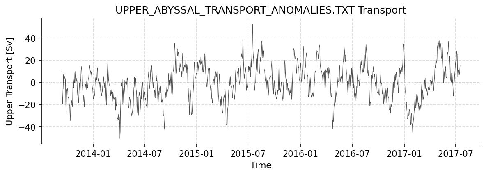
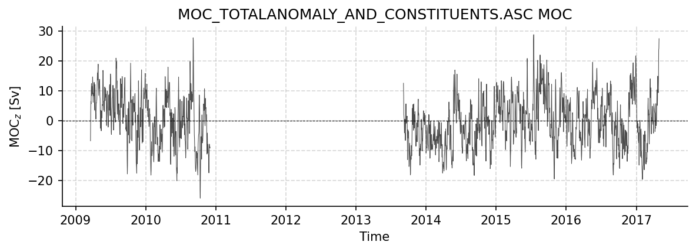

SAMBA Datasets
==============

This report covers all available SAMBA datasets.

----

Upper_Abyssal_Transport_Anomalies.txt
-------------------------------------

Dataset Overview
^^^^^^^^^^^^^^^^

- **Project**: South Atlantic MOC Basin-wide Array (SAMBA)
- **Description**: SAMBA 34S transport estimates dataset
- **Source File**: Upper_Abyssal_Transport_Anomalies.txt
- **Data Product**: Daily volume transport anomaly estimates for the upper and abyssal cells of the MOC
- **License**: 
- **Time Coverage**: 2013-09-12 to 2017-07-16
- **Record Length**: 1,404 observations (3.8 years)
- **Sampling Frequency**: daily

**Citation:**

    M. Kersalé et al., Highly variable upper and abyssal overturning cells in the South Atlantic. Sci. Adv. 6, eaba7573 (2020). DOI: 10.1126/sciadv.aba7573

**Acknowledgement:**

    SAMBA data were collected and made freely available by the SAMOC international project and contributing national programs.

Dataset Visualization
^^^^^^^^^^^^^^^^^^^^^

   Time series plot for UPPER_ABYSSAL_TRANSPORT_ANOMALIES.TXT dataset.

Dataset Statistics
^^^^^^^^^^^^^^^^^^

- **Total Variables**: 2
- **Total Coordinates**: 1
- **Dataset Size**: 0.03 MB

Coordinate Information
^^^^^^^^^^^^^^^^^^^^^^

The following table shows information about the dataset coordinates in the standardised version, including coordinate name remapping from the original, if any:

.. list-table::
   :widths: 14 14 14 14 14 14 14
   :header-rows: 1

   * - Coordinate
     - Description
     - Units
     - Size
     - Min Value
     - Max Value
     - Missing %
   * - **TIME**
     - Time
     - datetime64[ns]
     - (1404,)
     - 2013-09-12
     - 2017-07-16
     - 0.0%

Variable Information
^^^^^^^^^^^^^^^^^^^^

The following table shows the mapping from original variable names to standardized names,
along with key statistics for each variable.

.. list-table::
   :widths: 14 14 14 14 14 14 14
   :header-rows: 1

   * - Variable
     - Description
     - Units
     - Size
     - Min Value
     - Max Value
     - Missing %
   * - *Abyssal_cell_volume_transport_anomaly__relative_to_record_length_average_of_7_8_Sv* → **ABYSSAL_TRANSPORT**
     - **Abyssal Transport**: Abyssal-cell volume transport anomaly (relative to record-length average of 7.8 Sv)
     - Sverdrup
     - (1404,)
     - -19.09
     - 24.00
     - 0.0%
   * - *Upper_cell_volume_transport_anomaly__relative_to_record_length_average_of_17_3_Sv* → **UPPER_TRANSPORT**
     - **Upper Transport**: Upper-cell volume transport anomaly (relative to record-length average of 17.3 Sv)
     - Sverdrup
     - (1404,)
     - -50.28
     - 52.69
     - 0.0%

Metadata (edits applied noted)
^^^^^^^^^^^^^^^^^

The following metadata provides comprehensive information about this dataset:

- **Summary**: SAMBA 34S transport estimates dataset
- **Description\***: SAMBA 34S transport estimates dataset
- **Program\***: SAMBA
- **Project\***: South Atlantic MOC Basin-wide Array (SAMBA)
- **Acknowledgment**: SAMBA data were collected and made freely available by the SAMOC international project and contributing national programs.
- **Weblink\***: https://www.aoml.noaa.gov/phod/samoc
- **Platform**: mooring
- **Platform Vocabulary**: https://vocab.nerc.ac.uk/collection/L06/
- **Data Product\***: Daily volume transport anomaly estimates for the upper and abyssal cells of the MOC
- **Time Coverage Start\***: 2013-09-12
- **Time Coverage End\***: 2017-07-16
- **Contributing Institutions**: 
- **Contributing Institutions Vocabulary**: 
- **Contributing Institutions Role**: 
- **Conventions\***: CF-1.8, ACDD-1.3, OceanSITES-1.5
- **featureType\***: timeSeries
- **featureType_vocabulary**: https://cfconventions.org/cf-conventions/v1.6.0/cf-conventions.html#_features_and_feature_types
- **Source File\***: Upper_Abyssal_Transport_Anomalies.txt
- **Source Path\***: ~/AMOCatlas/data/Upper_Abyssal_Transport_Anomalies.txt
- **Source Url\***: ftp://ftp.aoml.noaa.gov/phod/pub/SAM/2020_Kersale_etal_ScienceAdvances/
- **Date Modified**: 2026-02-01T00:00:00Z
- **Processing Software**: http://github.com/AMOCcommunity/amocatlas
- **Processing Version**: v0.2.0
- **Processing Datasource\***: samba34s
- **Variable Mapping\***: [Complex metadata structure - 2 items]
- **Original Variable Metadata\***: [Complex metadata structure - 2 items]
- **Applied Variable Mapping**: [Complex metadata structure - 2 items]
- **Original Variable Mapping**: [Complex metadata structure - 2 items]
- **Sanitization Mapping**: [Complex metadata structure - 7 items]
- **Comment\***: (Note: date_modified has been set to a canonical value for documentation generation to avoid git churn)

----

MOC_TotalAnomaly_and_constituents.asc
-------------------------------------

Dataset Overview
^^^^^^^^^^^^^^^^

- **Project**: South Atlantic MOC Basin-wide Array (SAMBA)
- **Description**: SAMBA 34S transport estimates dataset
- **Source File**: MOC_TotalAnomaly_and_constituents.asc
- **Data Product**: Daily travel time values, calibrated to a nominal pressure of 1000 dbar, and bottom pressures from the two PIES/CPIES moorings
- **License**: 
- **Time Coverage**: 2009-03-19 to 2017-04-29
- **Record Length**: 2,964 observations (8.1 years)
- **Sampling Frequency**: daily

**Distribution Statement:**

    MOC transport data from the South Atlantic MOC Basin-wide Array (SAMBA) is made freely available to the public at: https://www.aoml.noaa.gov/phod/SAMOC_international/ . If you use data from SAMBA, please make sure to cite the Meinen et al. (2018) publication as it contains the appropriate credit for all of the data producers in the Acknowledgements.

**Citation:**

    Meinen, C. S., Speich, S., Piola, A. R., Ansorge, I., Campos, E., Kersalé, M., et al. (2018). Meridional overturning circulation transport variability at 34.5°S during 2009–2017: Baroclinic and barotropic flows and the dueling influence of the boundaries. Geophysical Research Letters, 45, 4180–4188. https://doi.org/10.1029/2018GL077408

**Acknowledgement:**

    SAMBA data were collected and made freely available by the SAMOC international project and contributing national programs.

Dataset Visualization
^^^^^^^^^^^^^^^^^^^^^

   Time series plot for MOC_TOTALANOMALY_AND_CONSTITUENTS.ASC dataset.

Dataset Statistics
^^^^^^^^^^^^^^^^^^

- **Total Variables**: 8
- **Total Coordinates**: 1
- **Dataset Size**: 0.20 MB

Coordinate Information
^^^^^^^^^^^^^^^^^^^^^^

The following table shows information about the dataset coordinates in the standardised version, including coordinate name remapping from the original, if any:

.. list-table::
   :widths: 14 14 14 14 14 14 14
   :header-rows: 1

   * - Coordinate
     - Description
     - Units
     - Size
     - Min Value
     - Max Value
     - Missing %
   * - **TIME**
     - Time
     - datetime64[ns]
     - (2964,)
     - 2009-03-19
     - 2017-04-29
     - 0.0%

Variable Information
^^^^^^^^^^^^^^^^^^^^

The following table shows the mapping from original variable names to standardized names,
along with key statistics for each variable.

.. list-table::
   :widths: 14 14 14 14 14 14 14
   :header-rows: 1

   * - Variable
     - Description
     - Units
     - Size
     - Min Value
     - Max Value
     - Missing %
   * - *Reference__bottom_pressure_gradient__contribution_to_the_MOC_anomaly* → **BAROTROPIC_MOC**
     - **Barotropic Trans. anom.**: Reference (bottom pressure gradient) contribution to the MOC anomaly
     - Sverdrup
     - (2964,)
     - -12.14
     - 20.58
     - 34.0%
   * - *Eastern_bottom_pressure_contribution_to_the_MOC_anomaly* → **EASTERN_BOT_PRESSURE**
     - **BP East Transport**: Eastern bottom pressure contribution to the MOC anomaly
     - Sverdrup
     - (2964,)
     - -12.93
     - 11.15
     - 34.0%
   * - *Eastern_density_contribution_to_the_MOC_anomaly* → **EASTERN_DENSITY**
     - ** ho East Transport**: Eastern density contribution to the MOC anomaly
     - Sverdrup
     - (2964,)
     - -16.67
     - 13.94
     - 34.0%
   * - *Ekman__wind__contribution_to_the_MOC_anomaly* → **EKMAN**
     - **Ekman**: Ekman (wind) contribution to the MOC anomaly
     - Sverdrup
     - (2964,)
     - -15.65
     - 20.30
     - 34.0%
   * - *Total_MOC_anomaly__relative_to_record_length_average_of_14_7_Sv* → **MOC**
     - **MOC_z**: MOC Total Anomaly (relative to record-length average of 14.7 Sv)
     - Sverdrup
     - (2964,)
     - -25.89
     - 28.72
     - 34.0%
   * - *Relative__density_gradient__contribution_to_the_MOC_anomaly* → **RELATIVE_MOC**
     - **Geos. Trans. Anom.**: Relative (density gradient) contribution to the MOC anomaly
     - Sverdrup
     - (2964,)
     - -19.69
     - 16.51
     - 34.0%
   * - *Western_bottom_pressure_contribution_to_the_MOC_anomaly* → **WESTERN_BOT_PRESSURE**
     - **BP West Transport**: Western bottom pressure contribution to the MOC anomaly
     - Sverdrup
     - (2964,)
     - -13.60
     - 21.73
     - 34.0%
   * - *Western_density_contribution_to_the_MOC_anomaly* → **WESTERN_DENSITY**
     - ** ho West Transport**: Western density contribution to the MOC anomaly
     - Sverdrup
     - (2964,)
     - -16.32
     - 6.87
     - 34.0%

Metadata (edits applied noted)
^^^^^^^^^^^^^^^^^

The following metadata provides comprehensive information about this dataset:

- **Summary**: SAMBA 34S transport estimates dataset
- **Description\***: SAMBA 34S transport estimates dataset
- **Program\***: SAMBA
- **Project\***: South Atlantic MOC Basin-wide Array (SAMBA)
- **Acknowledgment**: SAMBA data were collected and made freely available by the SAMOC international project and contributing national programs.
- **Weblink\***: https://www.aoml.noaa.gov/phod/samoc
- **Distribution Statement\***: MOC transport data from the South Atlantic MOC Basin-wide Array (SAMBA) is made freely available to the public at: https://www.aoml.noaa.gov/phod/SAMOC_international/ . If you use data from SAMBA, please make sure to cite the Meinen et al. (2018) publication as it contains the appropriate credit for all of the data producers in the Acknowledgements.
- **Platform**: mooring
- **Platform Vocabulary**: https://vocab.nerc.ac.uk/collection/L06/
- **Data Product\***: Daily travel time values, calibrated to a nominal pressure of 1000 dbar, and bottom pressures from the two PIES/CPIES moorings
- **Time Coverage Start\***: 2009-03-19
- **Time Coverage End\***: 2017-04-29
- **Contributing Institutions**: 
- **Contributing Institutions Vocabulary**: 
- **Contributing Institutions Role**: 
- **Conventions\***: CF-1.8, ACDD-1.3, OceanSITES-1.5
- **featureType\***: timeSeries
- **featureType_vocabulary**: https://cfconventions.org/cf-conventions/v1.6.0/cf-conventions.html#_features_and_feature_types
- **Source File\***: MOC_TotalAnomaly_and_constituents.asc
- **Source Path\***: ~/AMOCatlas/data/MOC_TotalAnomaly_and_constituents.asc
- **Source Url\***: https://www.aoml.noaa.gov/phod/SAMOC_international/documents/
- **Date Modified**: 2026-02-01T00:00:00Z
- **Processing Software**: http://github.com/AMOCcommunity/amocatlas
- **Processing Version**: v0.2.0
- **Processing Datasource\***: samba34s
- **Variable Mapping\***: [Complex metadata structure - 8 items]
- **Original Variable Metadata\***: [Complex metadata structure - 8 items]
- **Applied Variable Mapping**: [Complex metadata structure - 8 items]
- **Original Variable Mapping**: [Complex metadata structure - 8 items]
- **Sanitization Mapping**: [Complex metadata structure - 12 items]
- **Comment\***: (Note: date_modified has been set to a canonical value for documentation generation to avoid git churn)
