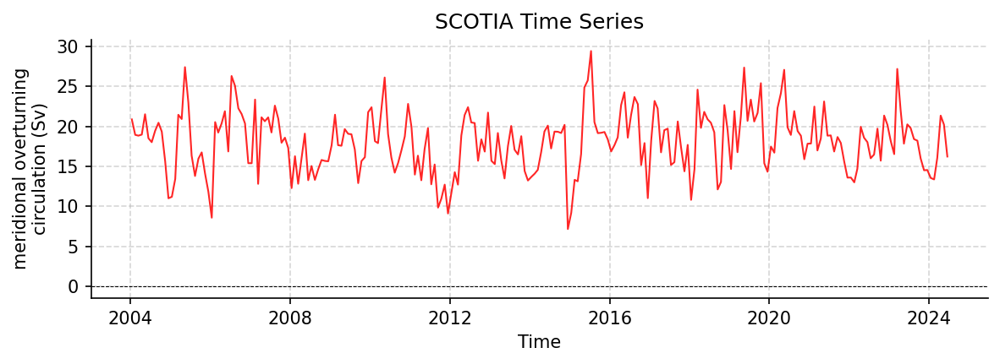

SCOTIA Datasets
===============

SCOTIA_overturning_diagnostics.nc
---------------------------------

Dataset Overview
^^^^^^^^^^^^^^^^

- **Project**: SCOTIA
- **Description**: Monthly overturning diagnostics of the Scotland-Canada overturning array (SCOTIA), computed in neutral-density space across the subpolar North Atlantic
- **Source File**: SCOTIA_overturning_diagnostics.nc
- **Data Product**: Monthly overturning diagnostics of the Scotland-Canada overturning array in neutral-density (gamma-n) space
- **License**: CC-BY-4.0
- **Time Coverage**: 2004-01-15 to 2024-06-15
- **Record Length**: 246 observations (20.4 years)
- **Sampling Frequency**: monthly

**Citation:**

    Jones, S. C., Fox, A., Burmeister, K., & Fraser, N. (2026). Code and data for "The Scotland-Canada overturning array (SCOTIA)" [Data set]. Zenodo. https://doi.org/10.5281/zenodo.19682610

**Acknowledgement:**

    The authors request that Fox et al. (2026) be cited alongside this dataset.

Dataset Visualization
^^^^^^^^^^^^^^^^^^^^^

   Time series plot for SCOTIA dataset.

Dataset Statistics
^^^^^^^^^^^^^^^^^^

- **Total Variables**: 7
- **Total Coordinates**: 2
- **Dataset Size**: 7.53 MB

Coordinate Information
^^^^^^^^^^^^^^^^^^^^^^

The following table shows information about the dataset coordinates in the standardised version, including coordinate name remapping from the original, if any:

.. list-table::
   :widths: 14 14 14 14 14 14 14
   :header-rows: 1

   * - Coordinate
     - Description
     - Units
     - Size
     - Min Value
     - Max Value
     - Missing %
   * - *gamma_n_bin* → **GAMMA**
     - neutral density
     - kg m-3
     - (2000,)
     - 10.00
     - 29.99
     - 0.0%
   * - *time* → **TIME**
     - Time
     - seconds since 1970-01-01T00:00:00Z
     - (246,)
     - 2004-01-15
     - 2024-06-15
     - 0.0%

Variable Information
^^^^^^^^^^^^^^^^^^^^

The following table shows the mapping from original variable names to standardized names,
along with key statistics for each variable.

.. list-table::
   :widths: 14 14 14 14 14 14 14
   :header-rows: 1

   * - Variable
     - Description
     - Units
     - Size
     - Min Value
     - Max Value
     - Missing %
   * - *df* → **DENSITY_FLUX**
     - **northward density flux across line**: Northward density flux across the SCOTIA section (integral of the streamfunction in density)
     - Gg s-1
     - (246,)
     - -13.94
     - -0.61
     - 0.0%
   * - *gamma_moc* → **GAMMA_MOC**
     - **neutral density at overturning maximum**: Neutral density at which the maximum of the overturning streamfunction occurs
     - kg m-3
     - (246,)
     - 27.62
     - 27.95
     - 0.0%
   * - *ff* → **MFT**
     - **northward ocean freshwater transport**: Northward freshwater flux across the SCOTIA section, referenced to the section-mean salinity
     - sverdrup
     - (246,)
     - -0.63
     - -0.24
     - 0.0%
   * - *hf* → **MHT**
     - **northward ocean heat transport**: Northward heat flux across the SCOTIA section
     - PW
     - (246,)
     - 0.32
     - 0.77
     - 0.0%
   * - *moc* → **MOC_GAMMA**
     - **meridional overturning circulation**: Maximum over neutral density of the overturning streamfunction
     - sverdrup
     - (246,)
     - 7.18
     - 29.44
     - 0.0%
   * - *psi* → **PSI_GAMMA**
     - **ocean meridional overturning streamfunction**: Overturning streamfunction across the SCOTIA section, cumulative in neutral density
     - sverdrup
     - (246, 2000)
     - -8.26
     - 29.44
     - 0.0%
   * - *transport* → **TRANS_GAMMA**
     - **sea water volume transport across line by neutral density class**: Sea water volume transport within each neutral-density class across the SCOTIA section
     - sverdrup
     - (246, 2000)
     - -3.56
     - 2.87
     - 0.0%

Metadata (edits applied noted)
^^^^^^^^^^^^^^^^^^^^^^^^^^^^^^

The following metadata describes this dataset:

- **Summary**: Monthly overturning diagnostics of the Scotland-Canada overturning array (SCOTIA), computed in neutral-density space across the subpolar North Atlantic
- **Description\***: Monthly overturning diagnostics of the Scotland-Canada overturning array (SCOTIA), computed in neutral-density space across the subpolar North Atlantic
- **Program\***: SCOTIA
- **Project\***: SCOTIA
- **License\***: CC-BY-4.0
- **Acknowledgment**: The authors request that Fox et al. (2026) be cited alongside this dataset.
- **References\***: Fox, A. D., Fraser, N. J., Burmeister, K., Jones, S. C., Cunningham, S. A., Drysdale, L. A., Dilmahamod, A. F., and Karstensen, J. (2026). The Scotland-Canada overturning array (SCOTIA): twenty years of meridional overturning in the subpolar North Atlantic. Ocean Science, 22, 1439-1456. https://doi.org/10.5194/os-22-1439-2026
- **Weblink\***: https://thredds.sams.ac.uk/thredds/catalog/Fox_et_al_2026/catalog.html
- **Data Product\***: Monthly overturning diagnostics of the Scotland-Canada overturning array in neutral-density (gamma-n) space
- **Time Coverage Start\***: 2004-01-15
- **Time Coverage End\***: 2024-06-15
- **Contributor Name\***: Sam Jones, Alan Fox, Kristin Burmeister, Neil Fraser
- **Contributor Role\***: originator, originator, originator, originator
- **Contributor Role Vocabulary\***: https://vocab.nerc.ac.uk/collection/G04/current/
- **Contributor Email**: , , , 
- **Contributor Id**: https://orcid.org/0000-0001-7371-9014, https://orcid.org/0000-0002-9047-1986, https://orcid.org/0000-0003-3881-0298, https://orcid.org/0000-0002-2171-9060
- **Contributing Institutions\***: Scottish Association for Marine Science (SAMS)
- **Contributing Institutions Vocabulary**: https://edmo.seadatanet.org/report/44
- **Contributing Institutions Role**: 
- **Conventions\***: CF-1.8, ACDD-1.3, OceanSITES-1.5
- **featureType\***: timeSeries
- **featureType_vocabulary**: https://cfconventions.org/cf-conventions/v1.6.0/cf-conventions.html#_features_and_feature_types
- **Source File\***: SCOTIA_overturning_diagnostics.nc
- **Source Path\***: ~/.amocatlas_data/SCOTIA_overturning_diagnostics.nc
- **Source Url\***: https://thredds.sams.ac.uk/thredds/fileServer/Fox_et_al_2026/SCOTIA_overturning_diagnostics.nc
- **Date Modified**: 2026-08-01T00:00:00Z
- **Processing Software**: http://github.com/AMOCcommunity/amocatlas
- **Processing Version**: v0.4.0
- **Processing Datasource\***: scotia
- **Applied Variable Mapping**: [Complex metadata structure - 11 items]
- **Report Plot Variable\***: MOC_GAMMA
