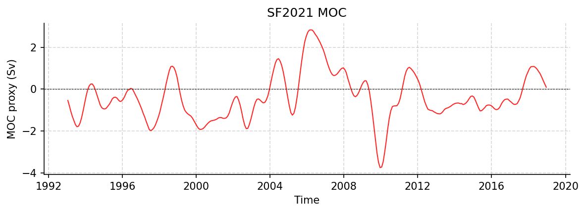

SF2021 Datasets
===============

altimetry_moc_transport_1993_2020_18mos_smoothed.nc
---------------------------------------------------

Dataset Overview
^^^^^^^^^^^^^^^^

- **Project**: Satellite proxy for the AMOC at 26N
- **Description**: A dynamically based method for estimating the Atlantic meridional overturning circulation at 26°N from satellite altimetry
- **Source File**: altimetry_moc_transport_1993_2020_18mos_smoothed.nc
- **Data Product**: A dynamically based method for estimating the Atlantic meridional overturning circulation at 26°N from satellite altimetry
- **License**: CC-BY-4.0
- **Time Coverage**: 1993-01-17 to 2018-12-17
- **Record Length**: 312 observations (25.9 years)
- **Sampling Frequency**: monthly

**Citation:**

    Sanchez-Franks, A., Frajka-Williams, E., Moat, B. I., and Smeed, D. A.: A dynamically based method for estimating the Atlantic meridional overturning circulation at 26°N from satellite altimetry, Ocean Sci., 17, 1321-1340, https://doi.org/10.5194/os-17-1321-2021, 2021

**Acknowledgement:**

    The authors thank the reviewers for their helpful comments. The authors also thank the many officers, crew, and technicians who helped to collect these data. Alejandra Sanchez-Franks also thanks Louis Clément for helpful discussions on normal-mode decomposition. This research has been supported by grants from the UK Natural Environment Research Council for the RAPID-AMOC programme and the ACSIS programme (grant no. NE/N018044/1) as well as funding from the European Union Horizon 2020 Research and Innovation programme BLUE-ACTION (grant no. 727852).

Dataset Visualization
^^^^^^^^^^^^^^^^^^^^^

   Time series plot for SF2021 dataset.

Dataset Statistics
^^^^^^^^^^^^^^^^^^

- **Total Variables**: 3
- **Total Coordinates**: 1
- **Dataset Size**: 0.01 MB

Coordinate Information
^^^^^^^^^^^^^^^^^^^^^^

The following table shows information about the dataset coordinates in the standardised version, including coordinate name remapping from the original, if any:

.. list-table::
   :widths: 14 14 14 14 14 14 14
   :header-rows: 1

   * - Coordinate
     - Description
     - Units
     - Size
     - Min Value
     - Max Value
     - Missing %
   * - *sat_time* → **TIME**
     - Time
     - seconds since 1970-01-01T00:00:00Z
     - (312,)
     - 1993-01-17
     - 2018-12-17
     - 0.0%

Variable Information
^^^^^^^^^^^^^^^^^^^^

The following table shows the mapping from original variable names to standardized names,
along with key statistics for each variable.

.. list-table::
   :widths: 14 14 14 14 14 14 14
   :header-rows: 1

   * - Variable
     - Description
     - Units
     - Size
     - Min Value
     - Max Value
     - Missing %
   * - *sat_moc_filt* → **MOC_PROXY**
     - **MOC proxy**: constructed by adding the satellite-derived TRANS_GS and TRANS_UMO with the TRANS_EK, obtained from ERA5 wind stress
     - sverdrup
     - (312,)
     - -3.76
     - 2.83
     - 0.0%
   * - *sat_gs_filt* → **TRANS_GS_PROXY**
     - **Gulf Stream / Florida Current**: The strength of the Gulf Stream transport through the Florida Straits between Florida and Bahamas, as measured by a submarine telephone cable.
     - sverdrup
     - (312,)
     - -0.64
     - 1.09
     - 0.0%
   * - *sat_umo_filt* → **TRANS_UMO_PROXY**
     - **UMO proxy**: sum of the western boundary wedge transport, the hypsometric mass compensation, and the internal geostrophic transport over the top 1100 m
     - sverdrup
     - (312,)
     - -2.37
     - 3.20
     - 0.0%

Metadata (edits applied noted)
^^^^^^^^^^^^^^^^^^^^^^^^^^^^^^

The following metadata describes this dataset:

- **Summary**: A dynamically based method for estimating the Atlantic meridional overturning circulation at 26°N from satellite altimetry
- **Description\***: A dynamically based method for estimating the Atlantic meridional overturning circulation at 26°N from satellite altimetry
- **Project\***: Satellite proxy for the AMOC at 26N
- **License\***: CC-BY-4.0
- **Acknowledgment\***: The authors thank the reviewers for their helpful comments. The authors also thank the many officers, crew, and technicians who helped to collect these data. Alejandra Sanchez-Franks also thanks Louis Clément for helpful discussions on normal-mode decomposition. This research has been supported by grants from the UK Natural Environment Research Council for the RAPID-AMOC programme and the ACSIS programme (grant no. NE/N018044/1) as well as funding from the European Union Horizon 2020 Research and Innovation programme BLUE-ACTION (grant no. 727852).
- **Weblink\***: https://zenodo.org/records/18941523
- **Data Product\***: A dynamically based method for estimating the Atlantic meridional overturning circulation at 26°N from satellite altimetry
- **Time Coverage Start\***: 1993-01-17
- **Time Coverage End\***: 2018-12-17
- **Contributor Name\***: Alejandra Sanchez-Franks
- **Contributor Role\***: originator
- **Contributor Role Vocabulary\***: https://vocab.nerc.ac.uk/collection/G04/current/
- **Contributor Email**: 
- **Contributor Id**: 
- **Contributing Institutions\***: National Oceanographic Centre
- **Contributing Institutions Vocabulary**: 
- **Contributing Institutions Role**: 
- **Conventions\***: CF-1.8, ACDD-1.3, OceanSITES-1.5
- **featureType\***: timeSeries
- **featureType_vocabulary**: https://cfconventions.org/cf-conventions/v1.6.0/cf-conventions.html#_features_and_feature_types
- **Source File\***: altimetry_moc_transport_1993_2020_18mos_smoothed.nc
- **Source Path\***: ~/.amocatlas_data/altimetry_moc_transport_1993_2020_18mos_smoothed.nc
- **Source Url\***: https://zenodo.org/records/18941523/files/altimetry_moc_transport_1993_2020_18mos_smoothed.nc
- **Date Modified**: 2026-08-01T00:00:00Z
- **Processing Software**: http://github.com/AMOCcommunity/amocatlas
- **Processing Version**: v0.4.0
- **Processing Datasource\***: sf2021
- **Applied Variable Mapping**: {'sat_time': 'TIME', 'sat_moc_filt': 'MOC_PROXY', 'sat_umo_filt': 'TRANS_UMO_PROXY', 'sat_gs_filt': 'TRANS_GS_PROXY'}
