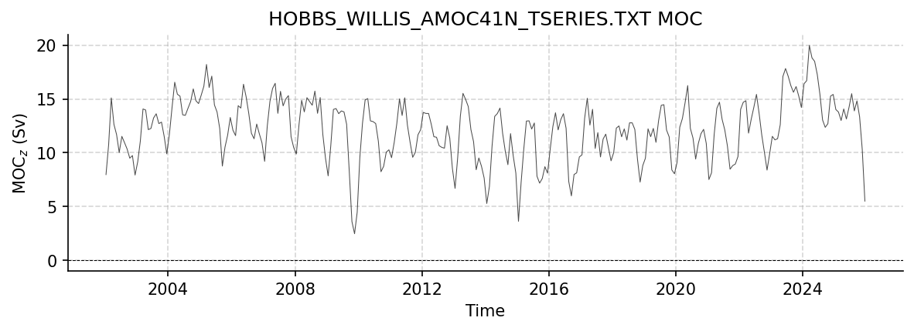
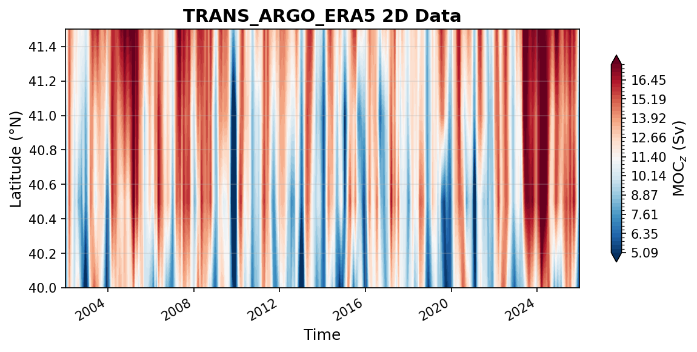
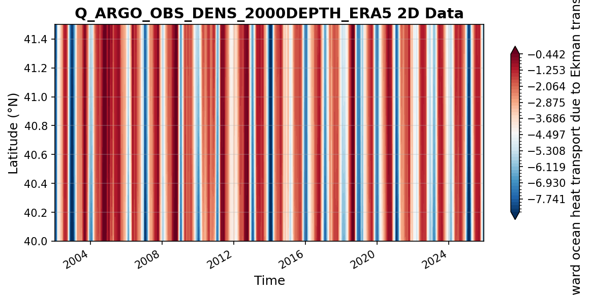

WH41N Datasets
==============

This report covers all available WH41N datasets.

----

hobbs_willis_amoc41N_tseries.txt
--------------------------------

Dataset Overview
^^^^^^^^^^^^^^^^

- **Project**: Atlantic Meridional Overturning Circulation Near 41N from Altimetry and Argo Observations
- **Description**: 41N transport estimates dataset
- **Source File**: hobbs_willis_amoc41N_tseries.txt
- **Data Product**: Atlantic Meridional Overturning Circulation Near 41N from Altimetry and Argo Observations
- **License**: CC-BY-4.0
- **Time Coverage**: 2002-01-16 to 2025-12-16
- **Record Length**: 288 observations (23.9 years)
- **Sampling Frequency**: monthly

**Citation:**

    Willis, J. K., and Hobbs, W. R., Atlantic Meridional Overturning Circulation Near 41N from Altimetry and Argo Observations. Dataset accessed at 10.5281/zenodo.8170365.

Dataset Visualization
^^^^^^^^^^^^^^^^^^^^^

   Time series plot for HOBBS_WILLIS_AMOC41N_TSERIES.TXT dataset.

Dataset Statistics
^^^^^^^^^^^^^^^^^^

- **Total Variables**: 4
- **Total Coordinates**: 1
- **Dataset Size**: 0.01 MB

Coordinate Information
^^^^^^^^^^^^^^^^^^^^^^

The following table shows information about the dataset coordinates in the standardised version, including coordinate name remapping from the original, if any:

.. list-table::
   :widths: 14 14 14 14 14 14 14
   :header-rows: 1

   * - Coordinate
     - Description
     - Units
     - Size
     - Min Value
     - Max Value
     - Missing %
   * - **TIME**
     - Time
     - datetime64[ns]
     - (288,)
     - 2002-01-16
     - 2025-12-16
     - 0.0%

Variable Information
^^^^^^^^^^^^^^^^^^^^

The following table shows the mapping from original variable names to standardized names,
along with key statistics for each variable.

.. list-table::
   :widths: 14 14 14 14 14 14 14
   :header-rows: 1

   * - Variable
     - Description
     - Units
     - Size
     - Min Value
     - Max Value
     - Missing %
   * - *MOC (PW)* → **MHT**
     - **MHT**: Meridional Overturning Heat Transport
     - PW
     - (288,)
     - -0.04
     - 0.94
     - 0.0%
   * - *MOC (Sv)* → **MOC**
     - **MOC_z**: Meridional Overturning Volume Transport
     - Sverdrup
     - (288,)
     - 2.47
     - 19.98
     - 0.0%
   * - *Ekman (Sv)* → **TRANS_EKMAN**
     - **Ekman**: Ekman Volume Transport
     - Sverdrup
     - (288,)
     - -8.79
     - 0.51
     - 0.0%
   * - *Geos (Sv)* → **TRANS_GEO**
     - **Geostrophic Transport**: Northward Geostrophic Transport
     - Sverdrup
     - (288,)
     - 6.16
     - 23.96
     - 0.0%

Metadata (edits applied noted)
^^^^^^^^^^^^^^^^^

The following metadata provides comprehensive information about this dataset:

- **Summary**: 41N transport estimates dataset
- **Description\***: 41N transport estimates dataset
- **Program\***: 41N
- **Project\***: Atlantic Meridional Overturning Circulation Near 41N from Altimetry and Argo Observations
- **License\***: CC-BY-4.0
- **Weblink\***: https://doi.org/10.5281/zenodo.8170365
- **Platform**: Argo floats
- **Platform Vocabulary**: https://vocab.nerc.ac.uk/collection/L06/
- **Data Product\***: Atlantic Meridional Overturning Circulation Near 41N from Altimetry and Argo Observations
- **Contributor Name\***: Will Hobbs, Josh K. Willis
- **Contributor Role\***: originator, principalInvestigator
- **Contributor Role Vocabulary**: https://vocab.nerc.ac.uk/collection/G04/current/
- **Contributor Email**: , 
- **Contributor Id**: https://orcid.org/0000-0002-2061-0899, https://orcid.org/0000-0002-4515-8771
- **Contributing Institutions\***: National Aeronautics and Space Administration - Jet Propulsion Laboratory (NASA JPL)
- **Contributing Institutions Vocabulary**: https://edmo.seadatanet.org/report/1224
- **Contributing Institutions Role**: 
- **Conventions\***: CF-1.8, ACDD-1.3, OceanSITES-1.5
- **featureType\***: timeSeries
- **featureType_vocabulary**: https://cfconventions.org/cf-conventions/v1.6.0/cf-conventions.html#_features_and_feature_types
- **Source File\***: hobbs_willis_amoc41N_tseries.txt
- **Source Path\***: ~/AMOCatlas/data/hobbs_willis_amoc41N_tseries.txt
- **Source Url\***: https://doi.org/10.5281/zenodo.8170365
- **Date Modified**: 2026-02-01T00:00:00Z
- **Processing Software**: http://github.com/AMOCcommunity/amocatlas
- **Processing Version**: v0.3.0
- **Processing Datasource\***: wh41n
- **Variable Mapping\***: {'Ekman (Sv)': 'TRANS_EKMAN', 'Geos (Sv)': 'TRANS_GEO', 'MOC (Sv)': 'MOC', 'MOC (PW)': 'MHT'}
- **Original Variable Metadata\***: [Complex metadata structure - 4 items]
- **Applied Variable Mapping**: {'Ekman (Sv)': 'TRANS_EKMAN', 'Geos (Sv)': 'TRANS_GEO', 'MOC (Sv)': 'MOC', 'MOC (PW)': 'MHT'}
- **Version\***: v5

----

trans_ARGO_ERA5.nc
------------------

Dataset Overview
^^^^^^^^^^^^^^^^

- **Project**: Atlantic Meridional Overturning Circulation Near 41N from Altimetry and Argo Observations
- **Description**: 41N transport estimates dataset
- **Source File**: trans_ARGO_ERA5.nc
- **Data Product**: Transport components from ARGO and ERA5
- **License**: CC-BY-4.0
- **Date Created**: Mon 12 Jan 2026 14:06:47 AEDT
- **Time Coverage**: 2002-01-15 to 2025-12-15
- **Record Length**: 288 observations (23.9 years)
- **Sampling Frequency**: monthly

**Citation:**

    Willis, J. K., and Hobbs, W. R., Atlantic Meridional Overturning Circulation Near 41N from Altimetry and Argo Observations. Dataset accessed at 10.5281/zenodo.8170365.

Dataset Visualization
^^^^^^^^^^^^^^^^^^^^^

   Time series plot for TRANS_ARGO_ERA5 dataset.

Dataset Statistics
^^^^^^^^^^^^^^^^^^

- **Total Variables**: 3
- **Total Coordinates**: 4
- **Dataset Size**: 282.67 MB

Coordinate Information
^^^^^^^^^^^^^^^^^^^^^^

The following table shows information about the dataset coordinates in the standardised version, including coordinate name remapping from the original, if any:

.. list-table::
   :widths: 14 14 14 14 14 14 14
   :header-rows: 1

   * - Coordinate
     - Description
     - Units
     - Size
     - Min Value
     - Max Value
     - Missing %
   * - *depth* → **DEPTH**
     - **Depth**:  Depth below surface of the water
     - m
     - (201,)
     - 0.00
     - 2000.00
     - 0.0%
   * - *lat* → **LATITUDE**
     - **Latitude**: Latitude north (WGS84)
     - degree_north
     - (4,)
     - 40.00
     - 41.50
     - 0.0%
   * - *lon* → **LONGITUDE**
     - **Longitude**: Longitude east (WGS84)
     - degree_east
     - (320,)
     - 280.12
     - 359.88
     - 0.0%
   * - **TIME**
     - Time
     - datetime64[ns]
     - (288,)
     - 2002-01-15
     - 2025-12-15
     - 0.0%

Variable Information
^^^^^^^^^^^^^^^^^^^^

The following table shows the mapping from original variable names to standardized names,
along with key statistics for each variable.

.. list-table::
   :widths: 14 14 14 14 14 14 14
   :header-rows: 1

   * - Variable
     - Description
     - Units
     - Size
     - Min Value
     - Max Value
     - Missing %
   * - *moc* → **MOC**
     - **MOC_z**: Overturning circulation transport
     - Sverdrup
     - (288, 4)
     - -4.78
     - 20.74
     - 0.0%
   * - *trans* → **TRANS_GEO**
     - **Geostrophic transport**: Observed geostrophic transport from ARGO
     - Sverdrup
     - (288, 4, 320, 201)
     - -0.18
     - 0.19
     - 26.2%
   * - *Vek* → **VEL_EKMAN**
     - **Ekman**: Ekman transport from ERA5 reanalysis
     - Sverdrup
     - (288, 4)
     - -8.99
     - 0.73
     - 0.0%

Metadata (edits applied noted)
^^^^^^^^^^^^^^^^^

The following metadata provides comprehensive information about this dataset:

- **Title**: transport from ARGO/SSH data
- **Summary**: 41N transport estimates dataset
- **Description\***: 41N transport estimates dataset
- **Program\***: 41N
- **Project\***: Atlantic Meridional Overturning Circulation Near 41N from Altimetry and Argo Observations
- **License\***: CC-BY-4.0
- **Weblink\***: https://doi.org/10.5281/zenodo.8170365
- **Platform**: Argo floats
- **Platform Vocabulary**: https://vocab.nerc.ac.uk/collection/L06/
- **Data Product\***: Transport components from ARGO and ERA5
- **Contributor Name\***: Will Hobbs, Josh K. Willis
- **Contributor Role\***: originator, principalInvestigator
- **Contributor Role Vocabulary**: https://vocab.nerc.ac.uk/collection/G04/current/
- **Contributor Email**: , 
- **Contributor Id**: https://orcid.org/0000-0002-2061-0899, https://orcid.org/0000-0002-4515-8771
- **Contributing Institutions\***: National Aeronautics and Space Administration - Jet Propulsion Laboratory (NASA JPL)
- **Contributing Institutions Vocabulary**: https://edmo.seadatanet.org/report/1224
- **Contributing Institutions Role**: 
- **Conventions\***: CF-1.8, ACDD-1.3, OceanSITES-1.5
- **Source File\***: trans_ARGO_ERA5.nc
- **Source Path\***: ~/AMOCatlas/data/trans_ARGO_ERA5.nc
- **Source Url\***: https://doi.org/10.5281/zenodo.8170365
- **Date Created**: Mon 12 Jan 2026 14:06:47 AEDT
- **Date Modified**: 2026-02-01T00:00:00Z
- **Processing Software**: http://github.com/AMOCcommunity/amocatlas
- **Processing Version**: v0.3.0
- **Processing Datasource\***: wh41n
- **Variable Mapping\***: {'Vek': 'VEL_EKMAN', 'trans': 'TRANS_GEO', 'moc': 'MOC', 'depth': 'DEPTH', 'lat': 'LATITUDE', 'lon': 'LONGITUDE'}
- **Original Variable Metadata\***: [Complex metadata structure - 3 items]
- **Applied Variable Mapping**: {'Vek': 'VEL_EKMAN', 'trans': 'TRANS_GEO', 'moc': 'MOC', 'depth': 'DEPTH', 'lat': 'LATITUDE', 'lon': 'LONGITUDE', 'MOC': 'MOC', 'DEPTH': 'DEPTH'}
- **Reference Temp**: kelvin
- **Wind Stress**: ERA5

----

Q_ARGO_obs_dens_2000depth_ERA5.nc
---------------------------------

Dataset Overview
^^^^^^^^^^^^^^^^

- **Project**: Atlantic Meridional Overturning Circulation Near 41N from Altimetry and Argo Observations
- **Description**: 41N transport estimates dataset
- **Source File**: Q_ARGO_obs_dens_2000depth_ERA5.nc
- **Data Product**: Heat transport based on various assumptions about temperature below 2000m
- **License**: CC-BY-4.0
- **Date Created**: Mon 12 Jan 2026 14:06:47 AEDT
- **Time Coverage**: 2002-01-15 to 2025-12-15
- **Record Length**: 288 observations (23.9 years)
- **Sampling Frequency**: monthly

**Citation:**

    Willis, J. K., and Hobbs, W. R., Atlantic Meridional Overturning Circulation Near 41N from Altimetry and Argo Observations. Dataset accessed at 10.5281/zenodo.8170365.

Dataset Visualization
^^^^^^^^^^^^^^^^^^^^^

   Time series plot for Q_ARGO_OBS_DENS_2000DEPTH_ERA5 dataset.

Dataset Statistics
^^^^^^^^^^^^^^^^^^

- **Total Variables**: 3
- **Total Coordinates**: 5
- **Dataset Size**: 282.68 MB

Coordinate Information
^^^^^^^^^^^^^^^^^^^^^^

The following table shows information about the dataset coordinates in the standardised version, including coordinate name remapping from the original, if any:

.. list-table::
   :widths: 14 14 14 14 14 14 14
   :header-rows: 1

   * - Coordinate
     - Description
     - Units
     - Size
     - Min Value
     - Max Value
     - Missing %
   * - *depth* → **DEPTH**
     - **Depth**:  Depth below surface of the water
     - m
     - (201,)
     - 0.00
     - 2000.00
     - 0.0%
   * - **Hpar**
     - deep ocean volumetric Heat
     - J/m^3
     - (4,)
     - 1115000064.00
     - 1129299968.00
     - 0.0%
   * - *lat* → **LATITUDE**
     - **Latitude**: Latitude north (WGS84)
     - degree_north
     - (4,)
     - 40.00
     - 41.50
     - 0.0%
   * - *lon* → **LONGITUDE**
     - **Longitude**: Longitude east (WGS84)
     - degree_east
     - (320,)
     - 280.12
     - 359.88
     - 0.0%
   * - **TIME**
     - Time
     - datetime64[ns]
     - (288,)
     - 2002-01-15
     - 2025-12-15
     - 0.0%

Variable Information
^^^^^^^^^^^^^^^^^^^^

The following table shows the mapping from original variable names to standardized names,
along with key statistics for each variable.

.. list-table::
   :widths: 14 14 14 14 14 14 14
   :header-rows: 1

   * - Variable
     - Description
     - Units
     - Size
     - Min Value
     - Max Value
     - Missing %
   * - *Q* → **MHT**
     - **MHT**: Observed meridional heat transport
     - PW
     - (288, 4, 320, 201)
     - -0.22
     - 0.24
     - 26.2%
   * - *Qek* → **MHT_EKMAN**
     - **MHT Ekman**: Ekman meridional heat transport
     - PW
     - (288, 4)
     - -10.55
     - 0.88
     - 0.0%
   * - *Qnet* → **MHT_NET**
     - **Net heat transport**: Net meridional heat transport
     - PW
     - (288, 4, 4)
     - -0.54
     - 1.21
     - 0.0%

Metadata (edits applied noted)
^^^^^^^^^^^^^^^^^

The following metadata provides comprehensive information about this dataset:

- **Title**: heat transport from ARGO/SSH data
- **Summary**: 41N transport estimates dataset
- **Description\***: 41N transport estimates dataset
- **Program\***: 41N
- **Project\***: Atlantic Meridional Overturning Circulation Near 41N from Altimetry and Argo Observations
- **License\***: CC-BY-4.0
- **Weblink\***: https://doi.org/10.5281/zenodo.8170365
- **Platform**: Argo floats
- **Platform Vocabulary**: https://vocab.nerc.ac.uk/collection/L06/
- **Data Product\***: Heat transport based on various assumptions about temperature below 2000m
- **Contributor Name\***: Will Hobbs, Josh K. Willis
- **Contributor Role\***: originator, principalInvestigator
- **Contributor Role Vocabulary**: https://vocab.nerc.ac.uk/collection/G04/current/
- **Contributor Email**: , 
- **Contributor Id**: https://orcid.org/0000-0002-2061-0899, https://orcid.org/0000-0002-4515-8771
- **Contributing Institutions\***: National Aeronautics and Space Administration - Jet Propulsion Laboratory (NASA JPL)
- **Contributing Institutions Vocabulary**: https://edmo.seadatanet.org/report/1224
- **Contributing Institutions Role**: 
- **Conventions\***: CF-1.8, ACDD-1.3, OceanSITES-1.5
- **Source File\***: Q_ARGO_obs_dens_2000depth_ERA5.nc
- **Source Path\***: ~/AMOCatlas/data/Q_ARGO_obs_dens_2000depth_ERA5.nc
- **Source Url\***: https://doi.org/10.5281/zenodo.8170365
- **Date Created**: Mon 12 Jan 2026 14:06:47 AEDT
- **Date Modified**: 2026-02-01T00:00:00Z
- **Processing Software**: http://github.com/AMOCcommunity/amocatlas
- **Processing Version**: v0.3.0
- **Processing Datasource\***: wh41n
- **Variable Mapping\***: {'Qnet': 'MHT_NET', 'Qek': 'MHT_EKMAN', 'Q': 'MHT', 'depth': 'DEPTH', 'lat': 'LATITUDE', 'lon': 'LONGITUDE', 'time': 'TIME'}
- **Original Variable Metadata\***: [Complex metadata structure - 3 items]
- **Applied Variable Mapping**: {'Qnet': 'MHT_NET', 'Qek': 'MHT_EKMAN', 'Q': 'MHT', 'depth': 'DEPTH', 'lat': 'LATITUDE', 'lon': 'LONGITUDE', 'DEPTH': 'DEPTH', 'TIME': 'TIME'}
- **Reference Temp**: kelvin
- **Wind Stress**: ERA5
