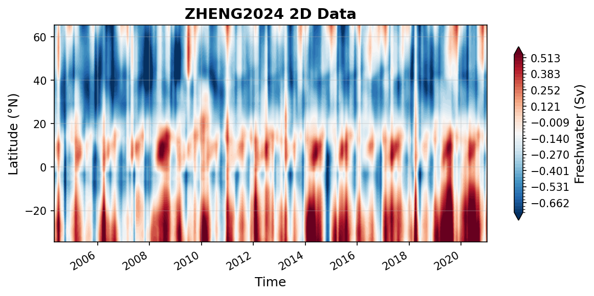

ZHENG2024 Datasets
==================

----

atl_mft_2000_extend_gpcp_oaflux.nc
----------------------------------

Dataset Overview
^^^^^^^^^^^^^^^^

- **Project**: An observation based estimate of the Atlantic meridional freshwater transport
- **Description**: An observation based estimate of the Atlantic meridional freshwater transport
- **Source File**: atl_mft_2000_extend_gpcp_oaflux.nc
- **Data Product**: An observation based estimate of the Atlantic meridional freshwater transport
- **License**: CC-BY-4.0
- **Time Coverage**: 2004-04-30 to 2020-12-31
- **Record Length**: 201 observations (16.7 years)
- **Sampling Frequency**: monthly

**Distribution Statement:**

    This dataset is publicly available. We kindly request that you cite the following reference in any publications that use this data.

**Citation:**

    Zheng, H. (2024). An observation-based estimate of the Atlantic meridional freshwater transport [Data set]. Zenodo. https://doi.org/10.5281/zenodo.12790901

**Acknowledgement:**

    "This study was supported by the National Natural Science Foundation of China (Grant 42122046, 42076202, 42075036), National Key Scientific and Technological Infrastructure project “Earth System Science Numerical Simulator Facility” (EarthLab) and the new Cornerstone Science Foundation through the XPLORER PRIZE. F. Li acknowledges the financial support from the National Key R&D Program of China (Grant 2023YFF0805102). Gratitude is extended to Elaine L. McDonagh, who graciously shared RAPID freshwater transport data."

Dataset Visualization
^^^^^^^^^^^^^^^^^^^^^

   Time series plot for ZHENG2024 dataset.

Dataset Statistics
^^^^^^^^^^^^^^^^^^

- **Total Variables**: 1
- **Total Coordinates**: 2
- **Dataset Size**: 0.16 MB

Coordinate Information
^^^^^^^^^^^^^^^^^^^^^^

The following table shows information about the dataset coordinates in the standardised version, including coordinate name remapping from the original, if any:

.. list-table::
   :widths: 14 14 14 14 14 14 14
   :header-rows: 1

   * - Coordinate
     - Description
     - Units
     - Size
     - Min Value
     - Max Value
     - Missing %
   * - *lat* → **LATITUDE**
     - **Latitude**: Latitude north (WGS84)
     - degree_north
     - (101,)
     - -34.50
     - 65.50
     - 0.0%
   * - *time* → **TIME**
     - **Time**: Time in datetime format
     - seconds since 1970-01-01T00:00:00Z
     - (201,)
     - 2004-04-30
     - 2020-12-31
     - 0.0%

Variable Information
^^^^^^^^^^^^^^^^^^^^

The following table shows the mapping from original variable names to standardized names,
along with key statistics for each variable.

.. list-table::
   :widths: 14 14 14 14 14 14 14
   :header-rows: 1

   * - Variable
     - Description
     - Units
     - Size
     - Min Value
     - Max Value
     - Missing %
   * - *mft* → **MFT**
     - **Freshwater**: An Observation-Based Estimate of Atlantic Meridional Freshwater Transport. AMFT given by RAPID array at 26.5°N was integrated southward and northward in combination with ocean freshwater content (calculated by salinity) and surface freshwater flux, with the residual of the freshwater budget equation being the AMFT.
     - Sverdrup
     - (201, 101)
     - -0.98
     - 0.92
     - 0.0%

Metadata (edits applied noted)
^^^^^^^^^^^^^^^^^

The following metadata provides comprehensive information about this dataset:

- **Summary**: An observation based estimate of the Atlantic meridional freshwater transport
- **Description\***: An observation based estimate of the Atlantic meridional freshwater transport
- **Program\***: amft
- **Project\***: An observation based estimate of the Atlantic meridional freshwater transport
- **License\***: CC-BY-4.0
- **Acknowledgment\***: "This study was supported by the National Natural Science Foundation of China (Grant 42122046, 42076202, 42075036), National Key Scientific and Technological Infrastructure project “Earth System Science Numerical Simulator Facility” (EarthLab) and the new Cornerstone Science Foundation through the XPLORER PRIZE. F. Li acknowledges the financial support from the National Key R&D Program of China (Grant 2023YFF0805102). Gratitude is extended to Elaine L. McDonagh, who graciously shared RAPID freshwater transport data."
- **References\***: Zheng, H., Cheng, L., Li, F., Pan, Y., & Zhu, C. (2024). An observation-based estimate of Atlantic meridional freshwater transport. Geophysical Research Letters, 51, e2024GL110021. https://doi.org/10.1029/2024GL110021
- **Weblink\***: https://zenodo.org/records/12790901
- **Distribution Statement\***: This dataset is publicly available. We kindly request that you cite the following reference in any publications that use this data.
- **Data Product\***: An observation based estimate of the Atlantic meridional freshwater transport
- **Time Coverage Start\***: 2004-04-30
- **Time Coverage End\***: 2020-12-31
- **Contributor Name\***: Huayi Zheng, Lijing Cheng, Feili Li, Yuying Pan, Chenyu Zhu
- **Contributor Role\***: originator, principalInvestigator, coAuthor, coAuthor, coAuthor
- **Contributor Role Vocabulary\***: https://vocab.nerc.ac.uk/collection/G04/current/
- **Contributor Email\***: zhenghuayi23@mails.ucas.ac.cn, chenglij@mail.iap.ac.cn, , , 
- **Contributor Id\***: https://orcid.org/0009-0004-5333-7595, https://orcid.org/0000-0002-9854-0392, https://orcid.org/0000-0002-3073-9813, https://orcid.org/0000-0001-7694-2625, https://orcid.org/0000-0002-9330-4294
- **Contributing Institutions\***: Institute of Atmospheric Physics, Chinese Academy of Sciences
- **Contributing Institutions Vocabulary\***: https://edmo.seadatanet.org/report/2452, 
- **Contributing Institutions Role**: , 
- **Conventions\***: CF-1.8, ACDD-1.3, OceanSITES-1.5
- **featureType\***: timeSeries
- **featureType_vocabulary**: https://cfconventions.org/cf-conventions/v1.6.0/cf-conventions.html#_features_and_feature_types
- **Source File\***: atl_mft_2000_extend_gpcp_oaflux.nc
- **Source Path\***: ~/.amocatlas_data/atl_mft_2000_extend_gpcp_oaflux.nc
- **Source Url\***: https://zenodo.org/records/12790901
- **Date Modified**: 2026-08-01T00:00:00Z
- **Processing Software**: http://github.com/AMOCcommunity/amocatlas
- **Processing Version**: v0.3.1
- **Processing Datasource\***: zheng2024
- **Applied Variable Mapping**: {'time': 'TIME', 'lat': 'LATITUDE', 'mft': 'MFT', 'TIME': 'TIME', 'MFT': 'MFT'}
- **Comment\***: Salinity observations used in this study are from the Institute of Atmospheric Physics (IAP). Argo floats, CTD salinity sensors, bottles, mooring, sourced from the World Ocean Database (WOD). Precipitation and evaporation observations are derived from the Global Precipitation Climatology Project (GPCP).
